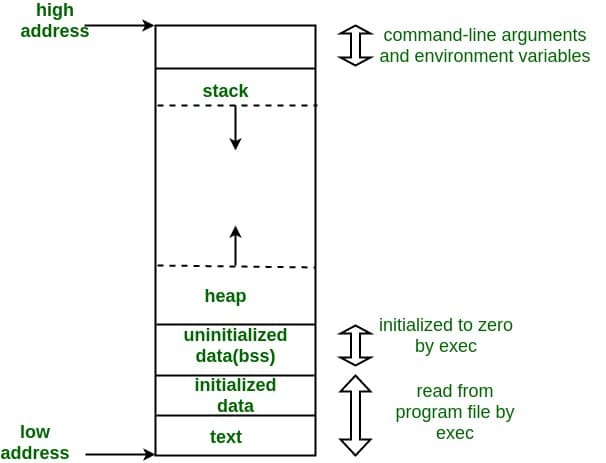

# Cortex-M3 ARM代码编译，链接与启动分析

​        本篇文章以武汉杰开科技的汽车级MCU芯片AC7811为硬件平台，使用GNU GCC作为开发工具。详细分析Compile 、Link 、Loader的过程以及Image(二进制程序)启动的详细分析。整个过程分析涉及到RW可读写DATA段从Flash到Mem的Copy，BSS段的初始化，Stack和Heap的初始化，C库函数移植、利用Semihosting 实现基本的IO等内容。基本可以让你从更深刻的层面理解**`源码`** -> **`编译`** -> **`链接`** -> **`运行`**的整个过程。理解了这些个过程之后，你就对那些从语言编程层面来说难于理解的问题自然领会了，比如：我们的源码时如何生成相应的代码段和数据段，代码段和数据段在哪？全局变量和局部变量的区别到底在哪？Stack和Heap的区别到底在哪？等等一些看起来是规定的东西，书本里一切不自然的概念都需要你用心去理解，去实践，达到自然的状态才有可能去解决实际遇到的问题。本文参考官方文档：[`Makefile`](./pdf/GNU_Make_v3.8_CN.pdf),[`GNU GCC`](./pdf/GNU_GCC_v11.2.0_EN.pdf),[`Linkers and Loaders`](./pdf/Linker.and.Loader(中文版).pdf),[`Cortex-M3 Technical Reference Manual`](./pdf/DDI0337H_cortex_m3_r2p0_trm.pdf)和[**`程序员的自我修养—链接、装载与库`**](./pdf/程序员的自我修养—链接、装载与库(全书带目录).pdf)。

### AUTOChip Cortex-M3 地址映射(Memory mapping)

​        如在我们比较常用的操作系统(Windows/Linux)中，整个`Virtual Memory`地址通过硬件的`MMU`被映射到相应的`Physical RAM/Memory`。然而在嵌入式系统中对于RAM,它时没有MMU的。因此在一些嵌入式系统里，如比较常用的STM32来说，地址映射被分为Flash Segments(也是我们所知的Flash,用来存储代码和数据)和RAM Segments用来存可读写数据。在分析代码编译，链接与启动之前，我们必须了解整个Cortex-M3 MCU的地址分配和启动模式。


​        从上图中AutoChip AC7811的Flash和SRAM地址范围分别在0x000 0000 ~ 0x2000 0000和0x2000 0000 ~ 0x4000 0000，内部外围总线地址0x4000 0000 ~ 0x6000 0000(这是我们常用的说的*APB*(Advanced Peripheral Bus)，外围总线地址)，外部存储设备地址0x6000 0000 ~ 0x6100 0000(这里是给外挂SPI FLASH映射的地址空间)，Cortex-M3私有Debug，外部和内部总线接口地址0xE000 0000 ~ 0xE100 0000(参考[`Cortex-M3 Technical Reference Manual`](./pdf/DDI0337H_cortex_m3_r2p0_trm.pdf))。本文主要讲的是Flash地址0x000 0000 ~ 0x2000 0000和SRAM地址0x2000 0000 ~ 0x4000 0000的应用。

​        下面通过分析AutoChip AC7811的四个boot mode启动模式帮助大家对应的地址映射转换。在[**`AC7811技术参考手册`**](./pdf/ATC_AC781x_ReferenceManual_EN.pdf)page23  **Boot configuration**可以设置**UART1_CTS**和**UART1_RTS**管脚使能不同的启动模式。


**Flash memory boot up** 和 **SRAM boot up**映射框图如下：


**ISP boot up** 和 **Serial flash boot up**映射框图如下：


### 裸机程序的整体说明

​        我们都熟悉有操作系统支持的应用程序开发，比如 Linux下C语言的开发。我们可以不用关心程序启动的细节，同时我们一般还可以使用各种方便的lib 库，比如基本的IO操作(printf scan)，动态分配内存操作(malloc)，文件操作(fopen fwrite fread)等。有操作系统支持的情况下，程序的编译、链接、启动都是有操作系统支持的，常用的编程库函数使用的是标准的C库。

​        那如果没有OS支持的情况下，想实现上面这些功能的话，该怎么做呐？这种情况就叫 Bare Metal (裸)程序开发。在嵌入式开发中是比较常见的情况，本文主要讲解基于Cortex-M3 的裸程序开发。本裸机程序实现了 基本IO，动态内存分配，基本函数库等功能。

### 如何实现的startup

​        还是和有OS支持的情况下来对比，有OS的情况下分析一个Project，一般会从3个方面来进行分析：一是看源代码的组织形式；一是看Compile && Link过程(即Makefile)；三是看Run时的情况(一般看运行起来后几个Process，几个Thread，以及他们之间的关系)。分析完这3个方面后，整个project从静到动，以及动静之间的转换都包括了，也就掌握了整个的Project。

​        在没有OS的情况下，1 2 两个方面是一样的，只不过程序运行的基础环境不一样，裸机程序运行需要考虑的细节多一些。裸机程序需要考虑的基本问题有：

1. 编译生成的可执行程序结构是什么样的？整个可执行程序的入口在哪？

2. 需要将可执行程序下载到什么地方？程序运行前需要做哪些准备工作？

3. C语言运行需要什么样的环境？

   我们按照上面说的方法，从3各方面出发，分析我们的Project。

### **源代码：**

顶层目录结构：

```bash
# tree -l
.
├── App
├── Device
│   ├── Include
│   │   ├── CMSIS
│   └── Source
│       ├── ARM
├── Drivers
│   ├── inc
│   └── src
└── makefile
```

其中App目录是Application层的主逻辑代码，其中main.c就在App目录中，是业务逻辑层的主代码。
Device-->include-->CMSIS目录是arm cmsis框架层的interface 说明文件。
Device-->Source-->ARM目录是启动代码startup_ac78xx.s和ac7811_flash.ld脚本。
ac7811_flash.ld脚本主要告诉ld(链接器)如何链接各个Objects文件为可执行程序.
Drivers目录是AutoChip提供的ac7811的SDK包。

更详细的项目目录结构：

```bash
# tree -l
.
├── App
│   └── main.c
├── Device
│   ├── Include
│   │   ├── CMSIS
│   │   │   ├── arm_common_tables.h
│   │   │   ├── arm_const_structs.h
│   │   │   ├── arm_math.h
│   │   │   ├── cmsis_armcc.h
│   │   │   ├── cmsis_armclang.h
│   │   │   ├── cmsis_compiler.h
│   │   │   ├── cmsis_gcc.h
│   │   │   ├── cmsis_iccarm.h
│   │   │   ├── cmsis_version.h
│   │   │   ├── core_cm3.h
│   │   │   ├── mpu_armv7.h
│   │   ├── ac78xx.h
│   │   ├── ac78xx_ckgen.h
│   │   ├── ac78xx_debugout.h
│   │   ├── ac78xx_spm.h
│   │   ├── debugzone.h
│   │   └── system_ac78xx.h
│   └── Source
│       ├── ARM
│       │   ├── ac7811_flash.ld
│       │   └── startup_ac78xx.s
│       ├── ac78xx_ckgen.c
│       ├── ac78xx_ckgen_regs.h
│       ├── ac78xx_debugout.c
│       ├── ac78xx_spm.c
│       ├── ac78xx_spm_regs.h
│       ├── syscalls.c
│       └── system_ac78xx.c
├── Drivers
│   ├── inc
│   │   ├── ac78xx_can.h
│   │   ├── ac78xx_can_reg.
│   │   ├── ac78xx_dma.h
│   │   ├── ac78xx_dma_reg.h
│   │   ├── ac78xx_eflash.h
│   │   ├── ac78xx_eflash_reg.h
│   │   ├── ac78xx_uart.h
│   │   ├── ac78xx_uart_reg.h
│   │   ├── ......
│   └── src
│       ├── ac78xx_can.c
│       ├── ac78xx_dma.c
│       ├── ac78xx_eflash.c
│       ├── ac78xx_uart.c
│       ├── ......
└── makefile
```


### 编译与链接

当然是直接 `make` 喽。但是我们还是需要知道对应的编译规则。不得不说AC7811的makefile写的还是非常规范的。我们可以把作为一个很好的makefile模版。

makefile详细说明：

```makefile
#--------------------------------- 编译参数 ------------------------------------
#把编译过程中的命令参数log不往屏幕显示
ifneq ($(V),1)
Q		:= @
NULL	:= 2>/dev/null
endif

TARGET := DEMO#编译文件名称，根据命名需要可自行修改
OPT    := -O0#不做任何优化，这是默认的编译选项。
CSTD   := -std=c11#使用C11标准库
CXXSTD := -std=c++11#使用C++11标准库

#--------------工程需要编译的头文件，根据需要自行添加--------------------
INC_FLAGS += -I ./Device/Include     \
		     -I ./Device/Include/CMSIS \
			 -I ./Drivers/inc	
#------链接文件,里面指定了芯片flash,ram大小，需根据实际大小进行修改
LDSCRIPT := ./Device/Source/ARM/ac7811_flash.ld

ARCH_FLAGS += -mthumb#thumb指令
ARCH_FLAGS += -mcpu=cortex-m3#cortex-m3 cpu架构

#编译告警设置
CWARN_FLAGS += -Wall -Wshadow
CWARN_FLAGS += -fno-common -ffunction-sections -fdata-sections
CWARN_FLAGS += -Wimplicit-function-declaration  
CWARN_FLAGS += -Wstrict-prototypes

#--通过printf打印串口log，需设置-specs=nosys.specs，并且在syscalls.c中实现_write_r函数，把printf映射到串口上。
LDLIBS		+= -Wl,--start-group -lc -lgcc  -Wl,--end-group -lm -specs=nosys.specs 

#----------------------------- 搜索工程目录下的源代码 ---------------------------

AS_SRC := ./Device/Source/ARM/startup_ac78xx.s
AS_OBJ := $(AS_SRC:%.s=%.o)
#-------源代码需根据实际情况删减-------------
C_SRC := ./Device/Source/ac78xx_ckgen.c    \
		 ./Device/Source/ac78xx_spm.c      \
		 ./Device/Source/system_ac78xx.c   \
		 ./Device/Source/ac78xx_debugout.c \
		 ./Device/Source/syscalls.c \
		 ./Drivers/src/ac78xx_dma.c	\
		 ./Drivers/src/ac78xx_gpio.c	\
		 ./Drivers/src/ac78xx_timer.c	\
		 ./Drivers/src/ac78xx_uart.c	\
		 ./Drivers/src/ac78xx_wdg.c	\
		 ./App/main.c
C_OBJ := $(C_SRC:%.c=%.o)  

#--------------------------------- 参数整合 ------------------------------------
# C flags
CFLAGS := $(OPT) $ $(CSTD) $(INC_FLAGS) $(FP_FLAGS) 
CFLAGS += $(DEFINES) $(ARCH_FLAGS) $(CWARN_FLAGS) -g #-g 增加调试选项，可以使用GDB进行调试

# Linker flags 链接器编译选项
LDFLAGS		:= --static#静态编译
LDFLAGS		+= -Wl,-Map=$(TARGET).map -Wl,--gc-sections
LDFLAGS		+= -T$(LDSCRIPT) $(ARCH_FLAGS) $(LDLIBS)

# OBJ
OBJ = $(AS_OBJ) $(C_OBJ)

#-------------------------------- 编译器调用指令 --------------------------------
PREFIX	:= arm-none-eabi

CC		:= $(PREFIX)-gcc
CXX		:= $(PREFIX)-g++
LD		:= $(PREFIX)-gcc
AR		:= $(PREFIX)-ar
AS		:= $(PREFIX)-as
OBJCOPY	:= $(PREFIX)-objcopy
OBJDUMP	:= $(PREFIX)-objdump
GDB		:= $(PREFIX)-gdb

.SUFFIXES: .elf .bin .hex .list .map .images
.SECONDEXPANSION:
.SECONDARY:

all: elf bin hex

elf: $(TARGET).elf
bin: $(TARGET).bin
hex: $(TARGET).hex
list: $(TARGET).list
images: $(TARGET).images

%.images: %.bin %.hex %.list %.map
	@printf "*** $* images generated ***\n"
#objdump生成二进制文件
%.bin: %.elf          
	@printf "  OBJCOPY $(*).bin\n"
	$(Q)$(OBJCOPY) -Obinary $(*).elf $(*).bin
#objdump生成hex文件
%.hex: %.elf
	@printf "  OBJCOPY $(*).hex\n"
	$(Q)$(OBJCOPY) -Oihex $(*).elf $(*).hex
	
%.list: %.elf
	@printf "  OBJDUMP $(*).list\n"
	$(Q)$(OBJDUMP) -S $(*).elf > $(*).list
#链接map生成elf规则	
%.elf %.map: $(OBJ) $(LDSCRIPT)
	@printf "  LD      $(TARGET).elf\n"
	$(Q)$(LD) $(OBJ) $(LDFLAGS) -o $(TARGET).elf
#汇编文件编译规则
$(AS_OBJ): %.o:%.s
	@printf "  AS      $(*).s\n"
	$(Q)$(CC) $(ARCH_FLAGS) $(FP_FLAGS) -g -Wa,--no-warn -x assembler-with-cpp -o $(*).o -c $(*).s
#C文件编译规则
$(C_OBJ): %.o:%.c
	@printf "  CC      $(*).c\n"
	$(Q)$(CC) $(CFLAGS) -o $(*).o -c $(*).c
	
clean:
	@#printf "  CLEAN\n"
	$(Q)$(RM) $(shell find -name '*.o' -o -name '*.d' -o -name '*.elf' -o -name '*.bin') 
	$(Q)$(RM) $(shell find -name '*.hex' -o -name '*.srec' -o -name '*.list' -o -name '*.map') 
	$(Q)$(RM) $(shell find -name 'generated.*' -o -name '*.srec' -o -name '*.list' -o -name '*.map') 

.PHONY: images clean elf bin hex list flash debug
```

### 映像结构与运行

​        有操作系统的情况下，我们不需要关心可执行映像的具体结构，一个可执行程序文件从静态文件到动态运行这个过程叫Loader&&Run。这个过程是由OS来完成的，应用程序级别的开发是不需要关心这些细节的。对OS如何处理Link&&Loader这些细节感兴趣的，可以参考书籍：
1. [**`程序员的自我修养—链接、装载与库`**](./pdf/程序员的自我修养—链接、装载与库(全书带目录).pdf)
2. [`Linkers and Loaders`](./pdf/Linker.and.Loader(中文版).pdf)

​        我们这里处理的是裸程序的启动细节问题，首先我们要知道的是通过编译器和链接器之后得到的二进制可执行映像的结构。也就是说得出的那个 *.bin 文件里面长啥样？一图胜万言，上张图先。



​        大家都知道冯.诺依曼架构的计算机，它的基本思想是把“做事情的步骤和所需要的资源都提前编写好，然后让计算机自己根据需要读取操作步骤和资源，实现部分的计算自动化”。计算机的设计思想可谓是精妙的，实现真正的计算自动化也是很多科学家和工程师的夙愿。上面所说的做事情的`步骤`在计算机领域叫`指令`，所需要的`资源`在计算机领域叫`数据`。从计算机体系结构角度去看`可执行映像`的话，其实也就分为`指令`和`数据`两个大的部分。指令部分还是比较单一的，把各个源文件中的指令部分最后都汇聚到一起，形成所谓的`text段`。从功能上分，代码段只是需要CPU去读取，不需要修改，因为可以将其放在RO存储器里。数据这个部分从功能上来看，它必须支持读写，也即数据段执行时必须位于RW存储器里。从功能细节上分数据段又分为`BSS段`，`Data段`，`Stack段`，`Heap段`。从计算机体系结构角度来一一分析，从数据的生存周期角度来看，有的数据的生存周期和程序的生存周期是一致的(`全局变量`)，有的数据的生存周期是根据使用情况即时分配和释放的（`局部变量`、`malloc动态分配的变量`）。`BSS段`和`Data段`属于全生命周期的数据，在源程序里主要是那些在文件域定义的`全局变量`和使用`static`关键字定义的全生命周期变量，`Data`是那些在程序里定义变量时初始化为固定值的量，`BSS段`是那些在程序里定义变量时未初始化的变量，这些变量在映像真正执行前会自动初始化为0。**对BSS段再多说一句，BSS段在映像文件里并不占用具体的空间，因为没有任何具体的信息，只需要在映像文件中提供BSS段的起始地址和大小信息即可**。在映像文件实际执行前，把BSS段要求的Data区域在实际RAM中预留出来并把这些区域初始化为0。短生命周期的数据包括Heap和Stack，它们的特点是随用随申请，用完就释放，比较灵活。Heap是一段预留出来的大空间，可以根据需求随时申请和释放，就是我们常见的malloc free函数操作的空间就是Heap 空间，这部分空间在映像里是独立出来的一段空间，见上面的程序映像图。

​        我们看到RO存储Flash Memory的地址段是：0x08000000–0x0801FFFF 共128K。RW存储SRAM的地址段是：0x20000000–0x20007FFF 共32K。MCU的启动配置是从0x08000000地址开始启动。为节约RAM空间，我们启动时映像的代码段不搬运，直接读取Flash Memory，数据段需要可读写，因此需要将所有的数据段搬移到RAM中去。大致情况见下图：


Link Script，它控制着如何产生最终的映像文件。在分析具体的Link Script之前，先来说Link Script里最重要的概念，Address && Offset，前面也说了，到了映像文件格式这一层面，也就剩下各种连续的内容(段)和地址(Address)了，因此地址对映像来说是一个十分重要的资源。Link Script无非就是告诉链接器哪段东西放在哪个地址上。那些段需要搬运，当然搬运也是需要地址的。

来看看我们项目中用到的Link Script：
分连个层面来看，一是Memory Map相关的，一是段分配相关的。
先看Memory Map，

```makefile
/* Specify the memory areas */
MEMORY
{
  FLASH (rx)      : ORIGIN = 0x08000000, LENGTH = 128K
  RAM (xrw)       : ORIGIN = 0x20000000, LENGTH = 32K
  MEMORY_B1 (rx)  : ORIGIN = 0x60000000, LENGTH = 0K
}
```


