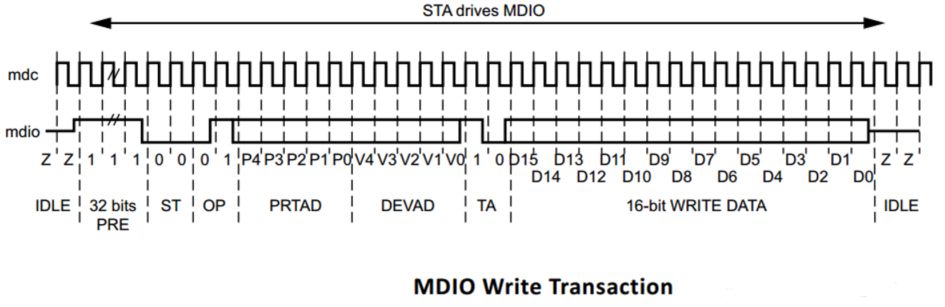

## 了解与MDIO/MDC接口相关的22号、45号条款

### MDIO接口

SMI：串行管理接口（Serial Management Interface），也被称作MII管理接口（MII Management Interface），包括MDC和MDIO两条信号线。MDIO是用来对PHY芯片等物理层信息进行操作管理接口。

### MDIO的历史

MDIO是Management Data Input/Output 的缩写，有两根线，分别为双向的MDIO和单向的MDC，用于以太网设备中上层对物理层的管理。之所以能够管理这些PHY芯片，是因为能够对PHY芯片的各类寄存器进行访问和修改。

MDIO接口最初是由IEEE RFC802.3中的`22号条款`定义的，在最初的定义中，一个单独的MDIO接口可以访问32个不同的PHY设备中的32个寄存器，这些寄存器提供状态和控制信息，例如：连接状态、传输速度能力、当前选择的传速、低压消耗时的下电情况、全双工还是半双工、自动协商、错误提示以及反馈信息等等。

为了满足10G以太网设备的普及发展，在IEEE 802.3ae 的`45号条款`中为MDIO接口提供了额外的规范：

1）能够通过32个端口访问32个不同设备的65536个寄存器；

2）为访问10G以太网提供额外的OP码和ST码，从而可以直接访问寄存器地址；

3）端到端的报错信号；

4）环回模式控制；

5）低压电气标准。

### MDIO数据传输协议

#### 22号条款

----------

| Frame | Preamble (32bits) | Start (2bits) | OP Code (2bits) | PHYAD (5bits) | REGAD (5bits) | Turn Around (2bits) | Data (16bits) | Idle |
| :---: | :---------------: | :-----------: | :-------------: | :-----------: | :-----------: | :-----------------: | :-----------: | ---- |
| Read  |     1.......1     |      01       |       10        |    A4...A0    |    R4...R0    |         Z0          | D15.......D0  | Z*   |
| Write |     1.......1     |      01       |       01        |    A4...A0    |    R4...R0    |         10          | D15.......D0  | Z*   |

上图中*表示高阻态，这时MDIO的状态由一个外部的1.5KΩ电阻决定。

**Preamble+Start：** 32bits的前导码以及2bit的开始位。

**OP Code：** 2bits的操作码，10表示读，01表示写。

**PHYAD：** 5bits的PHY地址，一般PHY地址从0开始顺序编号，例如6口switch中PHY地址为0-5。

**REGAD：** 5bits的寄存器地址，即要读或写的寄存器。

**Turn Around：** 2bits的TA，在读命令中，MDIO在此时由MAC驱动改为PHY驱动，并等待一个时钟周期准备发送数据。在写命令中，不需要MDIO方向发生变化，则只是等待两个时钟周期准备写入数据。

**Data：** 16bits数据，在读命令中，PHY芯片将读到的对应PHYAD的REGAD寄存器的数据写到Data中，在写命令中，MAC将要写入对应PHYAD的REGAD寄存器的值写入Data中。

**Idle：** 空闲状态，此时MDIO无源驱动，处高阻状态，但一般用上拉电阻使其处在高电平。

帧格式中PHY的地址和寄存器的地址都是5bit，这就限制了STA可以连接到的MMD的数量。此外，22号条款仅支持5V设备，没有其他的低压选项。

#### 45号条款

----------

|   Frame   | Preamble (32bits) | Start (2bits) | OP Code (2bits) | PRTAD (5bits) | DEVAD (5bits) | Turn Around (2bits) | Data (16bits) | Idle |
| :-------: | :---------------: | :-----------: | :-------------: | :-----------: | :-----------: | :-----------------: | :-----------: | ---- |
|  Address  |     1.......1     |      00       |       00        |     PPPPP     |     EEEEE     |         10          | A15.......A0  | Z*   |
|   Write   |     1.......1     |      00       |       01        |     PPPPP     |     EEEEE     |         10          | D15.......D0  | Z*   |
|   Read    |     1.......1     |      00       |       11        |     PPPPP     |     EEEEE     |         Z0          | D15.......D0  | Z*   |
| Read Inc. |     1.......1     |      00       |       10        |     PPPPP     |     EEEEE     |         Z0          | D15.......D0  | Z*   |

上图中*表示高阻态，这时MDIO的状态由一个外部的1.5KΩ电阻决定。

**Preamble+Start：** 32bits的前导码以及2bit的开始位。帧开始标志， 为了区别CL22，Clause45 的开始标志为比特“00”。

**OP Code：** 操作码，Clause45有4种操作码，比特“00”表示设置当前寄存器地址，比特“01”表示写当前寄存器。比特“10”表示读当前寄存器，比特“11”表示读当前寄存器读完后把当前寄存器的值加1，用于顺序读。

**PRTAD：** Port Address，端口地址， 也称物理地址。

**DEVAD**：器件地址，CL45新增概念，各值与器件对应如下。

| Value  | Device             |
| ------ | ------------------ |
| 00000  | Reserved           |
| 00001  | PMD/PMA            |
| 00010  | WIS                |
| 00011  | PCS                |
| 00100  | PHY XS             |
| 00101  | DTE XS             |
| ------ | ------------------ |

**REGAD：** 用来选MMD的65536个寄存器中的某个寄存器的地址。

**Turn Around：** 2bits的TA，在读命令中，MDIO在此时由MAC驱动改为PHY驱动，并等待一个时钟周期准备发送数据。在写命令中，不需要MDIO方向发生变化，则只是等待两个时钟周期准备写入数据。

**Data：** 帧的寄存器的数据域，16bits，若为读操作，则为MMD送到STA的数据，若为写操作，则为STA送到MMD数据。

**Idle：** 空闲状态，此时MDIO无源驱动，处高阻状态，但一般用上拉电阻使其处在高电平。

第45号条款的主要变化是如何访问寄存器。在第22中，一个单独的帧指定要读或写的地址和数据，同时完成了这些工作。45号中改变这种范式，第一个地址帧发送到指定的MMD和寄存器，然后发送第二帧来执行读或写。

 添加这个依次循环访问的好处是45条款是向后兼容22条款的，允许设备的互操作。其次，通过创建一个框架的登记地址，地址空间从5位增加到16位，这使得STA访问65536个不同的寄存器。

 为了做到这一点，在数据帧的组成部分进行了一些变化。定义了新的ST代码（00），用于标识第45号条款的数据帧。运算码扩展到指定地址帧，写帧，读帧，或读和读后增量地址帧。由于寄存器地址不再需要，这个字段被指定目标设备类型的内容代替。扩展后还允许STA接入除了PHY以外的其他设备。

##### 读第45号条款的寄存器操作：

Write Address AAAAAAAAAAAAAAAA to Device VVVVV on Port PPPPP 

Read Register From Device VVVVV on Port PPPPP 

##### 写第45号条款的寄存器操作：

Write Address AAAAAAAAAAAAAAAA to Device VVVVV on Port PPPPP 

Write Register To Device VVVVV on Port PPPPP

每个操作都需要执行两个步骤。

### 如果STA只支持Clause22访问，但是PHY却是802.3ah PHY

802.3ah PHY 为了能支持Clause22 STA的访问。只预留的**`Reg 13`** 和 **`Reg 14`**。STA能通过Clause22 访问Reg 13和14间接访问Clause45寄存器。

##### 用第22号条款访问第45号条款的寄存器读操作：

Write FN = Address & EEEEE to C22 Register 13 on Port PPPPP

Write Address AAAAAAAAAAAAAAAA to C22 Register 14 on Port PPPPP

Write FN = Data & EEEEE to C22 Register 13 on Port PPPPP

Read Register From C22 Register 14 on Port PPPPP

##### 用第22号条款访问第45号条款的寄存器写操作：

Write FN = Address & EEEEE to C22 Register 13 on Port PPPPP

Write Address AAAAAAAAAAAAAAAA to C22 Register 14 on Port PPPPP

Write FN = Data & EEEEE to C22 Register 13 on Port PPPPP

Write Register To C22 Register 14 on Port PPPPP

每个操作都需要执行四个步骤。

**[LInux GPIO 模拟 MDIO 接口使用代码](https://www.jianshu.com/p/910b235ea6c4)**

**[gpio模拟mdc/mdio通信](https://www.cnblogs.com/hjj801006/p/4864638.html)**

