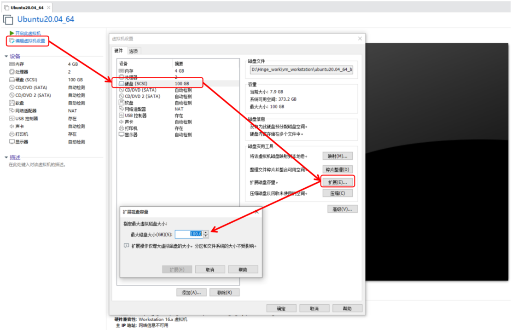

# VMware下对Ubuntu进行扩充磁盘空间  

之前使用VMware® Workstation 16 Pro创建的Ubuntu虚拟机分配了100G磁盘空间，但是由于工作需求安装了gitlab和Jenkins。项目越来越多，发现100G的空间完全不够用。重新安装再次分配大点的空间，相当于所有的工作需要重来。怎么办？

下面告诉你一个简单快捷扩展的方法：

#### **1. “编辑虚拟机设置”->“硬盘”->“磁盘实用工具”->“扩展”**



#### **2.输入需要扩展的磁盘容量大小**


#### **3.点击扩展，扩展完毕，扩充完毕后，打开Ubuntu，然后安装一个工具GParted** 

```shell
sudo apt-get install gparted

bspserver@ubuntu:~$ sudo apt-get install gparted
[sudo] password for bspserver: 
Reading package lists... Done
Building dependency tree       
Reading state information... Done
The following additional packages will be installed:
  gparted-common
Suggested packages:
  dmraid gpart jfsutils kpartx reiser4progs reiserfsprogs udftools xfsprogs
The following NEW packages will be installed:
  gparted gparted-common
0 upgraded, 2 newly installed, 0 to remove and 48 not upgraded.
Need to get 481 kB of archives.
After this operation, 2,393 kB of additional disk space will be used.
Do you want to continue? [Y/n] Y
Get:1 http://us.archive.ubuntu.com/ubuntu focal/main amd64 gparted-common all 1.0.0-0.1build1 [80.8 kB]
Get:2 http://us.archive.ubuntu.com/ubuntu focal/main amd64 gparted amd64 1.0.0-0.1build1 [401 kB]
Fetched 481 kB in 4s (138 kB/s)  
Selecting previously unselected package gparted-common.
(Reading database ... 190177 files and directories currently installed.)
Preparing to unpack .../gparted-common_1.0.0-0.1build1_all.deb ...
Unpacking gparted-common (1.0.0-0.1build1) ...
Selecting previously unselected package gparted.
Preparing to unpack .../gparted_1.0.0-0.1build1_amd64.deb ...
Unpacking gparted (1.0.0-0.1build1) ...
Setting up gparted-common (1.0.0-0.1build1) ...
Setting up gparted (1.0.0-0.1build1) ...
Processing triggers for desktop-file-utils (0.24-1ubuntu3) ...
Processing triggers for mime-support (3.64ubuntu1) ...
Processing triggers for hicolor-icon-theme (0.17-2) ...
Processing triggers for gnome-menus (3.36.0-1ubuntu1) ...
Processing triggers for man-db (2.9.1-1) ...
bspserver@ubuntu:~$ 
```

#### **4.安装完毕打开此应用**


#### **5.打开GParted应用，输入用户密码进入，你可以看到已分配分区状况和新增未分配的分区**


#### **6.使用`free -m`命令查看Swap使用情况，使用`swapoff -a`关闭交换分区**

使用free -m命令查看

```shell
bspserver@ubuntu:~$ free -m
              total        used        free      shared  buff/cache   available
Mem:           3901        1008         677           4        2214        2652
Swap:          2047           0        2047
```

我们可以看到交换分区的大小，先将交换分区关掉使用命令

```shell
spserver@ubuntu:~$ sudo swapoff -a
bspserver@ubuntu:~$ free -m
              total        used        free      shared  buff/cache   available
Mem:           3901        1008         678           4        2214        2653
Swap:             0           0           0
```

这时候可以看到swap的分区大小已经为0了。

#### **7.接下来选择/dev/sda2 extended，点击菜单栏上的，重新给/dev/sda2划分大小，直接拉拽至最大空间200GB。**


#### **8. 接下来选择/dev/sda5 ext4 *, 点击菜单栏上的，重新给/dev/sda5划分大小，预留2G空间给linux-swap分区。**


#### **9.接下来选择unallocated 分区 -> New** -> File system -> linux-swap,设置大小为2G。


#### **10.点击菜单栏上的按钮确认操作，最终完成分区。**

```shell
bspserver@ubuntu:~$ sudo swapon -a
[sudo] password for bspserver: 
bspserver@ubuntu:~$ free -m
              total        used        free      shared  buff/cache   available
Mem:           3901        1022         650           4        2228        2638
Swap:          2047           0        2047
bspserver@ubuntu:~$ df -h
Filesystem      Size  Used Avail Use% Mounted on
udev            1.9G     0  1.9G   0% /dev
tmpfs           391M  3.3M  387M   1% /run
/dev/sda5       194G  8.9G  177G   5% /
tmpfs           2.0G     0  2.0G   0% /dev/shm
tmpfs           5.0M  4.0K  5.0M   1% /run/lock
tmpfs           2.0G     0  2.0G   0% /sys/fs/cgroup
/dev/loop0      219M  219M     0 100% /snap/gnome-3-34-1804/72
/dev/loop1       51M   51M     0 100% /snap/snap-store/547
/dev/loop2       66M   66M     0 100% /snap/gtk-common-themes/1515
/dev/loop3       56M   56M     0 100% /snap/core18/2128
/dev/loop4       33M   33M     0 100% /snap/snapd/12704
/dev/sda1       511M  4.0K  511M   1% /boot/efi
tmpfs           391M   40K  391M   1% /run/user/1000
/dev/loop5       43M   43M     0 100% /snap/snapd/14066
/dev/loop6       56M   56M     0 100% /snap/core18/2253
/dev/loop7      128K  128K     0 100% /snap/bare/5
/dev/loop8       62M   62M     0 100% /snap/core20/1242
/dev/loop9      219M  219M     0 100% /snap/gnome-3-34-1804/77
/dev/loop10      66M   66M     0 100% /snap/gtk-common-themes/1519
/dev/loop11      55M   55M     0 100% /snap/snap-store/558
/dev/loop12     248M  248M     0 100% /snap/gnome-3-38-2004/87
```

