# Windows10搭建MSYS2和MINGW64环境

由于AC781X的Keil代码例如CMSIS/RTOS/Device/bare_sdk代码封于AutoChips.AC781x_DFP包中不便于整个代码管理，所以我们将整个AC781X的代码移植到**Windows10**的**MSYS2**和**MINGW64**编译环境中。**[msys64-arm-gcc-toolchain](http://173.20.15.201:8081/Hinge-SW/MCU/01_Baseline/11_AC78XX/03_msys64-arm-gcc-toolchain.git)** 有两种安装方法。

首先安装Windows系统[**Git-2.33.0.2-64-bit.exe**](http://173.20.15.201:8081/Hinge-SW/MCU/01_Baseline/11_AC78XX/03_msys64-arm-gcc-toolchain/blob/master/install/Git-2.33.0.2-64-bit.exe), 安装教程如[Windows系统Git安装教程(详解Git安装过程)](https://www.cnblogs.com/xueweisuoyong/p/11914045.html)。

### 1. **解压已有的[msys64.tar.gz](http://173.20.15.201:8081/Hinge-SW/MCU/01_Baseline/11_AC78XX/03_msys64-arm-gcc-toolchain/blob/master/msys64.tar.gz)压缩包**

gitlab库中[Hinge-SW / MCU / 01_Baseline / 11_AC78XX / 03_msys64-arm-gcc-toolchain · GitLab](http://173.20.15.201:8081/Hinge-SW/MCU/01_Baseline/11_AC78XX/03_msys64-arm-gcc-toolchain) 已经有安装好的msys64压缩包。

###### a. 例如进入到D盘符，鼠标右键⇨选择“**Git Bash Here**”

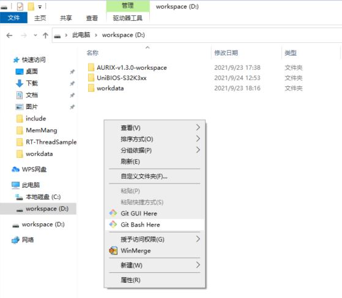

###### b. 进入到“**Git Bash**”命令行界面

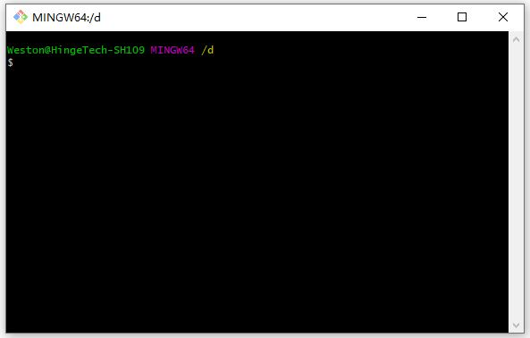

###### c. Git克隆msys64-arm-gcc-toolchain仓库到D盘**toolchain**目录。进入到**toolchain**目录，用**tar**命令解压**msys64.tar.gz**

```bash
# git clone git@173.20.15.201:Hinge-SW/MCU/01_Baseline/11_AC78XX/03_msys64-arm-gcc-toolchain.git toolchain

Cloning into 'toolchain'...
remote: Counting objects: 15, done.
remote: Compressing objects: 100% (13/13), done.
remote: Total 15 (delta 2), reused 0 (delta 0)
Receiving objects: 100% (15/15), 1017.33 MiB | 13.27 MiB/s, done.
Resolving deltas: 100% (2/2), done.
# cd toolchain/

# tar zxf msys64.tar.gz
```

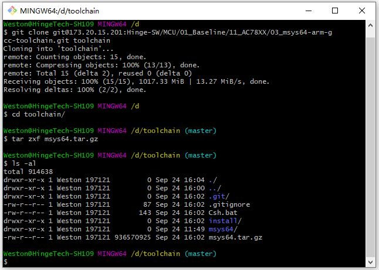

###### d. 进入到D盘符, 在D盘符的路径框前面插入“cmd”，然后回车。

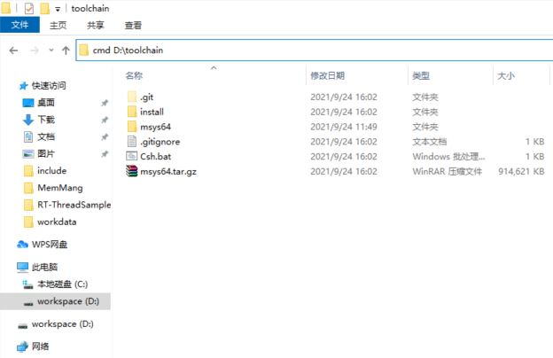

###### e. 进入到Windows命令行，输入Csh.bat

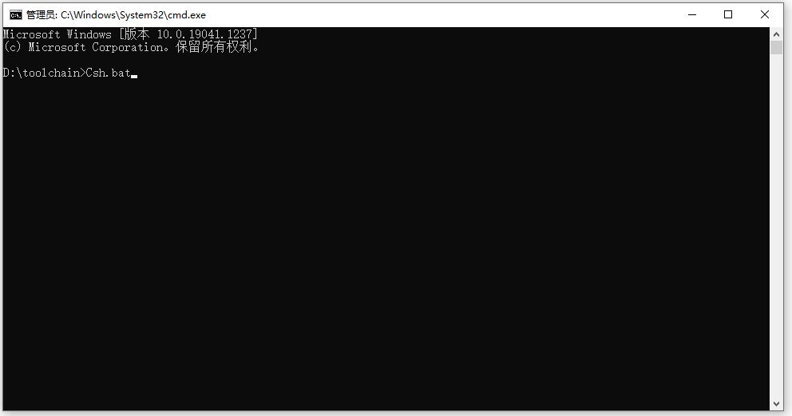

###### f. 进入到mingw32命令行界面。

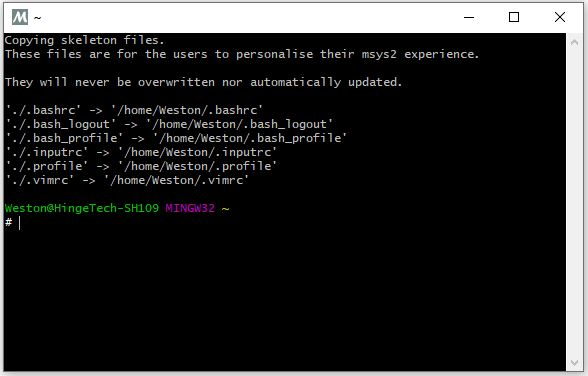


### 2. 直接安装[msys2-x86_64-latest.exe](http://173.20.15.201:8081/Hinge-SW/MCU/01_Baseline/11_AC78XX/03_msys64-arm-gcc-toolchain/blob/master/install/msys2-x86_64-latest.exe)及其工具组件

###### a.双击msys2-x86_64-latest.exe,并点击`下一步`选择安装文件夹在对应的toolchain目录下

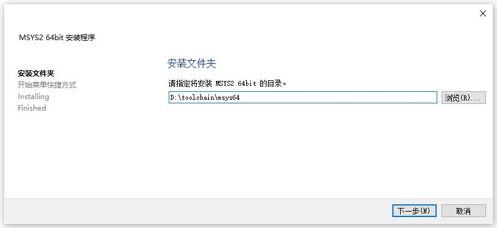

然后`下一步`直到开始安装

###### b.安装完成后点击`完 成`退出安装程序

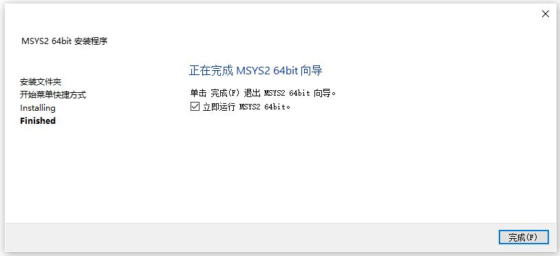

###### c.进入到“MSYS2 MSYS”命令界面

打开后执行命令`pacman -Syu`更新系统核心和各种包等，如下面的截图

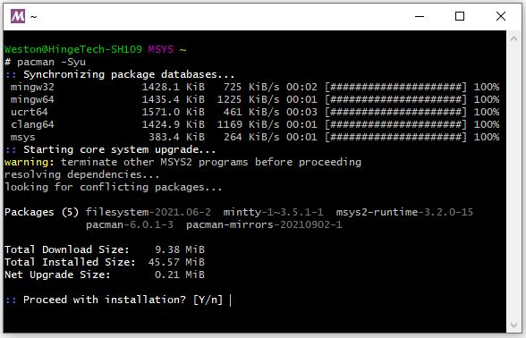

输入“Y”键开始更新
注意: 更新时会遇到下图的警告,这时一定要点击右上角的×来关闭窗口

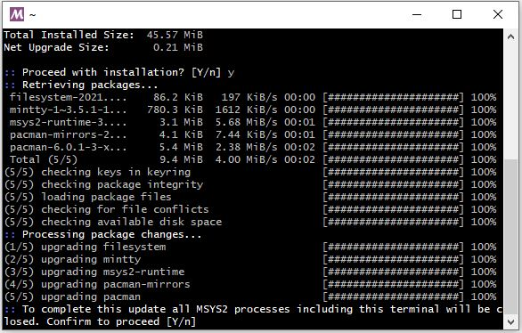

关闭窗口时会弹出一个对话框(如下图),点击Y就可以了。

上面的更新没有结束,需要继续更新, 再执行一次`pacman -Syu`

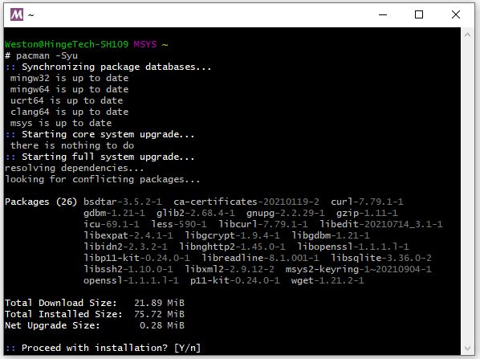

继续输入“Y”键开始更新。再执行一次`pacman -Syu`

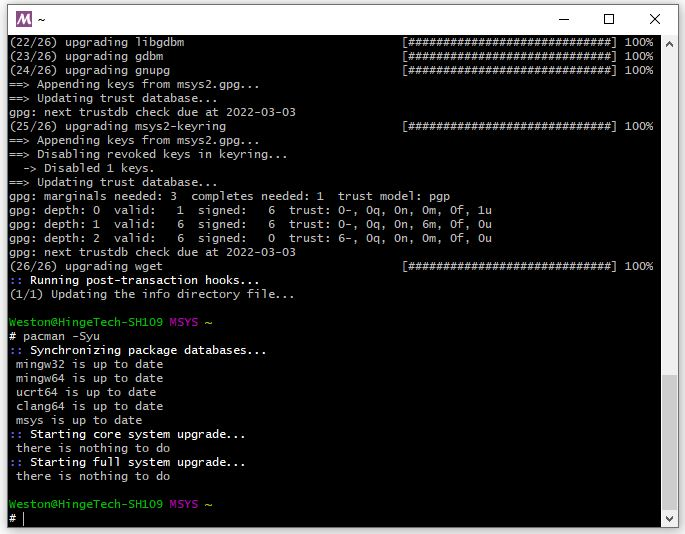

这样更新就可以顺利结束了,

msys2的安装也顺利结束了。

###### d. 安装编译环境

查看可以安装的gcc版本

命令: `pacman -Sl | grep gcc`

```bash
# pacman -Sl | grep gcc
mingw32 mingw-w64-i686-arm-none-eabi-gcc 10.1.0-2
mingw32 mingw-w64-i686-avr-gcc 8.4.0-4
mingw32 mingw-w64-i686-gcc 10.3.0-5
mingw32 mingw-w64-i686-gcc-ada 10.3.0-5
mingw32 mingw-w64-i686-gcc-fortran 10.3.0-5
mingw32 mingw-w64-i686-gcc-libgfortran 10.3.0-5
mingw32 mingw-w64-i686-gcc-libs 10.3.0-5
mingw32 mingw-w64-i686-gcc-objc 10.3.0-5
mingw32 mingw-w64-i686-libgccjit 10.3.0-5
mingw32 mingw-w64-i686-riscv64-unknown-elf-gcc 10.1.0-2
mingw64 mingw-w64-x86_64-arm-none-eabi-gcc 10.1.0-2
mingw64 mingw-w64-x86_64-avr-gcc 8.4.0-4
mingw64 mingw-w64-x86_64-gcc 10.3.0-5
mingw64 mingw-w64-x86_64-gcc-ada 10.3.0-5
mingw64 mingw-w64-x86_64-gcc-fortran 10.3.0-5
mingw64 mingw-w64-x86_64-gcc-libgfortran 10.3.0-5
mingw64 mingw-w64-x86_64-gcc-libs 10.3.0-5
mingw64 mingw-w64-x86_64-gcc-objc 10.3.0-5
mingw64 mingw-w64-x86_64-libgccjit 10.3.0-5
mingw64 mingw-w64-x86_64-riscv64-unknown-elf-gcc 10.1.0-2
ucrt64 mingw-w64-ucrt-x86_64-gcc 10.3.0-5
ucrt64 mingw-w64-ucrt-x86_64-gcc-fortran 10.3.0-5
ucrt64 mingw-w64-ucrt-x86_64-gcc-libgfortran 10.3.0-5
ucrt64 mingw-w64-ucrt-x86_64-gcc-libs 10.3.0-5
ucrt64 mingw-w64-ucrt-x86_64-gcc-objc 10.3.0-5
ucrt64 mingw-w64-ucrt-x86_64-libgccjit 10.3.0-5
msys gcc 10.2.0-1
msys gcc-fortran 10.2.0-1
msys gcc-libs 10.2.0-1 [installed]
msys mingw-w64-cross-gcc 10.2.0-1
```

安装gcc, 执行下面的命令安装与MinGW-w64-i686匹配的gcc
命令: `pacman -S mingw-w64-i686-arm-none-eabi-gcc mingw-w64-i686-gcc ` 

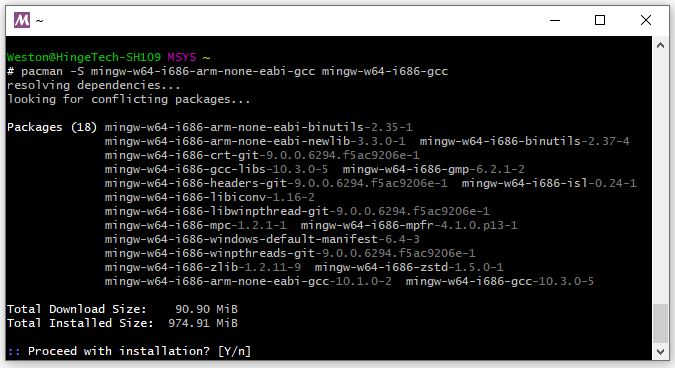

继续输入“Y”键开始安装。

```bash
# pacman -S mingw-w64-i686-arm-none-eabi-gcc mingw-w64-i686-gcc
resolving dependencies...
looking for conflicting packages...

Packages (18) mingw-w64-i686-arm-none-eabi-binutils-2.35-1
              mingw-w64-i686-arm-none-eabi-newlib-3.3.0-1  mingw-w64-i686-binutils-2.37-4
              mingw-w64-i686-crt-git-9.0.0.6294.f5ac9206e-1
              mingw-w64-i686-gcc-libs-10.3.0-5  mingw-w64-i686-gmp-6.2.1-2
              mingw-w64-i686-headers-git-9.0.0.6294.f5ac9206e-1  mingw-w64-i686-isl-0.24-1
              mingw-w64-i686-libiconv-1.16-2
              mingw-w64-i686-libwinpthread-git-9.0.0.6294.f5ac9206e-1
              mingw-w64-i686-mpc-1.2.1-1  mingw-w64-i686-mpfr-4.1.0.p13-1
              mingw-w64-i686-windows-default-manifest-6.4-3
              mingw-w64-i686-winpthreads-git-9.0.0.6294.f5ac9206e-1
              mingw-w64-i686-zlib-1.2.11-9  mingw-w64-i686-zstd-1.5.0-1
              mingw-w64-i686-arm-none-eabi-gcc-10.1.0-2  mingw-w64-i686-gcc-10.3.0-5

Total Download Size:    90.90 MiB
Total Installed Size:  974.91 MiB

:: Proceed with installation? [Y/n] y
:: Retrieving packages...
 mingw-w64-i686-arm-no...     3.7 MiB  1543 KiB/s 00:02 [############################] 100%
 mingw-w64-i686-header...     5.3 MiB  1878 KiB/s 00:03 [############################] 100%
 mingw-w64-i686-binuti...     5.5 MiB   959 KiB/s 00:06 [############################] 100%
 mingw-w64-i686-isl-0....   983.5 KiB  1429 KiB/s 00:01 [############################] 100%
 mingw-w64-i686-gcc-li...   834.4 KiB  1187 KiB/s 00:01 [############################] 100%
 mingw-w64-i686-arm-no...     2.9 MiB   426 KiB/s 00:07 [############################] 100%
 mingw-w64-i686-libico...   750.5 KiB   403 KiB/s 00:02 [############################] 100%
 mingw-w64-i686-crt-gi...     2.4 MiB   377 KiB/s 00:07 [############################] 100%
 mingw-w64-i686-arm-none-...    31.3 MiB  3.01 MiB/s 00:10 [###############################] 100%
 mingw-w64-i686-mpfr-4.1....   338.7 KiB   586 KiB/s 00:01 [###############################] 100%
 mingw-w64-i686-zlib-1.2....   105.3 KiB   306 KiB/s 00:00 [###############################] 100%
 mingw-w64-i686-zstd-1.5....   510.7 KiB   376 KiB/s 00:01 [###############################] 100%
 mingw-w64-i686-gmp-6.2.1...   486.9 KiB   309 KiB/s 00:02 [###############################] 100%
 mingw-w64-i686-mpc-1.2.1...    73.3 KiB  86.9 KiB/s 00:01 [###############################] 100%
 mingw-w64-i686-winpthrea...    40.6 KiB  70.3 KiB/s 00:01 [###############################] 100%
 mingw-w64-i686-libwinpth...    32.3 KiB  89.9 KiB/s 00:00 [###############################] 100%
 mingw-w64-i686-windows-d...    12.9 KiB  39.3 KiB/s 00:00 [###############################] 100%
 mingw-w64-i686-gcc-10.3....    26.3 MiB  6.78 MiB/s 00:01 [######################---------]  73%
 Total (17/18)                  81.6 MiB  6.78 MiB/s 00:01 [###########################----]  89%

```

查看可以安装的make版本

命令: `pacman -Sl | grep make`

```bash
# pacman -Sl | grep make
mingw32 mingw-w64-i686-bmake 20181221-7
mingw32 mingw-w64-i686-cmake 3.21.3-1
mingw32 mingw-w64-i686-cmake-doc-qt 3.19.3-1
mingw32 mingw-w64-i686-dmake 4.12.2.2-1
mingw32 mingw-w64-i686-extra-cmake-modules 5.85.0-1
mingw32 mingw-w64-i686-make 4.3-1
mingw32 mingw-w64-i686-premake 5.0a16-1
mingw32 mingw-w64-i686-python-sphinxcontrib-moderncmakedomain 3.19-2
mingw32 mingw-w64-i686-xmake 2.5.7-1
mingw64 mingw-w64-x86_64-bmake 20181221-7
mingw64 mingw-w64-x86_64-cmake 3.21.3-1
mingw64 mingw-w64-x86_64-cmake-doc-qt 3.19.3-1
mingw64 mingw-w64-x86_64-dmake 4.12.2.2-1
mingw64 mingw-w64-x86_64-extra-cmake-modules 5.85.0-1
mingw64 mingw-w64-x86_64-make 4.3-1
mingw64 mingw-w64-x86_64-premake 5.0a16-1
mingw64 mingw-w64-x86_64-python-sphinxcontrib-moderncmakedomain 3.19-2
mingw64 mingw-w64-x86_64-xmake 2.5.7-1
msys cmake 3.21.3-1
msys cmake-emacs 3.21.3-1
msys cmake-vim 3.21.3-1
msys colormake-git r8.9c1d2e6-1
msys icmake 9.03.01-1
msys make 4.3-1
msys remake 4.3+dbg1.5-2
```

安装make, 执行下面的命令安装与MinGW-w64-i686匹配的make和cmake
命令: `pacman -S mingw-w64-i686-cmake mingw-w64-i686-make make cmake   `  

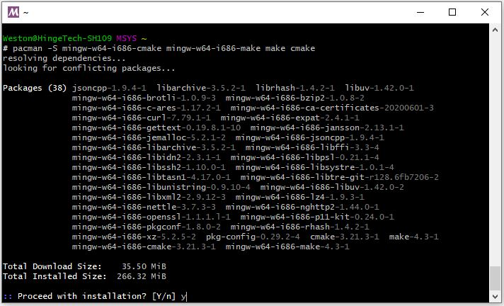

安装git vim cscosp, 

命令: `pacman -S git vim cscope       `  

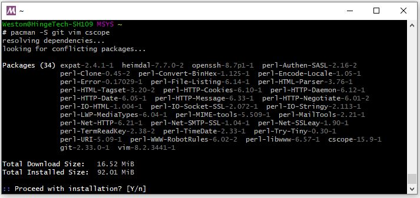

安装结束。
