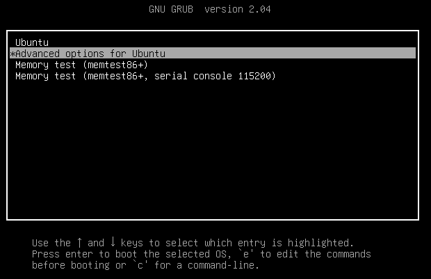
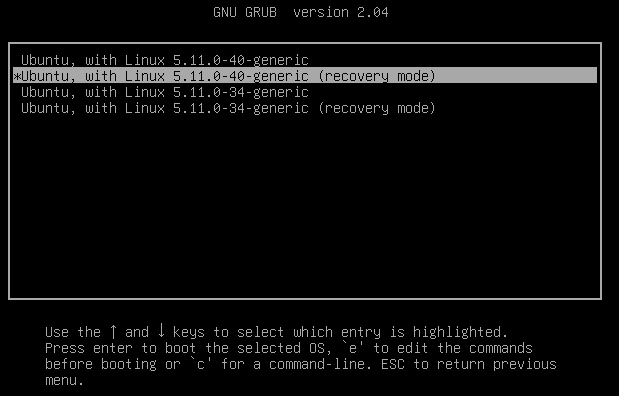
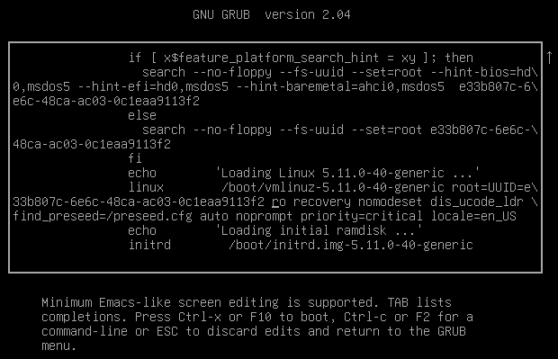
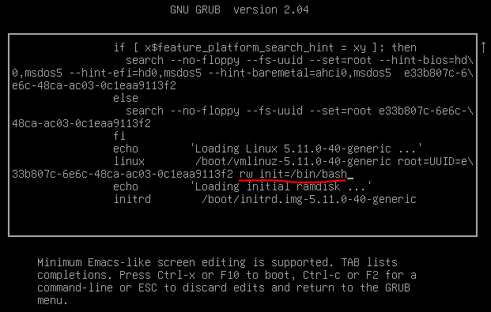
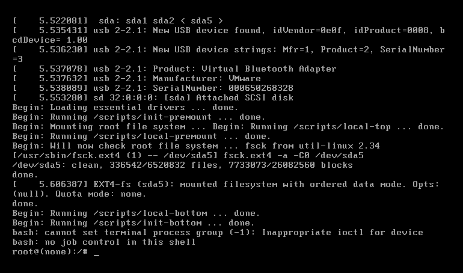
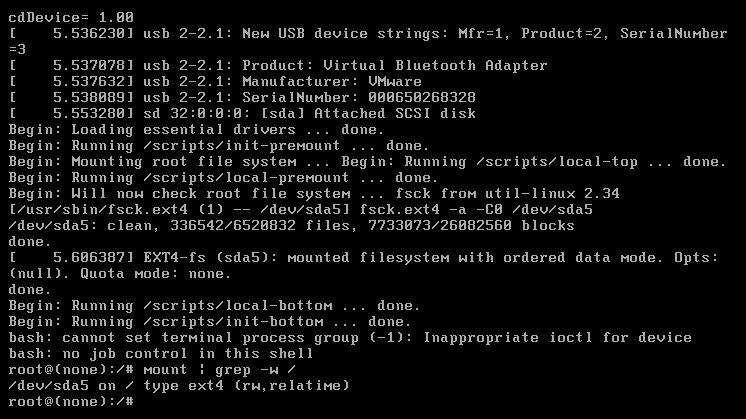
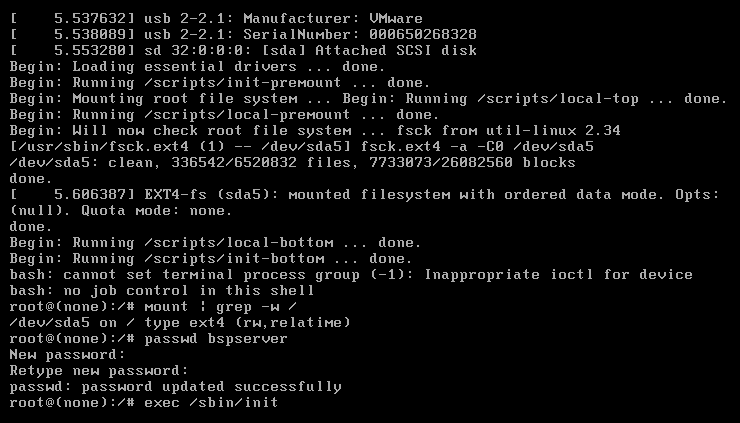
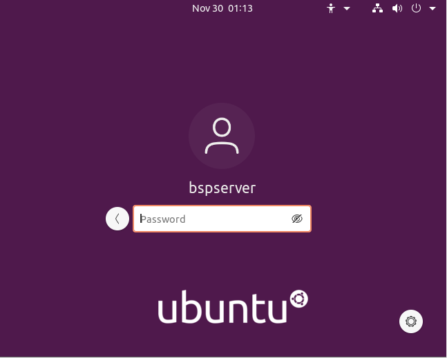

# **Ubuntu20.04密码忘记了怎么办？**  

Ubuntu 20.04是 Ubuntu 的第 8 个 LTS 版本， 代号为"Focal Fossa"，安装教程教程查看Ubuntu 20.04 LTS发布及安装教程。

本教程的目的是在 Ubuntu 20.04 Focal Fossa Linux 上重置丢失的 root 或用户密码。其实以下Root密码重置方法适用于Ubuntu 12.04以上任意版本的Ubuntu。

在本文中你将学会：

> * 如何在没有密码的情况下获得root shell
> * 如何挂载根（/）目录读/写
> * 如何重置root密码
> * 如何重置用户密码


### Root密码修改过程

重启Ubuntu20.04操作系统，然后快速的按下`shift`按键，并保持，进入grub菜单。直到出现如下界面，选择【Advanced options for Ubuntu】回车继续。



接下来，当您的选择Ubuntu 启动菜单第二项【ubuntu，with [Linux](https://so.csdn.net/so/search?from=pc_blog_highlight&q=Linux) 5.11.0-40-generic (recovery mode)】突出显示时，按`e`编辑Grub的启动提示符。



进入编辑界面后， 使用导航箭头找到包含以下字符串的行`ro recovery nomodeset`。



将`ro recovery nomodeset`至`locale=en_US`起后面所有内容替换成`rw init=/bin/bash`。



进行更改后，按 `ctrl+x`或者`F10` 继续引导。

成功启动后，您应该直接就是root用户身份在执行命令了，而不需要输入root密码。



执行以下命令确认根目录是否已被挂载为rw可读写权限。

```shell
mount | grep -w /
```



确认根目录状态

确认根目录正处于rw状态后，那就可以直接重置或破解Ubuntu 20.04任何用户的密码了。

重置root密码：

```shell
passwd root
```

或者

```shell
passwd
```

不加用户名表示重置root密码。

重置其它用户的密码，比如bspserver。

```shell
passwd bspserver
```

完成重置密码或者破解密码的工作后，重启Ubuntu 20.04，执行以下命令重启服务器：

```shell
exec /sbin/init
```



你可以使用重置的密码登录bspserver用户。



### 错误提示

如果执行passwd时，提示以下错误：

```shell
passwd: Authentication token manipulation error
passwd: password unchanged
```

原因：根目录挂载了只读状态。

解决方法如下：

```shell
mount -o remount,rw /
```

如果提示错误[ end Kernel panic - not syncing: Attempted to kill init! exit code=0x0007f00

确保在前面修改grub参数时，删除splash启动选项。

如果执行reboot命令时被提示：

```shell
System has not been booted with systemd as init system (PID 1). Can't operate.
Failed to connect to bus: Host is down
Failed to talk to init daemon.
```

忽略这样的错误，改为以下命令重启服务器：

```shell
exec /sbin/init
```

