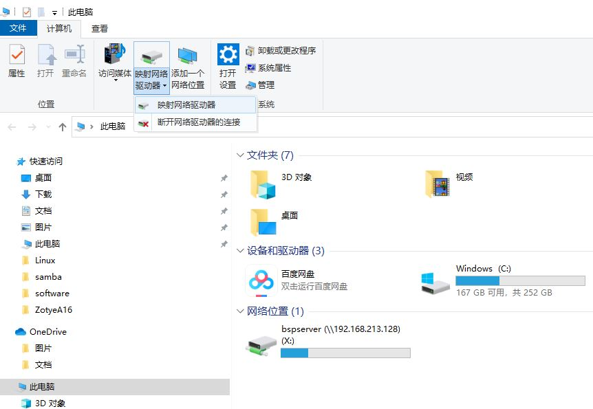
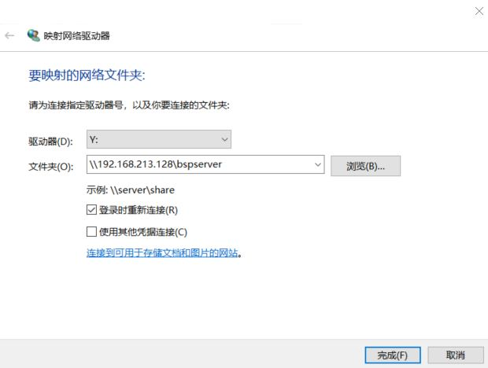

# Ubuntu16.04下ssh和samba服务器安装与配置  

本人安装的是Ubuntu16.04，为了平时需要Linux环境。开发方便自己在windows与Ubuntu自由操作与拷贝文件需要安装ssh与samba。

## 1. 如何安装配置ssh

**安装openssh-server**

```bash
bspserver@bspserver-Hinge-tech:~$ sudo apt-get install openssh-server
Reading package lists... Done
Building dependency tree
Reading state information... Done
The following additional packages will be installed:
  ncurses-term openssh-sftp-server ssh-import-id
Suggested packages:
  ssh-askpass rssh molly-guard monkeysphere
The following NEW packages will be installed:
  ncurses-term openssh-server openssh-sftp-server ssh-import-id
0 upgraded, 4 newly installed, 0 to remove and 184 not upgraded.
Need to get 633 kB of archives.
After this operation, 5,136 kB of additional disk space will be used.
Do you want to continue? [Y/n] y
Get:1 http://cn.archive.ubuntu.com/ubuntu xenial/main amd64 ncurses-term all 6.0+20160213-1ubuntu1 [249 kB]
Get:2 http://cn.archive.ubuntu.com/ubuntu xenial-updates/main amd64 openssh-sftp-server amd64 1:7.2p2-4ubuntu2.10 [38.8 kB]
Get:3 http://cn.archive.ubuntu.com/ubuntu xenial-updates/main amd64 openssh-server amd64 1:7.2p2-4ubuntu2.10 [335 kB]
Get:4 http://cn.archive.ubuntu.com/ubuntu xenial/main amd64 ssh-import-id all 5.5-0ubuntu1 [10.2 kB]
Fetched 633 kB in 3s (205 kB/s)
Preconfiguring packages ...
Selecting previously unselected package ncurses-term.
(Reading database ... 178803 files and directories currently installed.)
Preparing to unpack .../ncurses-term_6.0+20160213-1ubuntu1_all.deb ...
Unpacking ncurses-term (6.0+20160213-1ubuntu1) ...
Selecting previously unselected package openssh-sftp-server.
Preparing to unpack .../openssh-sftp-server_1%3a7.2p2-4ubuntu2.10_amd64.deb ...
Unpacking openssh-sftp-server (1:7.2p2-4ubuntu2.10) ...
Selecting previously unselected package openssh-server.
Preparing to unpack .../openssh-server_1%3a7.2p2-4ubuntu2.10_amd64.deb ...
Unpacking openssh-server (1:7.2p2-4ubuntu2.10) ...
Selecting previously unselected package ssh-import-id.
Preparing to unpack .../ssh-import-id_5.5-0ubuntu1_all.deb ...
Unpacking ssh-import-id (5.5-0ubuntu1) ...
Processing triggers for man-db (2.7.5-1) ...
Processing triggers for ureadahead (0.100.0-19.1) ...
Processing triggers for systemd (229-4ubuntu21.28) ...
Processing triggers for ufw (0.35-0ubuntu2) ...
Setting up ncurses-term (6.0+20160213-1ubuntu1) ...
Setting up openssh-sftp-server (1:7.2p2-4ubuntu2.10) ...
Setting up openssh-server (1:7.2p2-4ubuntu2.10) ...
Creating SSH2 RSA key; this may take some time ...
2048 SHA256:r5ORoBVuFpJMmbWDdcupxOcRLS7hYkMGqkeuVYszJ1A root@bspserver-Hinge-tech (RSA)
Creating SSH2 DSA key; this may take some time ...
1024 SHA256:5B05ndimHdLblNM9FfC698ZnpYwi9FXVCBdEvFgIxVk root@bspserver-Hinge-tech (DSA)
Creating SSH2 ECDSA key; this may take some time ...
256 SHA256:+YfjXUnWoqaPcWy5y+cGZy927PxdyFHrfkGDxIJZtW4 root@bspserver-Hinge-tech (ECDSA)
Creating SSH2 ED25519 key; this may take some time ...
256 SHA256:6p3HM2inZ97W4ewjPV/9QY9Dtz5Ayn4YUN/typPRIpc root@bspserver-Hinge-tech (ED25519)
Setting up ssh-import-id (5.5-0ubuntu1) ...
Processing triggers for ureadahead (0.100.0-19.1) ...
Processing triggers for systemd (229-4ubuntu21.28) ...
Processing triggers for ufw (0.35-0ubuntu2) ...
```

**安装openssh-client**

```bash
bspserver@bspserver-Hinge-tech:~$ sudo apt-get install openssh-client
Reading package lists... Done
Building dependency tree
Reading state information... Done
openssh-client is already the newest version (1:7.2p2-4ubuntu2.10).
0 upgraded, 0 newly installed, 0 to remove and 184 not upgraded.
```

**修改ssh配置需要密码安全访问**

配置ssh客户端，去掉PasswordAuthentication yes前面的#号，保存退出。

```bash
bspserver@bspserver-Hinge-tech:~$ sudo vim /etc/ssh/ssh_config

# This is the ssh client system-wide configuration file.  See
# ssh_config(5) for more information.  This file provides defaults for
# users, and the values can be changed in per-user configuration files
# or on the command line.

# Configuration data is parsed as follows:
#  1. command line options
#  2. user-specific file
#  3. system-wide file
# Any configuration value is only changed the first time it is set.
# Thus, host-specific definitions should be at the beginning of the
# configuration file, and defaults at the end.

# Site-wide defaults for some commonly used options.  For a comprehensive
# list of available options, their meanings and defaults, please see the
# ssh_config(5) man page.

Host *
#   ForwardAgent no
#   ForwardX11 no
#   ForwardX11Trusted yes
#   RhostsRSAAuthentication no
#   RSAAuthentication yes
    PasswordAuthentication yes
#   HostbasedAuthentication no
#   GSSAPIAuthentication no
#   GSSAPIDelegateCredentials no

```

**重启ssh服务**

```bash
bspserver@bspserver-Hinge-tech:~$ sudo /etc/init.d/ssh restart
[ ok ] Restarting ssh (via systemctl): ssh.service.
bspserver@bspserver-Hinge-tech:~$
```

现在你可以通过Xshell的ssh登录你的Ubuntu了。

```bash
Xshell for Xmanager Enterprise 5 (Build 0959)
Copyright (c) 2002-2016 NetSarang Computer, Inc. All rights reserved.

Type `help' to learn how to use Xshell prompt.
[c:\~]$ 

Connecting to 111.20.111.179:22...
Connection established.
To escape to local shell, press 'Ctrl+Alt+]'.

Welcome to Ubuntu 16.04.7 LTS (GNU/Linux 4.15.0-112-generic x86_64)

 * Documentation:  https://help.ubuntu.com
 * Management:     https://landscape.canonical.com
 * Support:        https://ubuntu.com/advantage


193 packages can be updated.
159 updates are security updates.

New release '18.04.5 LTS' available.
Run 'do-release-upgrade' to upgrade to it.

Last login: Fri Sep 17 13:34:37 2021 from 111.20.111.148
bspserver@bspserver-Hinge-tech:~$ 
```


## 2. 如何安装配置samba

**安装samba服务器**

打开终端，在终端输入。或者我们使用Xshell，ssh登录Ubuntu主机。

```bash
bspserver@bspserver-Hinge-tech:~$ sudo apt-get install samba
[sudo] password for bspserver: 
Reading package lists... Done
Building dependency tree       
Reading state information... Done
The following additional packages will be installed:
  attr libaio1 libldb1 libsmbclient libwbclient0 python-crypto python-dnspython python-ldb python-samba python-tdb samba-common samba-common-bin samba-dsdb-modules samba-libs samba-vfs-modules tdb-tools
Suggested packages:
  python-crypto-dbg python-crypto-doc bind9 bind9utils ctdb ldb-tools ntp smbldap-tools winbind heimdal-clients
The following NEW packages will be installed:
  attr libaio1 python-crypto python-dnspython python-ldb python-samba python-tdb samba samba-common samba-common-bin samba-dsdb-modules samba-vfs-modules tdb-tools
The following packages will be upgraded:
  libldb1 libsmbclient libwbclient0 samba-libs
4 upgraded, 13 newly installed, 0 to remove and 180 not upgraded.
Need to get 1,770 kB/8,821 kB of archives.
After this operation, 25.8 MB of additional disk space will be used.
Do you want to continue? [Y/n] y
Get:1 http://cn.archive.ubuntu.com/ubuntu xenial/main amd64 python-dnspython all 1.12.0-1 [85.2 kB]
Get:2 http://cn.archive.ubuntu.com/ubuntu xenial-updates/main amd64 python-crypto amd64 2.6.1-6ubuntu0.16.04.3 [246 kB]
Get:3 http://cn.archive.ubuntu.com/ubuntu xenial/main amd64 python-tdb amd64 1.3.8-2 [11.1 kB]
Get:4 http://cn.archive.ubuntu.com/ubuntu xenial/main amd64 tdb-tools amd64 1.3.8-2 [21.0 kB]
Get:5 http://cn.archive.ubuntu.com/ubuntu xenial-updates/main amd64 samba amd64 2:4.3.11+dfsg-0ubuntu0.16.04.34 [903 kB]
Get:6 http://cn.archive.ubuntu.com/ubuntu xenial/main amd64 attr amd64 1:2.4.47-2 [25.5 kB]
Get:7 http://cn.archive.ubuntu.com/ubuntu xenial/main amd64 libaio1 amd64 0.3.110-2 [6,356 B]
Get:8 http://cn.archive.ubuntu.com/ubuntu xenial-updates/main amd64 samba-dsdb-modules amd64 2:4.3.11+dfsg-0ubuntu0.16.04.34 [216 kB]
Get:9 http://cn.archive.ubuntu.com/ubuntu xenial-updates/main amd64 samba-vfs-modules amd64 2:4.3.11+dfsg-0ubuntu0.16.04.34 [256 kB]
Fetched 1,770 kB in 2s (666 kB/s)          
Preconfiguring packages ...
......
......
Creating config file /etc/samba/smb.conf with new version
Setting up samba-common-bin (2:4.3.11+dfsg-0ubuntu0.16.04.34) ...
Setting up tdb-tools (1.3.8-2) ...
update-alternatives: using /usr/bin/tdbbackup.tdbtools to provide /usr/bin/tdbbackup (tdbbackup) in auto mode
Setting up samba (2:4.3.11+dfsg-0ubuntu0.16.04.34) ...
Setting up attr (1:2.4.47-2) ...
Setting up libaio1:amd64 (0.3.110-2) ...
Setting up samba-dsdb-modules (2:4.3.11+dfsg-0ubuntu0.16.04.34) ...
Setting up samba-vfs-modules (2:4.3.11+dfsg-0ubuntu0.16.04.34) ...
Processing triggers for libc-bin (2.23-0ubuntu11.2) ...
Processing triggers for ureadahead (0.100.0-19.1) ...
Processing triggers for systemd (229-4ubuntu21.28) ...
Processing triggers for ufw (0.35-0ubuntu2) ...
bspserver@bspserver-Hinge-tech:~$ 
```

**安装samba客户端**

```bash
bspserver@bspserver-Hinge-tech:~$ sudo apt-get install smbclient
Reading package lists... Done
Building dependency tree       
Reading state information... Done
Suggested packages:
  cifs-utils heimdal-clients
The following NEW packages will be installed:
  smbclient
0 upgraded, 1 newly installed, 0 to remove and 180 not upgraded.
Need to get 311 kB of archives.
After this operation, 1,505 kB of additional disk space will be used.
Get:1 http://cn.archive.ubuntu.com/ubuntu xenial-updates/main amd64 smbclient amd64 2:4.3.11+dfsg-0ubuntu0.16.04.34 [311 kB]
Fetched 311 kB in 1s (208 kB/s)     
Selecting previously unselected package smbclient.
(Reading database ... 182458 files and directories currently installed.)
Preparing to unpack .../smbclient_2%3a4.3.11+dfsg-0ubuntu0.16.04.34_amd64.deb ...
Unpacking smbclient (2:4.3.11+dfsg-0ubuntu0.16.04.34) ...
Processing triggers for man-db (2.7.5-1) ...
Setting up smbclient (2:4.3.11+dfsg-0ubuntu0.16.04.34) ...
bspserver@bspserver-Hinge-tech:~$ 
```

**新增用户名和密码**

如果你的ubuntu还没有添加用户，则先添加一个用户，我这里添加一个bspserver用户。

```bash
sudo useradd bspserver
```

如果已经有用户了，则可以跳过这一步。

接着为这个新添加的用户设置密码。

在终端输入

```bash
sudo smbpasswd -a bspserver
```

会让你输入密码：

```bash
New SMB password:
Retype new SMB password:
Added user bspserver.
```

**修改配置文件**

打开smb.conf配置文件，在终端输入

```bash
sudo vi /etc/samba/smb.conf
```

然后在文件中添加以下内容：

```bash
[bspserver]
    browseable = yes
    writable = yes
    path = /home/bspserver
    public = yes
    guest ok = yes
    security = share
    create mask = 0777
    directory mask = 0777
    force directory mode = 0777
    force create mode = 0777
```

表示在登录Ubuntu共享目录的时候，是直接将自己的Ubuntu用户目录windows可见并可以访问。

**启动samba服务**

在ubuntu终端输入

```bash
sudo service smbd restart
```

启动samba服务。

在终端输入

```bash
sudo ifconfig
```

获取ubuntu主机的ip地址。

在windows上右键选择此电脑，选择映射网络驱动器。





点击完成。

