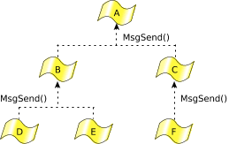
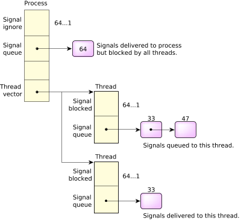
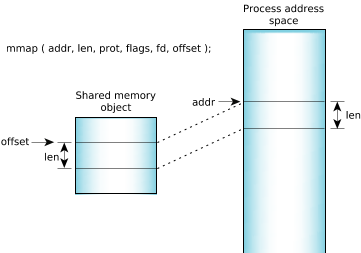

# QNX®  Neutrino 微内核

### 介绍

Interprocess Communication（IPC，进程间通信）在QNX Neutrino从一个嵌入式实时系统向一个全面的POSIX系统转变起着至关重要的作用。IPC是将在内核中提供各种服务的进程内聚在一起的粘合剂。在QNX中，消息传递是IPC的主要形式，也提供了其他的形式，除非有特殊的说明，否则这些形式也都是基于本地消息传递而实现的。

将更高级别的 IPC 服务（如通过我们的消息传递实现的管道和 FIFO）与其宏内核对应物进行比较的基准测试表明性能相当。

QNX Neutrino提供以下形式的IPC：

| Service:             | Implemented in:  |
| -------------------- | ---------------- |
| Message-passing      | Kernel           |
| Signals              | Kernel           |
| POSIX message queues | External process |
| Shared memory        | Process manager  |
| Pipes                | External process |
| FIFOs                | External process |

设计人员可以根据带宽要求，排队需求，网络透明度等选择这些服务。权衡可能很复杂，但灵活性很实用。

#### Synchronous message passing

一个线程调用`MsgSend()`往目标线程发送消息时会阻塞住，直到目标线程调用`MsgReceive()`，进行消息处理并调用`MsgReply()`回复后才会解除阻塞。
 在QNX Neutrino中，服务器线程通常是循环的，等待接收客户端发过来的消息。可以看看客户端线程和服务器线程在消息传递过程中的状态变化：

##### 客户端线程


> * 客户端线程调用`MsgSend()`后，如果服务器线程还没调用`MsgReceive()`，客户端线程状态则为`SEND blocked`，一旦服务器线程调用了`MsgReceive()`，客户端线程状态变为`REPLY blocked`，当服务器线程执行`MsgReply()`后，客户端线程状态就变成了`READY`；
>
> * 如果客户端线程调用`MsgSend()`后，而服务器线程正阻塞在`MsgReceive()`上， 则客户端线程状态直接跳过`SEND blocked`，直接变成`REPLY blocked`；
>
> * 当服务器线程失败、退出、或者消失了，客户端线程状态变成`READY`，此时`MsgSend()`会返回一个错误值。

##### 服务器线程


>* 服务器线程调用`MsgReceive()`时，当没有线程给它发送消息，它的状态为`RECEIVE blocked`，当有线程发送时变为`READY`；
>
>* 服务器线程调用`MsgReceive()`时，当已经有其他线程给它发送过消息，`MsgReceive()`会立马返回，而不会阻塞；
>
>* 服务器线程调用`MsgReply()`时，不会阻塞；

#### Message copying

QNX的消息服务，是直接将消息从一个线程的地址空间拷贝到另一个线程地址空间，不需要中间缓冲，因此消息传递的性能接近底层硬件的内存带宽。消息内容对内核来说没有特殊的意义，只对消息的发送和接收者才有意义，当然，QNX也提供了定义良好的消息类型，以便能扩充或替代系统提供的服务。
 消息在拷贝的时候，支持分块传输，也就是不要求连续的缓冲区，发送和接收线程可以指定向量表，在这个表中去指定消息在内存中的位置。这个与DMA的`scatter/gather`机制类似。


分块传输也用在文件系统中，比如读数据的时候，将文件系统缓存中的数据分块读到用户提供的空间内，如下图：


#### Simple messages

对于简单的单块消息传递，就不需要通过`IOV`(input/output vector)的形式了，直接指向缓冲区即可。对于发送和接收的接口，多块发送和单块发送如下：

在消息发送原语的情况下——它接受一个发送和一个回复缓冲区——这引入了四种变体:

| Function                                                     | Send message | Reply message |
| ------------------------------------------------------------ | ------------ | ------------- |
| [*MsgSend()*](http://www.qnx.com/developers/docs/7.1/com.qnx.doc.neutrino.lib_ref/topic/m/msgsend.html) | Simple       | Simple        |
| [*MsgSendsv()*](http://www.qnx.com/developers/docs/7.1/com.qnx.doc.neutrino.lib_ref/topic/m/msgsendsv.html) | Simple       | IOV           |
| [*MsgSendvs()*](http://www.qnx.com/developers/docs/7.1/com.qnx.doc.neutrino.lib_ref/topic/m/msgsendvs.html) | IOV          | Simple        |
| [*MsgSendv()*](http://www.qnx.com/developers/docs/7.1/com.qnx.doc.neutrino.lib_ref/topic/m/msgsendv.html) | IOV          | IOV           |

其他采用直接消息的消息传递原语只是在其名称中删除尾随的“v”：

| IOV                                                          | Simple direct                                                |
| ------------------------------------------------------------ | ------------------------------------------------------------ |
| [*MsgReceivev()*](http://www.qnx.com/developers/docs/7.1/com.qnx.doc.neutrino.lib_ref/topic/m/msgreceivev.html) | [*MsgReceive()*](http://www.qnx.com/developers/docs/7.1/com.qnx.doc.neutrino.lib_ref/topic/m/msgreceive.html) |
| [*MsgReceivePulsev()*](http://www.qnx.com/developers/docs/7.1/com.qnx.doc.neutrino.lib_ref/topic/m/msgreceivepulsev.html) | [*MsgReceivePulse()*](http://www.qnx.com/developers/docs/7.1/com.qnx.doc.neutrino.lib_ref/topic/m/msgreceivepulse.html) |
| [*MsgReplyv()*](http://www.qnx.com/developers/docs/7.1/com.qnx.doc.neutrino.lib_ref/topic/m/msgreplyv.html) | [*MsgReply()*](http://www.qnx.com/developers/docs/7.1/com.qnx.doc.neutrino.lib_ref/topic/m/msgreply.html) |
| [*MsgReadv()*](http://www.qnx.com/developers/docs/7.1/com.qnx.doc.neutrino.lib_ref/topic/m/msgreadv.html) | [*MsgRead()*](http://www.qnx.com/developers/docs/7.1/com.qnx.doc.neutrino.lib_ref/topic/m/msgread.html) |
| [*MsgWritev()*](http://www.qnx.com/developers/docs/7.1/com.qnx.doc.neutrino.lib_ref/topic/m/msgwritev.html) | [*MsgWrite()*](http://www.qnx.com/developers/docs/7.1/com.qnx.doc.neutrino.lib_ref/topic/m/msgwrite.html) |

#### Channels and connections

在QNX Neutrino中，消息传递是面向通道（channel）和连接（connection）的，而不是直接从线程到线程的。接收消息的线程需要创建一个`channel`，发送消息的线程需要与该`channel`建立`connection`。
 服务器使用`MsgReceive()`接收消息时需要使用`channels`，客户端则需要创建`connections`，以连接到服务器的通道上，连接建立好之后，客户端便可通过`MsgSend()`来发送消息了。如果进程中有很多线程都连接到一个通道上，为了提高效率，这些所有的连接都会映射到同一个内核对象中。在进程中，`channels`和`connecttions`会用一个小的整型标识符来标记。客户端`connections`会直接映射到文件描述符，在架构上这是一个关键点，可以消除另一层转换，不需要根据文件描述符来确定往哪里发消息，而是直接将消息发往文件描述符即可。

| Function                                                     | Description                              |
| ------------------------------------------------------------ | ---------------------------------------- |
| [*ChannelCreate()*](http://www.qnx.com/developers/docs/7.1/com.qnx.doc.neutrino.lib_ref/topic/c/channelcreate.html) | Create a channel to receive messages on. |
| [*ChannelDestroy()*](http://www.qnx.com/developers/docs/7.1/com.qnx.doc.neutrino.lib_ref/topic/c/channeldestroy.html) | Destroy a channel.                       |
| [*ConnectAttach()*](http://www.qnx.com/developers/docs/7.1/com.qnx.doc.neutrino.lib_ref/topic/c/connectattach.html) | Create a connection to send messages on. |
| [*ConnectDetach()*](http://www.qnx.com/developers/docs/7.1/com.qnx.doc.neutrino.lib_ref/topic/c/connectdetach.html) | Detach a connection.                     |


作为服务器的进程将实现一个事件循环来接收和处理消息，如下所示：

```c
chid = ChannelCreate(flags);
SETIOV(&iov, &msg, sizeof(msg));
for(;;) {
    rcv_id = MsgReceivev( chid, &iov, parts, &info );

    switch( msg.type ) {
        /* Perform message processing here */
        }

    MsgReplyv( rcv_id, &iov, rparts );
    }
```

有几个与`channel`有关联的列表：

>- Receive，等待消息的LIFO线程队列；
>- Send，已发送消息但还未被接收的优先级FIFO线程队列；
>- Reply， 已发送消息，并且已经被收到，但尚未回复的无序线程列表；
>   不管在上述哪个列表中，线程都是阻塞状态，多个线程和多个客户端可能等待在同一个`channel`上。


#### Pulses

除了同步发送/接收/回复服务外，QNX还支持固定大小的非阻塞消息，这种消息被称为`Pulse`，携带一个小的负载（四个字节数据，加一个字节的代码）。`Pulse`通常被用在中断处理函数中，用作通知机制；也允许服务器在不阻塞客户端的情况下，向客户端发送信号。


#### 优先级继承与消息

服务器进程按照优先级顺序来接收消息和脉冲，当服务器中的线程接收请求时，它们将继承发送线程的优先级。请求服务器工作的线程的优先级被保留，服务器工作将以适当的优先级执行，这种消息驱动的优先级继承避免了优先级反转的问题。

##### Message-passing API

| Function                                                     | Description                                                  |
| ------------------------------------------------------------ | ------------------------------------------------------------ |
| [*MsgSend()*](http://www.qnx.com/developers/docs/7.1/com.qnx.doc.neutrino.lib_ref/topic/m/msgsend.html) | Send a message and block until reply.                        |
| [*MsgReceive()*](http://www.qnx.com/developers/docs/7.1/com.qnx.doc.neutrino.lib_ref/topic/m/msgreceive.html) | Wait for a message.                                          |
| [*MsgReceivePulse()*](http://www.qnx.com/developers/docs/7.1/com.qnx.doc.neutrino.lib_ref/topic/m/msgreceivepulse.html) | Wait for a tiny, nonblocking message (pulse).                |
| [*MsgReply()*](http://www.qnx.com/developers/docs/7.1/com.qnx.doc.neutrino.lib_ref/topic/m/msgreply.html) | Reply to a message.                                          |
| [*MsgError()*](http://www.qnx.com/developers/docs/7.1/com.qnx.doc.neutrino.lib_ref/topic/m/msgerror.html) | Reply only with an error status. No message bytes are transferred. |
| [*MsgRead()*](http://www.qnx.com/developers/docs/7.1/com.qnx.doc.neutrino.lib_ref/topic/m/msgread.html) | Read additional data from a received message.                |
| [*MsgWrite()*](http://www.qnx.com/developers/docs/7.1/com.qnx.doc.neutrino.lib_ref/topic/m/msgwrite.html) | Write additional data to a reply message.                    |
| [*MsgInfo()*](http://www.qnx.com/developers/docs/7.1/com.qnx.doc.neutrino.lib_ref/topic/m/msginfo.html) | Obtain info on a received message.                           |
| [*MsgSendPulse()*](http://www.qnx.com/developers/docs/7.1/com.qnx.doc.neutrino.lib_ref/topic/m/msgsendpulse.html) | Send a tiny, nonblocking message (pulse).                    |
| [*MsgDeliverEvent()*](http://www.qnx.com/developers/docs/7.1/com.qnx.doc.neutrino.lib_ref/topic/m/msgdeliverevent.html) | Deliver an event to a client.                                |
| [*MsgKeyData()*](http://www.qnx.com/developers/docs/7.1/com.qnx.doc.neutrino.lib_ref/topic/m/msgkeydata.html) | Key a message to allow security checks.                      |

##### Robust implementations with Send/Receive/Reply

异步系统的一个重要问题是事件通知需要运行信号处理程序。异步IPC难以彻底对系统进行测试，此外也难以确保信号处理程序按预期的运行。基于`Send/Receive/Reply`构建的同步、非队列系统结构，可以让应用程序的架构更健壮。

在使用各种IPC机制时，避免死锁是一个难题，在QNX中只需要遵循两个原则，就可以构建无死锁系统：

> - 永远不要两个线程相互发送消息；
> - 将线程组织为层级结构，并只向上发送消息；



上层的线程可以通过`MsgSendPulse()`或`MsgDeliverEvent()`来传递非阻塞消息或事件：


#### Events

QNX Neutrino提供异步事件通知机制，事件源可能有三种：

>* 调用`MsgDeliverEvent()`接口发送事件
>
>* 中断处理函数
>
>* 定时器到期

事件本身可以有多种类型：`Pulse`、中断、各种形式的信号、强制解除阻塞的事件等。
 考虑到事件本身的多样性，服务器实现所有的异步通知显然不太合适，更好的方式是客户端提供一个数据结构或者`cookie`，服务器调用`MsgDeliverEvent()`时将事件类型写进`cookie`中。


`ionotify()`函数是客户端线程请求异步事件通知的一种方式，许多POSIX异步服务都基于这个之上来构建的，比如`mq_notify`和`select`等。

#### Signals

信号类似于软中断，QNX支持的信号如下：

| Signal range | Description                                           |
| ------------ | ----------------------------------------------------- |
| 1 ... 56     | 56 POSIX signals (including traditional UNIX signals) |
| 41 ... 56    | 16 POSIX realtime signals (SIGRTMIN to SIGRTMAX)      |
| 57 ... 64    | Eight special-purpose QNX Neutrino signals            |

QNX Neutrino扩展了信号传递机制，允许信号针对特定的线程，而不是简单的针对包含线程的进程。由于信号是异步事件，它们通过事件传递机制实现。接口如下：

| Microkernel call                                             | POSIX call                                                   | Description                                          |
| ------------------------------------------------------------ | ------------------------------------------------------------ | ---------------------------------------------------- |
| [*SignalKill()*](http://www.qnx.com/developers/docs/7.1/com.qnx.doc.neutrino.lib_ref/topic/s/signalkill.html) | [*kill()*](http://www.qnx.com/developers/docs/7.1/com.qnx.doc.neutrino.lib_ref/topic/k/kill.html), [*pthread_kill()*](http://www.qnx.com/developers/docs/7.1/com.qnx.doc.neutrino.lib_ref/topic/p/pthread_kill.html), [*raise()*](http://www.qnx.com/developers/docs/7.1/com.qnx.doc.neutrino.lib_ref/topic/r/raise.html), [*sigqueue()*](http://www.qnx.com/developers/docs/7.1/com.qnx.doc.neutrino.lib_ref/topic/s/sigqueue.html) | Set a signal on a process group, process, or thread. |
| [*SignalAction()*](http://www.qnx.com/developers/docs/7.1/com.qnx.doc.neutrino.lib_ref/topic/s/signalaction.html) | [*sigaction()*](http://www.qnx.com/developers/docs/7.1/com.qnx.doc.neutrino.lib_ref/topic/s/sigaction.html) | Define action to take on receipt of a signal.        |
| [*SignalProcmask()*](http://www.qnx.com/developers/docs/7.1/com.qnx.doc.neutrino.lib_ref/topic/s/signalprocmask.html) | [*sigprocmask()*](http://www.qnx.com/developers/docs/7.1/com.qnx.doc.neutrino.lib_ref/topic/s/sigprocmask.html), [*pthread_sigmask()*](http://www.qnx.com/developers/docs/7.1/com.qnx.doc.neutrino.lib_ref/topic/p/pthread_sigmask.html) | Change signal blocked mask of a thread.              |
| [*SignalSuspend()*](http://www.qnx.com/developers/docs/7.1/com.qnx.doc.neutrino.lib_ref/topic/s/signalsuspend.html) | [*sigsuspend()*](http://www.qnx.com/developers/docs/7.1/com.qnx.doc.neutrino.lib_ref/topic/s/sigsuspend.html), [*pause()*](http://www.qnx.com/developers/docs/7.1/com.qnx.doc.neutrino.lib_ref/topic/p/pause.html) | Block until a signal invokes a signal handler.       |
| [*SignalWaitinfo()*](http://www.qnx.com/developers/docs/7.1/com.qnx.doc.neutrino.lib_ref/topic/s/signalwaitinfo.html) | [*sigwaitinfo()*](http://www.qnx.com/developers/docs/7.1/com.qnx.doc.neutrino.lib_ref/topic/s/sigwaitinfo.html) | Wait for signal and return info on it.               |

最初的 POSIX 规范仅定义了对进程的信号操作。在多线程进程中，遵循以下规则：

>* 由 CPU 异常（例如 SIGSEGV、SIGBUS）引起的信号总是传递给引起异常的线程。
>* 信号动作保持在过程级别。如果线程为信号指定操作（例如，忽略或捕获它），则该操作会影响进程内的所有线程。
>* 信号掩码保持在线程级别。如果一个线程阻塞一个信号，阻塞只影响那个线程。
>* 针对某个线程的未忽略信号仅传递给该线程。
>* 针对进程的未忽略信号被传递到第一个没有阻塞信号的线程。如果所有线程都阻塞了该信号，则该信号将在进程上排队，直到任何线程忽略或解除该信号的阻塞。如果忽略，进程上的信号将被删除。如果解除阻塞，信号将从进程移动到解除阻塞的线程。

当信号针对具有大量线程的进程时，必须扫描线程表，寻找信号未阻塞的线程。 大多数多线程进程的标准做法是在所有线程中屏蔽信号，只有一个线程专用于处理它们。 为了提高进程信号传递的效率，内核将缓存接受信号的最后一个线程，并始终尝试首先将信号传递给它。



##### 信号概要

| Signal            | Description                                                  | Default action                                               |
| ----------------- | ------------------------------------------------------------ | ------------------------------------------------------------ |
| SIGABRT           | Abnormal termination, issued by functions such as [*abort()*](http://www.qnx.com/developers/docs/7.1/com.qnx.doc.neutrino.lib_ref/topic/a/abort.html) | Kill the process and write a dump file                       |
| SIGALRM           | Alarm clock, issued by functions such as [*alarm()*](http://www.qnx.com/developers/docs/7.1/com.qnx.doc.neutrino.lib_ref/topic/a/alarm.html) | Kill the process                                             |
| SIGBUS            | Bus error, or a memory parity error (a QNX Neutrino-specific interpretation). If a second fault occurs while your process is in a signal handler for this fault, the process is terminated. | Kill the process and write a dump file                       |
| SIGCHLD or SIGCLD | A child process terminated                                   | Ignore the signal, but still let the process's children become zombies |
| SIGCONT           | Continue the process. You can't block this signal.           | Make the process continue if it's STOPPED; otherwise ignore the signal |
| SIGDEADLK         | A mutex deadlock occurred. If a process dies while holding a non-robust mutex and no still-existing process has called [*SyncMutexEvent()*](http://www.qnx.com/developers/docs/7.1/com.qnx.doc.neutrino.lib_ref/topic/s/syncmutexevent.html) to set up an event to be delivered when the mutex owner dies, the kernel delivers a SIGDEADLK to all threads that are waiting on the mutex without a timeout. The kernel also delivers this signal if an event has been set up but its target is the same process that has died and this process didn't call [*procmgr_guardian()*](http://www.qnx.com/developers/docs/7.1/com.qnx.doc.neutrino.lib_ref/topic/p/procmgr_guardian.html) to designate another process as the new parent to its children. Note that it's up to any guardian process to revive the mutex by calling [*SyncMutexRevive()*](http://www.qnx.com/developers/docs/7.1/com.qnx.doc.neutrino.lib_ref/topic/s/syncmutexrevive.html), as the signal is not sent in this case.SIGDEADLK and SIGEMT refer to the same signal. Some utilities (e.g., [gdb](http://www.qnx.com/developers/docs/7.1/com.qnx.doc.neutrino.utilities/topic/g/gdb.html), [ksh](http://www.qnx.com/developers/docs/7.1/com.qnx.doc.neutrino.utilities/topic/k/ksh.html), [slay](http://www.qnx.com/developers/docs/7.1/com.qnx.doc.neutrino.utilities/topic/s/slay.html), and [kill](http://www.qnx.com/developers/docs/7.1/com.qnx.doc.neutrino.utilities/topic/k/kill.html)) know about SIGEMT, but not SIGDEADLK. | Kill the process and write a dump file                       |
| SIGEMT            | EMT instruction (emulation trap)SIGDEADLK and SIGEMT refer to the same signal. Some utilities (e.g., [gdb](http://www.qnx.com/developers/docs/7.1/com.qnx.doc.neutrino.utilities/topic/g/gdb.html), [ksh](http://www.qnx.com/developers/docs/7.1/com.qnx.doc.neutrino.utilities/topic/k/ksh.html), [slay](http://www.qnx.com/developers/docs/7.1/com.qnx.doc.neutrino.utilities/topic/s/slay.html), and [kill](http://www.qnx.com/developers/docs/7.1/com.qnx.doc.neutrino.utilities/topic/k/kill.html)) know about SIGEMT, but not SIGDEADLK. | Kill the process and write a dump file                       |
| SIGFPE            | Floating point exception                                     | Kill the process and write a dump file                       |
| SIGHUP            | Hangup; the session leader died, or the controlling terminal closed | Kill the process                                             |
| SIGILLa           | Illegal hardware instruction. If a second fault occurs while your thread is in a signal handler for this fault, the process is terminated. | Kill the process and write a dump file                       |
| SIGINT            | Interrupt; typically generated when you press **Ctrl**–**C** or **Ctrl**–**Break** (you can change this with [stty](http://www.qnx.com/developers/docs/7.1/com.qnx.doc.neutrino.utilities/topic/s/stty.html)) | Kill the process                                             |
| SIGIO             | Asynchronous I/O                                             | Ignore the signal                                            |
| SIGIOT            | I/O trap; a synonym for SIGABRT                              | Kill the process                                             |
| SIGKILL           | Kill. You can't block or catch this signal.                  | Kill the process                                             |
| SIGPIPE           | Write on pipe with no reader                                 | Kill the process                                             |
| SIGPOLL           | System V name for SIGIO                                      | Ignore the signal                                            |
| SIGPROF           | Profiling timer expired. POSIX has marked this signal as obsolescent; QNX Neutrino doesn't support profiling timers or send this signal. | Kill the process                                             |
| SIGPWR            | Power failure                                                | Ignore the signal                                            |
| SIGQUIT           | Quit; typically generated when you press **Ctrl**–**\** (you can change this with [stty](http://www.qnx.com/developers/docs/7.1/com.qnx.doc.neutrino.utilities/topic/s/stty.html)) | Kill the process and write a dump file                       |
| SIGSEGV           | Segmentation violation; an invalid memory reference was detected. If a second fault occurs while your process is in a signal handler for this fault, the process will be terminated. | Kill the process and write a dump file                       |
| SIGSTOP           | Stop the process. You can't block or catch this signal.      | Stop the process                                             |
| SIGSYS            | Bad argument to system call                                  | Kill the process and write a dump file                       |
| SIGTERM           | Termination signal                                           | Kill the process                                             |
| SIGTRAP           | Trace trap                                                   | Kill the process and write a dump file                       |
| SIGTSTP           | Stop signal from tty; typically generated when you press **Ctrl**–**Z** (you can change this with [stty](http://www.qnx.com/developers/docs/7.1/com.qnx.doc.neutrino.utilities/topic/s/stty.html)) | Stop the process                                             |
| SIGTTIN           | Background read attempted from control terminal              | Stop the process                                             |
| SIGTTOU           | Background write attempted to control terminal               | Stop the process                                             |
| SIGURG            | Urgent condition on I/O channel                              | Ignore the signal                                            |
| SIGUSR1           | User-defined signal 1                                        | Kill the process                                             |
| SIGUSR2           | User-defined signal 2                                        | Kill the process                                             |
| SIGVTALRM         | Virtual timer expired. POSIX has marked this signal as obsolescent; QNX Neutrino doesn't support virtual timers or send this signal. | Kill the process                                             |
| SIGWINCH          | The size of the terminal window changed                      | Ignore the signal                                            |
| SIGXCPU           | Soft CPU time limit exceeded see the RLIMIT_CPU resource for [*setrlimit()*](http://www.qnx.com/developers/docs/7.1/com.qnx.doc.neutrino.lib_ref/topic/s/setrlimit.html)) | Kill the process and write a dump file                       |


当一个服务器线程想通知一个客户端线程时，有两种合理的事件选择：`Pulse`或信号

> - `Pulse`，需要客户端创建一个`channel`，并且调用`MsgReceive()`接收；
> - 信号，只需要调用`sigwaitinfo()`，不需要创建`channel`；


#### POSIX message queues

POSIX通过`message queues`定义一组非阻塞的消息传递机制。消息队列为命名对象，针对这些对象可以进行读取和写入，作为离散消息的优先级队列，消息队列具有比管道更多的结构，为应用程序提供了更多的通信控制。QNX Neutrino内核不包含`message queues`，它的实现在内核之外。
 QNX Neutrino提供了两种`message queues`的实现：

>- mqueue，使用mqueue资源管理的传统实现
>- mq，使用mq服务和非同步消息的替代实现

QNX消息机制与POSIX的`Message queues`有一个根本的区别：，QNX的消息机制通过内存拷贝来实现消息的传递；而POSIX的消息队列通过将消息进行存取来实现消息的传递。QNX的消息机制比POSIX的消息队列效率更高，但有时为了POSIX的灵活，需要适当的牺牲一点效率。

消息队列与文件类似，操作的接口相近。

| Function                                                     | Description                                                  |
| ------------------------------------------------------------ | ------------------------------------------------------------ |
| [*mq_open()*](http://www.qnx.com/developers/docs/7.1/com.qnx.doc.neutrino.lib_ref/topic/m/mq_open.html) | Open a message queue                                         |
| [*mq_close()*](http://www.qnx.com/developers/docs/7.1/com.qnx.doc.neutrino.lib_ref/topic/m/mq_close.html) | Close a message queue                                        |
| [*mq_unlink()*](http://www.qnx.com/developers/docs/7.1/com.qnx.doc.neutrino.lib_ref/topic/m/mq_unlink.html) | Remove a message queue                                       |
| [*mq_send()*](http://www.qnx.com/developers/docs/7.1/com.qnx.doc.neutrino.lib_ref/topic/m/mq_send.html) | Add a message to the message queue                           |
| [*mq_receive()*](http://www.qnx.com/developers/docs/7.1/com.qnx.doc.neutrino.lib_ref/topic/m/mq_receive.html) | Receive a message from the message queue                     |
| [*mq_notify()*](http://www.qnx.com/developers/docs/7.1/com.qnx.doc.neutrino.lib_ref/topic/m/mq_notify.html) | Tell the calling process that a message is available on a message queue |
| [*mq_setattr()*](http://www.qnx.com/developers/docs/7.1/com.qnx.doc.neutrino.lib_ref/topic/m/mq_setattr.html) | Set message queue attributes                                 |
| [*mq_getattr()*](http://www.qnx.com/developers/docs/7.1/com.qnx.doc.neutrino.lib_ref/topic/m/mq_getattr.html) | Get message queue attributes                                 |


#### Shared memory

共享内存提供了最高带宽的IPC机制，一旦创建了共享内存对象，访问对象的进程可以使用指针直接对其进行读写操作。共享内存本身是不同步的，需要结合同步原语一起使用，信号量和互斥锁都适合与共享内存一块使用，信号量一般用于进程之间的同步，而互斥锁通常用于线程之间的同步，通通常来说互斥锁的效率会比信号量要高。

共享内存与消息传递结合起来的IPC机制，可以提供以下特点：

> - 非常高的性能（共享内存）
> - 同步（消息传递）
> - 跨网络传递（消息传递）

QNX中消息传递通过拷贝完成，当消息较大时，可以通过共享内存来完成，发送消息时不需要发送整个消息内容，只需将消息保存到共享内存中，并将地址传递过去即可。

| Function                                                     | Description                                                  | Classification |
| ------------------------------------------------------------ | ------------------------------------------------------------ | -------------- |
| [*shm_open()*](http://www.qnx.com/developers/docs/7.1/com.qnx.doc.neutrino.lib_ref/topic/s/shm_open.html) | Open (or create) a shared memory region.                     | POSIX          |
| [*close()*](http://www.qnx.com/developers/docs/7.1/com.qnx.doc.neutrino.lib_ref/topic/c/close.html) | Close a shared memory region.                                | POSIX          |
| [*mmap()*](http://www.qnx.com/developers/docs/7.1/com.qnx.doc.neutrino.lib_ref/topic/m/mmap.html) | Map a shared memory region into a process's address space.   | POSIX          |
| [*munmap()*](http://www.qnx.com/developers/docs/7.1/com.qnx.doc.neutrino.lib_ref/topic/m/munmap.html) | Unmap a shared memory region from a process's address space. | POSIX          |
| [*munmap_flags()*](http://www.qnx.com/developers/docs/7.1/com.qnx.doc.neutrino.lib_ref/topic/m/munmap_flags.html) | Unmap previously mapped addresses, exercising more control than possible with *munmap()* | QNX Neutrino   |
| [*mprotect()*](http://www.qnx.com/developers/docs/7.1/com.qnx.doc.neutrino.lib_ref/topic/m/mprotect.html) | Change protections on a shared memory region.                | POSIX          |
| [*msync()*](http://www.qnx.com/developers/docs/7.1/com.qnx.doc.neutrino.lib_ref/topic/m/msync.html) | Synchronize memory with physical storage.                    | POSIX          |
| [*shm_ctl()*](http://www.qnx.com/developers/docs/7.1/com.qnx.doc.neutrino.lib_ref/topic/s/shm_ctl.html), [*shm_ctl_special()*](http://www.qnx.com/developers/docs/7.1/com.qnx.doc.neutrino.lib_ref/topic/s/shm_ctl.html) | Give special attributes to a shared memory object.           | QNX Neutrino   |
| [*shm_unlink()*](http://www.qnx.com/developers/docs/7.1/com.qnx.doc.neutrino.lib_ref/topic/s/shm_unlink.html) | Remove a shared memory region.                               | POSIX          |

通常会使用mmap来将共享内存区域映射到进程地址空间中来，如下图所示：



```c
void * mmap( void *where_i_want_it,
             size_t length,
             int memory_protections,
             int mapping_flags,
             int fd,
             off_t offset_within_shared_memory );
```

mmap（）的返回值将是进程映射对象的地址空间中的地址。参数 where_i_want_it 用作系统提示您放置对象的位置。如果可能，该对象将被放置在所请求的地址。大多数应用程序指定的地址为零，这使系统可以自由地将对象放置在所需的位置。

可以为 memory_protections 指定以下保护类型：

| Manifest     | Description                  |
| ------------ | ---------------------------- |
| PROT_EXEC    | Memory may be executed.      |
| PROT_NOCACHE | Memory should not be cached. |
| PROT_NONE    | No access allowed.           |
| PROT_READ    | Memory may be read.          |
| PROT_WRITE   | Memory may be written.       |

当您使用共享内存区域访问可由硬件修改的双端口内存（例如，视频帧缓冲区或内存映射网络或通信板）时，应使用 PROT_NOCACHE 清单。如果没有此清单，处理器可能会从先前缓存的读取中返回“陈旧”数据。mapping_flags 确定内存的映射方式。

这些标志分为两部分-第一部分是类型，必须指定为以下之一：

| Map type    | Description                                                  |
| ----------- | ------------------------------------------------------------ |
| MAP_SHARED  | The mapping may be shared by many processes; changes are propagated back to the underlying object. |
| MAP_PRIVATE | The mapping is private to the calling process; changes *aren't* propagated back to the underlying object. The *mmap()* function allocates system RAM and makes a copy of the object. |

#### Typed memory

类型化内存是POSIX规范中定义的功能，它是高级实时扩展的一部分。
POSIX类型化内存，提供了一个接口来打开内存对象（以操作系统特定的方式定义），并对它们执行映射操作。这个对提供BSP/板级特定的地址布局与设备驱动或用户代码之间的抽象时非常有用。

POSIX 指定以特定于实现的方式创建和定义类型化内存池（或对象）。 在 QNX Neutrino 下，类型化内存对象是根据系统页面 asinfo 部分中指定的内存区域定义的。 因此，类型化内存对象直接映射到启动定义的地址空间层次结构（asinfo 段）。 类型化内存对象还继承了 asinfo 中定义的属性，即内存段的物理地址（或边界）。

一般来说，asinfo 条目的命名和属性是任意的，完全在用户的控制之下。 但是，有一些强制性条目：

> * **memory**  处理器的物理可寻址性，通常在 32 位 CPU 上为 4GB（物理寻址扩展更多）。
> * **ram** 系统上的所有 RAM。这可能包含多个条目。
> * **sysram** 系统 RAM，即分配给操作系统管理的内存。 这也可能由多个条目组成。 操作系统将此池用于系统上的所有通用内存分配，包括代码、数据、堆栈、堆、内核和进程管理器数据、共享内存对象和内存映射文件

您可以创建额外的条目，但只能在启动时使用  [*as_add()*](http://www.qnx.com/developers/docs/7.1/com.qnx.doc.neutrino.building/topic/startup_lib/as_add.html)  函数（参见构建嵌入式系统的“启动库”一章）。

#### Pipes and FIFOs

##### 管道（Pipes）

管道是一种非命名IO通道，用于在多个进程之间的通信，一个进程往管道写，其他进程从管道读取。管道一般用于平行的两个进程单向的传递数据，如果要双向通信的话，就应该使用消息传递了。

管道管理器负责缓冲数据。缓冲区大小在<limits.h>文件中定义为 PIPE_BUF。一旦两端都已关闭，就将其移除。函数 pathconf（）返回限制的值。管道通常在两个进程并行运行时使用，数据在一个方向上从一个进程移动到另一个进程。（如果需要双向通信，则应使用消息。）管道的典型应用是将一个程序的输出连接到另一个程序的输入。这种连接通常由 shell 完成。例如：

```shell
ls | more
```

| If you want to:                    | Use the:                                                     |
| ---------------------------------- | ------------------------------------------------------------ |
| Create pipes from within the shell | pipe symbol (“\|”)                                           |
| Create pipes from within programs  | [*pipe()*](http://www.qnx.com/developers/docs/7.1/com.qnx.doc.neutrino.lib_ref/topic/p/pipe.html) or [*popen()*](http://www.qnx.com/developers/docs/7.1/com.qnx.doc.neutrino.lib_ref/topic/p/popen.html) functions |

##### FIFOs

FIFOs与管道本质是一样的，不同点在于FIFOs会在文件系统中保存为一个永久的命名文件。

| If you want to:                    | Use the:                                                     |
| ---------------------------------- | ------------------------------------------------------------ |
| Create FIFOs from within the shell | [mkfifo](http://www.qnx.com/developers/docs/7.1/com.qnx.doc.neutrino.utilities/topic/m/mkfifo.html) utility |
| Create FIFOs from within programs  | [*mkfifo()*](http://www.qnx.com/developers/docs/7.1/com.qnx.doc.neutrino.lib_ref/topic/m/mkfifo.html) function |
| Remove FIFOs from within the shell | [rm](http://www.qnx.com/developers/docs/7.1/com.qnx.doc.neutrino.utilities/topic/r/rm.html) utility |
| Remove FIFOs from within programs  | [*remove()*](http://www.qnx.com/developers/docs/7.1/com.qnx.doc.neutrino.lib_ref/topic/r/remove.html) or [*unlink()*](http://www.qnx.com/developers/docs/7.1/com.qnx.doc.neutrino.lib_ref/topic/u/unlink.html) function |

参考文献：

[**System Architecture** - Interprocess Communication (IPC)](http://www.qnx.com/developers/docs/7.1/index.html#com.qnx.doc.neutrino.sys_arch/topic/ipc.html)