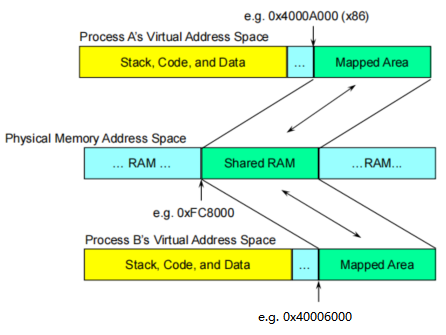

# QNX®  Neutrino 进程间通信编程之Shared Memory

## 介绍

Interprocess Communication（IPC，进程间通信）在QNX Neutrino从一个嵌入式实时系统向一个全面的POSIX系统转变起着至关重要的作用。IPC是将在内核中提供各种服务的进程内聚在一起的粘合剂。在QNX中，消息传递是IPC的主要形式，也提供了其他的形式，除非有特殊的说明，否则这些形式也都是基于本地消息传递而实现的。

将更高级别的 IPC 服务（如通过我们的消息传递实现的管道和 FIFO）与其宏内核对应物进行比较的基准测试表明性能相当。

QNX Neutrino提供以下形式的IPC：

| Service:             | Implemented in:     |
| -------------------- | ------------------- |
| Message-passing      | Kernel              |
| Pules                | Kernel              |
| Signals              | Kernel              |
| Event Delivery       | External process    |
| POSIX message queues | External process    |
| **Shared memory**    | **Process manager** |
| Pipes                | External process    |
| FIFOs                | External process    |

本篇幅介绍的是POSIX IPC Shared Memory。

## Shared memory

共享内存提供了最高带宽的IPC机制，一旦创建了共享内存对象，访问对象的进程可以使用指针直接对其进行读写操作。共享内存本身是不同步的，需要结合同步原语一起使用，信号量和互斥锁都适合与共享内存一块使用，信号量一般用于进程之间的同步，而互斥锁通常用于线程之间的同步，通通常来说互斥锁的效率会比信号量要高。

共享内存与消息传递结合起来的IPC机制，可以提供以下特点：

> - 非常高的性能（共享内存）
> - 同步（消息传递）
> - 跨网络传递（消息传递）

QNX中消息传递通过拷贝完成，当消息较大时，可以通过共享内存来完成，发送消息时不需要发送整个消息内容，只需将消息保存到共享内存中，并将地址传递过去即可。通常会使用mmap来将共享内存区域映射到进程地址空间中来，如下图所示：


进程中的线程之间自动共享内存。通过设置shared memory,同样的物理内存可以被多个进程访问。



共享内存建立流程：

```C
fd = shm_open( “/myname”, O_RDWR|O_CREAT, 0666 );
// 共享内存的名字必须是唯一的。
ftruncate( fd, SHARED_SIZE ); 
// 通过ftruncate分配共享内存对象大小，这个SHARED_SIZE将四舍五入为页面(4KB)大小的倍数。
ptr = mmap( NULL, SHARED_SIZE, PROT_READ|PROT_WRITE, MAP_SHARED, fd, 0 );
//mmap 将对应的物理地址空间映射出相应的虚拟地址空间，然后下一步并将其初始化。
close(fd); 
//你不在使用文件句柄的时候，你需要将它关闭
```

共享内存访问流程：

```C
fd = shm_open( “/myname”,O_RDWR );
//使用共享内存是，共享内存名必须一样。
ptr = mmap( NULL, SHARED_SIZE, PROT_READ|PROT_WRITE, MAP_SHARED, fd, 0 );
//如果对共享内存只读访问，那么不必使用PROT_WRITE属性。
//如果对共享内存模块子块进行访问，只需要将最后一个参数offset零替换成你对应子块的偏移，大小也需要做相应的调整。
close(fd); 
//你不在使用文件句柄的时候，你需要将它关闭
```

清除共享内存流程：

```C
// 每个句柄，mapping,共享内存名都是一个参考依据
// 可以明确关闭和取消映射
close(fd);
munmap( ptr, SHARED_SIZE );
// 在进程死亡时，所有 fds 都会自动关闭并且所有映射都未映射
// 必须明确删除名称：
shm_unlink( “/myname” );
// 在开发和测试期间，这可以从命令行手动完成：
rm /dev/shmem/myname
```

共享内存的问题：

>– readers不知道数据何时稳定
>– writers不知道什么时候写作是安全的

所以这样涉及到了同步的操作。

>* 共享内存区域中的线程同步对象
>  * 如果使用 sem_init()，则 pshared 参数必须非零
>  * 互斥体和条件变量需要 PTHREAD_PROCESS_SHARED 标志属性
>* 使用atomic_*() 函数来操作变量
>* IPC
>  * MsgSend()/MsgReceive()/MsgReply() 具有内置同步功能
>  * 使用共享内存避免大数据拷贝


Process进程间通过shared memory 通信同步策略:


## **POSIX共享内存API** 


| Function                                                     | Description                                                  | Classification |
| ------------------------------------------------------------ | ------------------------------------------------------------ | -------------- |
| [*shm_open()*](http://www.qnx.com/developers/docs/7.1/com.qnx.doc.neutrino.lib_ref/topic/s/shm_open.html) | Open (or create) a shared memory region.                     | POSIX          |
| [*close()*](http://www.qnx.com/developers/docs/7.1/com.qnx.doc.neutrino.lib_ref/topic/c/close.html) | Close a shared memory region.                                | POSIX          |
| [*mmap()*](http://www.qnx.com/developers/docs/7.1/com.qnx.doc.neutrino.lib_ref/topic/m/mmap.html) | Map a shared memory region into a process's address space.   | POSIX          |
| [*munmap()*](http://www.qnx.com/developers/docs/7.1/com.qnx.doc.neutrino.lib_ref/topic/m/munmap.html) | Unmap a shared memory region from a process's address space. | POSIX          |
| [*munmap_flags()*](http://www.qnx.com/developers/docs/7.1/com.qnx.doc.neutrino.lib_ref/topic/m/munmap_flags.html) | Unmap previously mapped addresses, exercising more control than possible with *munmap()* | QNX Neutrino   |
| [*mprotect()*](http://www.qnx.com/developers/docs/7.1/com.qnx.doc.neutrino.lib_ref/topic/m/mprotect.html) | Change protections on a shared memory region.                | POSIX          |
| [*msync()*](http://www.qnx.com/developers/docs/7.1/com.qnx.doc.neutrino.lib_ref/topic/m/msync.html) | Synchronize memory with physical storage.                    | POSIX          |
| [*shm_ctl()*](http://www.qnx.com/developers/docs/7.1/com.qnx.doc.neutrino.lib_ref/topic/s/shm_ctl.html), [*shm_ctl_special()*](http://www.qnx.com/developers/docs/7.1/com.qnx.doc.neutrino.lib_ref/topic/s/shm_ctl.html) | Give special attributes to a shared memory object.           | QNX Neutrino   |
| [*shm_unlink()*](http://www.qnx.com/developers/docs/7.1/com.qnx.doc.neutrino.lib_ref/topic/s/shm_unlink.html) | Remove a shared memory region.                               | POSIX          |

函数shm_open和shm_unlink非常类似于为普通文件所提供的open和unlink系统调用。如果要编写一个可移植的程序,那么shm_open和shm_unlink是最好的选择。

- **shm_open**:创建一个新的共享区域或者附加在已有的共享区域上.区域被其名字标识,函数返回各文件的描述符。

```cpp
#include <sys/mman.h>
#include <sys/stat.h>        /* For mode constants */
#include <fcntl.h>           /* For O_* constants */
int shm_open(const char *name, int oflag, mode_t mode);
```

>参数:
>
>  **name**: 共享内存名字;
>
>  **oflag**: 与open函数类型, 可以是O_RDONLY, O_WRONLY, O_RDWR, 还可以按位或上O_CREAT, O_EXCL, O_TRUNC.
>
>  **mode**: 此参数总是需要设置, 如果oflag没有指定O_CREAT, 则mode可以设置为0;
>
>返回值:
>
>  成功: 返回一个文件描述符;
>
>  失败: 返回-1;


- **ftruncate**:修改共享内存大小。

```cpp
int ftruncate(int fd, off_t length);
```

>参数:
>
>  **fd**:文件描述符
>
>  **length**:长度
>
>返回值:
>
>成功返回0,失败返回-1


- **shm_unlink**:类似于unlink系统调用对文件进行操作,直到所有的进程不再引用该内存区后才对其进行释放。

```cpp
int shm_unlink(const char *name);
```

>参数:
>
>  name:共享内存对象的名字
>
>返回值:
>
>  成功返回0,失败返回-1


- **mmap**:用于将一个文件映射到某一内存区中,其中也使用了shm_open函数返回的文件描述符。
- **munmap**:用于释放mmap所映射的内存区域。

```cpp
#include <sys/mman.h>
void * mmap( void *where_i_want_it,
             size_t length,
             int memory_protections,
             int mapping_flags,
             int fd,
             off_t offset_within_shared_memory );
int munmap(void *addr, size_t length);
```

>参数:
>
>  **where_i_want_it**: 要映射的起始地址, 通常指定为NULL, 让内核自动选择;
>
>  **length**: 映射到进程地址空间的字节数, 通常是先前已经创建的共享内存的大小;
>
>  **memory_protections**: 映射区保护方式(见下);
>
>mmap（）的返回值将是进程映射对象的地址空间中的地址。参数 where_i_want_it 用作系统提示您放置对象的位置。如果可能，该对象将被放置在所请求的地址。大多数应用程序指定的地址为零，这使系统可以自由地将对象放置在所需的位置。
>
>可以为 memory_protections 指定以下保护类型：
>
>- **PROT_EXEC**表示映射的内存页可执行
>- **PROT_READ**表示映射的内存可被读
>- **PROT_WRITE**表示映射的内存可被写
>- **PROT_NONE**表示映射的内存不可访问
>
>当您使用共享内存区域访问可由硬件修改的双端口内存（例如，视频帧缓冲区或内存映射网络或通信板）时，应使用 PROT_NOCACHE 清单。如果没有此清单，处理器可能会从先前缓存的读取中返回“陈旧”数据。
>
>  **mapping_flags**: 标志(通常指定为MAP_SHARED, 用于进程间通信);
>
>这些标志分为两部分-第一部分是类型，必须指定为以下之一：
>
>- **MAP_SHARED**表示共享这块映射的内存，读写这块内存相当于直接读写文件，这些操作对其他进程可见，由于OS对文件的读写都有缓存机制，所以实际上不会立即将更改写入文件，除非带哦用msync()或mumap()
>- **MAP_PRIVATE**表示创建一个私有的copy-on-write的映射， 更新映射区对其他映射到这个文件的进程是不可见的
>
>  **fd**: 文件描述符(填为shm_open返回的共享内存ID);
>
>  **offset_within_shared_memory**: 从文件头开始的偏移量(一般填为0);
>
>mmap返回值:
>
>  成功: 返回映射到的内存区的起始地址;
>
>  失败: 返回-1;


- **msync**:同步存取一个映射区域并将高速缓存的数据回写到物理内存中,以便其他进程可以监听这些改变。

```cpp
#include <sys/mman.h>
int msync(void *start, size_t length, int flags);
```

>**flags**值可为 MS_ASYNC,MS_SYNC,MS_INVALIDATE
>
>- MS_ASYNC的作用是，不管映射区是否更新，直接冲洗返回。
>- MS_SYNC的作用是，如果映射区更新了，则冲洗返回，如果映射区没有更新，则等待，知道更新完毕，就冲洗返回。
>- MS_INVALIDATE的作用是，丢弃映射区中和原文件相同的部分。

具体实例如下：


客户端进程代码如下：

```C
/*
 *
 *       client.c: Write strings for printing in POSIX shared memory object
 *                 
 */

#include <stdio.h>
#include <stdlib.h>
#include <sys/types.h>
#include <sys/stat.h>
#include <fcntl.h>
#include <string.h>
#include <time.h>
#include <unistd.h>
#include <semaphore.h>
#include <sys/mman.h>

// Buffer data structures
#define MAX_BUFFERS 10

#define LOGFILE "/tmp/example.log"

#define SEM_MUTEX_NAME "/sem-mutex"
#define SEM_BUFFER_COUNT_NAME "/sem-buffer-count"
#define SEM_SPOOL_SIGNAL_NAME "/sem-spool-signal"
#define SHARED_MEM_NAME "/posix-shared-mem-example"

struct shared_memory {
    char buf [MAX_BUFFERS] [256];
    int buffer_index;
    int buffer_print_index;
};

void error (char *msg);

int main (int argc, char **argv)
{
    struct shared_memory *shared_mem_ptr;
    sem_t *mutex_sem, *buffer_count_sem, *spool_signal_sem;
    int fd_shm;
    char mybuf [256];
    
    //  mutual exclusion semaphore, mutex_sem 
    if ((mutex_sem = sem_open (SEM_MUTEX_NAME, 0, 0, 0)) == SEM_FAILED)
        error ("sem_open");
    
    // Get shared memory 
    if ((fd_shm = shm_open (SHARED_MEM_NAME, O_RDWR, 0)) == -1)
        error ("shm_open");

    if ((shared_mem_ptr = mmap (NULL, sizeof (struct shared_memory), PROT_READ | PROT_WRITE, MAP_SHARED,
            fd_shm, 0)) == MAP_FAILED)
       error ("mmap");

    // counting semaphore, indicating the number of available buffers.
    if ((buffer_count_sem = sem_open (SEM_BUFFER_COUNT_NAME, 0, 0, 0)) == SEM_FAILED)
        error ("sem_open");

    // counting semaphore, indicating the number of strings to be printed. Initial value = 0
    if ((spool_signal_sem = sem_open (SEM_SPOOL_SIGNAL_NAME, 0, 0, 0)) == SEM_FAILED)
        error ("sem_open");

    char buf [200], *cp;

    printf ("Please type a message: ");

    while (fgets (buf, 198, stdin)) {
        // remove newline from string
        int length = strlen (buf);
        if (buf [length - 1] == '\n')
           buf [length - 1] = '\0';

        // get a buffer: P (buffer_count_sem);
        if (sem_wait (buffer_count_sem) == -1)
            error ("sem_wait: buffer_count_sem");
    
        /* There might be multiple producers. We must ensure that 
            only one producer uses buffer_index at a time.  */
        // P (mutex_sem);
        if (sem_wait (mutex_sem) == -1)
            error ("sem_wait: mutex_sem");

	    // Critical section
            time_t now = time (NULL);
            cp = ctime (&now);
            int len = strlen (cp);
            if (*(cp + len -1) == '\n')
                *(cp + len -1) = '\0';
            sprintf (shared_mem_ptr -> buf [shared_mem_ptr -> buffer_index], "%d: %s %s\n", getpid (), 
                     cp, buf);
            (shared_mem_ptr -> buffer_index)++;
            if (shared_mem_ptr -> buffer_index == MAX_BUFFERS)
                shared_mem_ptr -> buffer_index = 0;

        // Release mutex sem: V (mutex_sem)
        if (sem_post (mutex_sem) == -1)
            error ("sem_post: mutex_sem");
    
	// Tell spooler that there is a string to print: V (spool_signal_sem);
        if (sem_post (spool_signal_sem) == -1)
            error ("sem_post: (spool_signal_sem");

        printf ("Please type a message: ");
    }
 
    if (munmap (shared_mem_ptr, sizeof (struct shared_memory)) == -1)
        error ("munmap");
    exit (0);
}

// Print system error and exit
void error (char *msg)
{
    perror (msg);
    exit (1);
}
```

服务器端进程代码如下：

```C
/*
 *
 *       logger.c: Write strings in POSIX shared memory to file
 *                 (Server process)
 */

#include <stdio.h>
#include <stdlib.h>
#include <sys/types.h>
#include <sys/stat.h>
#include <fcntl.h>
#include <string.h>
#include <unistd.h>
#include <semaphore.h>
#include <sys/mman.h>

// Buffer data structures
#define MAX_BUFFERS 10

#define LOGFILE "/tmp/example.log"

#define SEM_MUTEX_NAME "/sem-mutex"
#define SEM_BUFFER_COUNT_NAME "/sem-buffer-count"
#define SEM_SPOOL_SIGNAL_NAME "/sem-spool-signal"
#define SHARED_MEM_NAME "/posix-shared-mem-example"

struct shared_memory {
    char buf [MAX_BUFFERS] [256];
    int buffer_index;
    int buffer_print_index;
};

void error (char *msg);

int main (int argc, char **argv)
{
    struct shared_memory *shared_mem_ptr;
    sem_t *mutex_sem, *buffer_count_sem, *spool_signal_sem;
    int fd_shm, fd_log;
    char mybuf [256];
    
    // Open log file
    if ((fd_log = open (LOGFILE, O_CREAT | O_WRONLY | O_APPEND | O_SYNC, 0666)) == -1)
        error ("fopen");

    //  mutual exclusion semaphore, mutex_sem with an initial value 0.
    if ((mutex_sem = sem_open (SEM_MUTEX_NAME, O_CREAT, 0660, 0)) == SEM_FAILED)
        error ("sem_open");
    
    // Get shared memory 
    if ((fd_shm = shm_open (SHARED_MEM_NAME, O_RDWR | O_CREAT, 0660)) == -1)
        error ("shm_open");

    if (ftruncate (fd_shm, sizeof (struct shared_memory)) == -1)
       error ("ftruncate");
    
    if ((shared_mem_ptr = mmap (NULL, sizeof (struct shared_memory), PROT_READ | PROT_WRITE, MAP_SHARED,
            fd_shm, 0)) == MAP_FAILED)
       error ("mmap");
    // Initialize the shared memory
    shared_mem_ptr -> buffer_index = shared_mem_ptr -> buffer_print_index = 0;

    // counting semaphore, indicating the number of available buffers. Initial value = MAX_BUFFERS
    if ((buffer_count_sem = sem_open (SEM_BUFFER_COUNT_NAME, O_CREAT, 0660, MAX_BUFFERS)) == SEM_FAILED)
        error ("sem_open");

    // counting semaphore, indicating the number of strings to be printed. Initial value = 0
    if ((spool_signal_sem = sem_open (SEM_SPOOL_SIGNAL_NAME, O_CREAT, 0660, 0)) == SEM_FAILED)
        error ("sem_open");

    // Initialization complete; now we can set mutex semaphore as 1 to 
    // indicate shared memory segment is available
    if (sem_post (mutex_sem) == -1)
        error ("sem_post: mutex_sem");
    
    while (1) {  // forever
        // Is there a string to print? P (spool_signal_sem);
        if (sem_wait (spool_signal_sem) == -1)
            error ("sem_wait: spool_signal_sem");
    
        strcpy (mybuf, shared_mem_ptr -> buf [shared_mem_ptr -> buffer_print_index]);

        /* Since there is only one process (the logger) using the 
           buffer_print_index, mutex semaphore is not necessary */
        (shared_mem_ptr -> buffer_print_index)++;
        if (shared_mem_ptr -> buffer_print_index == MAX_BUFFERS)
           shared_mem_ptr -> buffer_print_index = 0;

        /* Contents of one buffer has been printed.
           One more buffer is available for use by producers.
           Release buffer: V (buffer_count_sem);  */
        if (sem_post (buffer_count_sem) == -1)
            error ("sem_post: buffer_count_sem");
        
        // write the string to file
        if (write (fd_log, mybuf, strlen (mybuf)) != strlen (mybuf))
            error ("write: logfile");
    }
}

// Print system error and exit
void error (char *msg)
{
    perror (msg);
    exit (1);
}
```

客户端和服务器端编译命令和输出结果如下：

```shell
gcc -pthread client.c -lrt -o client
gcc -pthread server.c -lrt -o server
# 服务器进程加载
bspserver@ubuntu:~/workspace/posix_share_memory$ ./server

# 客户进程 A 
bspserver@ubuntu:~/workspace/posix_share_memory$ ./client
Please type a message: Fuck U~ Client A

# 客户进程 B 
bspserver@ubuntu:~/workspace/posix_share_memory$ ./client
Please type a message: I Love U! Client B

# 客户进程 C
bspserver@ubuntu:~/workspace/posix_share_memory$ ./client
Please type a message: Hello World! Client C

#在/tmp/目录下查询example.log日志
bspserver@ubuntu:~/workspace/posix_share_memory$cat /tmp/example.log
2785: Fri Dec 17 02:02:11 2021 Hello World! Client C
2695: Fri Dec 17 02:02:40 2021 I Love U! Client B
2788: Fri Dec 17 02:04:40 2021 Fuck U~ Client A

```


参考文献：

[Programming with POSIX Threads](https://download.csdn.net/download/janesshang/10910991)

