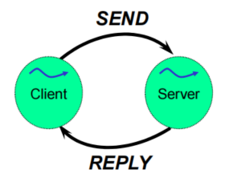
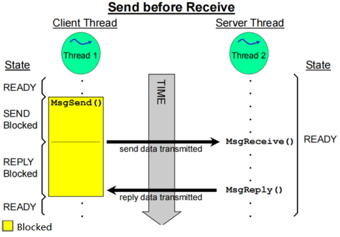
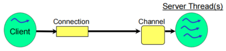
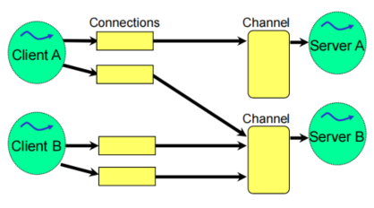
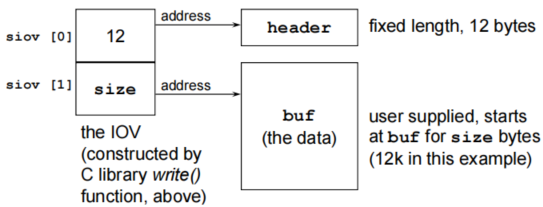
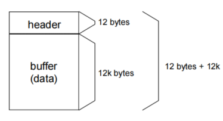
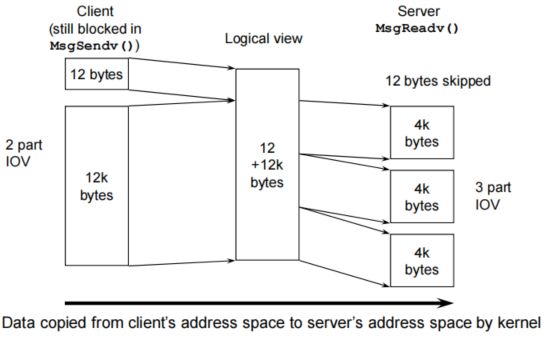

# QNX®  Neutrino 进程间通信编程之Message-passing/Pules

### 介绍

Interprocess Communication（IPC，进程间通信）在QNX Neutrino从一个嵌入式实时系统向一个全面的POSIX系统转变起着至关重要的作用。IPC是将在内核中提供各种服务的进程内聚在一起的粘合剂。在QNX中，消息传递是IPC的主要形式，也提供了其他的形式，除非有特殊的说明，否则这些形式也都是基于本地消息传递而实现的。

将更高级别的 IPC 服务（如通过我们的消息传递实现的管道和 FIFO）与其宏内核对应物进行比较的基准测试表明性能相当。

QNX Neutrino提供以下形式的IPC：

| Service:             | Implemented in:  |
| -------------------- | ---------------- |
| Message-passing      | Kernel           |
| Pules                | Kernel           |
| Signals              | Kernel           |
| POSIX message queues | External process |
| Shared memory        | Process manager  |
| Pipes                | External process |
| FIFOs                | External process |

设计人员可以根据带宽要求，排队需求，网络透明度等选择这些服务。权衡可能很复杂，但灵活性很实用。

### **Message-passing**

比较传统的IPC方式是基于主从式构架（client-server），并且是双向通信。




再仔细来看的话，就是每一个process里面都有一个thread来负责通信。当一个线程在等待回信的时候，就会傻傻的等待，什么都不做了。直到收到回复信息。

**客户端线程**


> * 客户端线程调用`MsgSend()`后，如果服务器线程还没调用`MsgReceive()`，客户端线程状态则为`SEND blocked`，一旦服务器线程调用了`MsgReceive()`，客户端线程状态变为`REPLY blocked`，当服务器线程执行`MsgReply()`后，客户端线程状态就变成了`READY`；
>
> * 如果客户端线程调用`MsgSend()`后，而服务器线程正阻塞在`MsgReceive()`上， 则客户端线程状态直接跳过`SEND blocked`，直接变成`REPLY blocked`；
>
> * 当服务器线程失败、退出、或者消失了，客户端线程状态变成`READY`，此时`MsgSend()`会返回一个错误值。

**服务器线程**


>* 服务器线程调用`MsgReceive()`时，当没有线程给它发送消息，它的状态为`RECEIVE blocked`，当有线程发送时变为`READY`；
>
>* 服务器线程调用`MsgReceive()`时，当已经有其他线程给它发送过消息，`MsgReceive()`会立马返回，而不会阻塞；
>
>* 服务器线程调用`MsgReply()`时，不会阻塞；

客户端线程和服务器线程在时间主线里显示如下：


下面列出两种场景**Receive before Send**和**Send before Receive**

服务器线程MsgReceive发生在客户线程MsgSend之前


客户线程MsgSend发生在服务器线程MsgReceive之前



由上面两个场景看客户线程MsgSend和服务器线程MsgReceive直接影响Message-passing性能。


Servers收到信息在通道上，Clients通过connection连接上channel，来发送信息。



一个进程可以有多个connections连接到另一个进程的channel上，是个多对一的关系。



**Message-passing编程流程如下**

>– Server:
>
>• creates a channel (***ChannelCreate**()*)
>
>• waits for a message (***MsgReceive**()*)
>
>• performs processing
>
>• sends reply (***MsgReply**()*)
>
>• goes back for more -> waits for a message (***MsgReceive**()*)
>
>– Client:
>
>• attaches to channel (***ConnectAttach**()*)
>
>• sends message (***MsgSend**()*)
>
>• processes reply

**函数原型**

```C
int ChannelCreate( unsigned flags );
int ChannelDestroy( int chid );
int name_open( const char * name, int flags );
int name_close( int coid );

int ConnectAttach( uint32_t nd, pid_t pid, int chid, unsigned index, int flags );
int ConnectDetach( int coid );
name_attach_t * name_attach( dispatch_t * dpp, const char * path, unsigned flags );
int name_detach( name_attach_t * attach, unsigned flags );

long MsgSend( int coid, const void* smsg, size_t sbytes, void* rmsg, size_t rbytes );
int MsgReceive( int chid, void * msg, size_t bytes, struct _msg_info * info );
int MsgReply( int rcvid, long status, const void* msg, size_t bytes );

ssize_t MsgWrite( int rcvid, const void* msg, size_t size, size_t offset );
ssize_t MsgRead( int rcvid,  void* msg, size_t bytes,  size_t offset );
```

详细命令使用请看以下命令链接：

Message-passing API

| Function                                                     | Description                                                  |
| ------------------------------------------------------------ | ------------------------------------------------------------ |
| [*ChannelCreate()*](https://www.oschina.net/action/GoToLink?url=http%3A%2F%2Fwww.qnx.com%2Fdevelopers%2Fdocs%2F7.1%2Fcom.qnx.doc.neutrino.lib_ref%2Ftopic%2Fc%2Fchannelcreate.html) | Create a channel to receive messages on.                     |
|                                                              |                                                              |
| [*ChannelDestroy()*](https://www.oschina.net/action/GoToLink?url=http%3A%2F%2Fwww.qnx.com%2Fdevelopers%2Fdocs%2F7.1%2Fcom.qnx.doc.neutrino.lib_ref%2Ftopic%2Fc%2Fchanneldestroy.html) | Destroy a channel.                                           |
| [*ConnectAttach()*](https://www.oschina.net/action/GoToLink?url=http%3A%2F%2Fwww.qnx.com%2Fdevelopers%2Fdocs%2F7.1%2Fcom.qnx.doc.neutrino.lib_ref%2Ftopic%2Fc%2Fconnectattach.html) | Create a connection to send messages on.                     |
| [*ConnectDetach()*](https://www.oschina.net/action/GoToLink?url=http%3A%2F%2Fwww.qnx.com%2Fdevelopers%2Fdocs%2F7.1%2Fcom.qnx.doc.neutrino.lib_ref%2Ftopic%2Fc%2Fconnectdetach.html) | Detach a connection.                                         |
| [name_open()](http://www.qnx.com/developers/docs/7.1/com.qnx.doc.neutrino.lib_ref/topic/n/name_open.html) | Open a name to connect to a server                           |
| [name_close()](http://www.qnx.com/developers/docs/7.1/com.qnx.doc.neutrino.lib_ref/topic/n/name_close.html) | Close a server connection that was opened by **name_open()** |
| [name_attach()](http://www.qnx.com/developers/docs/7.1/com.qnx.doc.neutrino.lib_ref/topic/n/name_attach.html) | Register a name in the pathname space and create a channel   |
| [name_detach()](http://www.qnx.com/developers/docs/7.1/com.qnx.doc.neutrino.lib_ref/topic/n/name_detach.html) | Remove a name from the namespace and destroy the channel     |
| [*MsgSend()*](https://www.oschina.net/action/GoToLink?url=http%3A%2F%2Fwww.qnx.com%2Fdevelopers%2Fdocs%2F7.1%2Fcom.qnx.doc.neutrino.lib_ref%2Ftopic%2Fm%2Fmsgsend.html) | Send a message and block until reply.                        |
| [MsgSendv()](http://www.qnx.com/developers/docs/7.1/index.html#com.qnx.doc.neutrino.lib_ref/topic/m/msgsendv.html) | Send a message to a channel                                  |
| [*MsgReceive()*](https://www.oschina.net/action/GoToLink?url=http%3A%2F%2Fwww.qnx.com%2Fdevelopers%2Fdocs%2F7.1%2Fcom.qnx.doc.neutrino.lib_ref%2Ftopic%2Fm%2Fmsgreceive.html) | Wait for a message.                                          |
| [MsgReceivev()](http://www.qnx.com/developers/docs/7.1/index.html#com.qnx.doc.neutrino.lib_ref/topic/m/msgreceivev.html) | Wait for a message or pulse on a channel                     |
| [*MsgReceivePulse()*](https://www.oschina.net/action/GoToLink?url=http%3A%2F%2Fwww.qnx.com%2Fdevelopers%2Fdocs%2F7.1%2Fcom.qnx.doc.neutrino.lib_ref%2Ftopic%2Fm%2Fmsgreceivepulse.html) | Wait for a tiny, nonblocking message (pulse).                |
| [*MsgReply()*](https://www.oschina.net/action/GoToLink?url=http%3A%2F%2Fwww.qnx.com%2Fdevelopers%2Fdocs%2F7.1%2Fcom.qnx.doc.neutrino.lib_ref%2Ftopic%2Fm%2Fmsgreply.html) | Reply to a message.                                          |
| [*MsgError()*](https://www.oschina.net/action/GoToLink?url=http%3A%2F%2Fwww.qnx.com%2Fdevelopers%2Fdocs%2F7.1%2Fcom.qnx.doc.neutrino.lib_ref%2Ftopic%2Fm%2Fmsgerror.html) | Reply only with an error status. No message bytes are transferred. |
| [*MsgRead()*](https://www.oschina.net/action/GoToLink?url=http%3A%2F%2Fwww.qnx.com%2Fdevelopers%2Fdocs%2F7.1%2Fcom.qnx.doc.neutrino.lib_ref%2Ftopic%2Fm%2Fmsgread.html) | Read additional data from a received message.                |
| [MsgReadv()](http://www.qnx.com/developers/docs/7.1/index.html#com.qnx.doc.neutrino.lib_ref/topic/m/msgreadv.html) | Read data from a message                                     |
| [*MsgWrite()*](https://www.oschina.net/action/GoToLink?url=http%3A%2F%2Fwww.qnx.com%2Fdevelopers%2Fdocs%2F7.1%2Fcom.qnx.doc.neutrino.lib_ref%2Ftopic%2Fm%2Fmsgwrite.html) | Write additional data to a reply message.                    |
| [MsgWritev()](http://www.qnx.com/developers/docs/7.1/index.html#com.qnx.doc.neutrino.lib_ref/topic/m/msgwritev.html) | Write a reply message                                        |
| [*MsgInfo()*](https://www.oschina.net/action/GoToLink?url=http%3A%2F%2Fwww.qnx.com%2Fdevelopers%2Fdocs%2F7.1%2Fcom.qnx.doc.neutrino.lib_ref%2Ftopic%2Fm%2Fmsginfo.html) | Obtain info on a received message.                           |
| [*MsgSendPulse()*](https://www.oschina.net/action/GoToLink?url=http%3A%2F%2Fwww.qnx.com%2Fdevelopers%2Fdocs%2F7.1%2Fcom.qnx.doc.neutrino.lib_ref%2Ftopic%2Fm%2Fmsgsendpulse.html) | Send a tiny, nonblocking message (pulse).                    |
| [*MsgDeliverEvent()*](https://www.oschina.net/action/GoToLink?url=http%3A%2F%2Fwww.qnx.com%2Fdevelopers%2Fdocs%2F7.1%2Fcom.qnx.doc.neutrino.lib_ref%2Ftopic%2Fm%2Fmsgdeliverevent.html) | Deliver an event to a client.                                |
| [*MsgKeyData()*](https://www.oschina.net/action/GoToLink?url=http%3A%2F%2Fwww.qnx.com%2Fdevelopers%2Fdocs%2F7.1%2Fcom.qnx.doc.neutrino.lib_ref%2Ftopic%2Fm%2Fmsgkeydata.html) | Key a message to allow security checks.                      |

服务器端伪代码如下：

```C
#include <sys/neutrino.h>
int chid; // channel ID
main ()
{
	int rcvid; // receive ID
	chid = ChannelCreate (0 /* or flags */);
	/* create client thread */
	...
	while (1) {
		rcvid = MsgReceive (chid, &recvmsg, rbytes, NULL);
		// process message from client here...
		MsgReply (rcvid, 0, &replymsg, rbytes);
	} 
}
```

客户端伪代码如下：

```C
#include <sys/neutrino.h>
extern int chid;
int coid; // connection id
int status;
client_thread() {
	// create the connection, typically done only once
	coid = ConnectAttach (0, 0, chid, _NTO_SIDE_CHANNEL, 0);
	...
	// at some point later we decide we want to send a message
	status = MsgSend (coid, &sendmsg, sbytes, &replymsg, rbytes);
}
```

Massage之间的**通信数据总是通过拷贝**，而不是指针的传递。


那么如何设计消息传递策略呢？

>* 定义公共消息头消息类型结构体
>* 所有消息都是同一个消息类型
>* 具有匹配每个消息类型的结构
>* 如果消息相关或它们使用共同的结构，请考虑使用消息类型和子类型
>* 定义匹配的回复结构体。如果合适，避免不同类型服务器的消息类型重叠

下面的消息传递策略伪代码帮助你理解：

```C
while(1) {
		recvid = MsgReceive( chid, &msg, sizeof(msg), NULL );
		switch( msg.hdr.type ) {
			case MSG_TYPE_1:
				handle_msg_type_1(rcvid, &msg);
				break;
		case MSG_TYPE_2:
				… 
	} 
}
```


用**name_open**与**MsgSend**消息传递的客户端线程

```C
#include <stdio.h>
#include <errno.h>
#include <stdlib.h>
#include <string.h>
#include <sys/dispatch.h>

#define ATTACH_POINT "myname"

/* We specify the header as being at least a pulse */
typedef struct _pulse msg_header_t;

/* Our real data comes after the header */
typedef struct _my_data {
    msg_header_t hdr;
    int data;
} my_data_t;

/*** Client Side of the code ***/
int client() 
{
    my_data_t msg;
	int msg_reply;
    int server_coid;

    if ((server_coid = name_open(ATTACH_POINT, 0)) == -1) {
		printf("client name open failed\n");
        return EXIT_FAILURE;
    }

    /* We would have pre-defined data to stuff here */
    msg.hdr.type = 0x00;
    msg.hdr.subtype = 0x00;
	msg.data = 1;

    /* Do whatever work you wanted with server connection */
    printf("client name open success, Client sending msg %d \n", msg.data);
    if (MsgSend(server_coid, &msg, sizeof(msg), &msg_reply, sizeof(msg_reply)) == -1) {
		printf("client send msg 1 error\n");    
	}
	
    printf("client receive msg 1 reply: %d \n", msg_reply);
	
	msg.hdr.type = 0x00;
    msg.hdr.subtype = 0x01;
	msg.data = 2;
	printf("client name open success, Client sending msg %d \n", msg.data);
	if (MsgSend(server_coid, &msg, sizeof(msg), &msg_reply, sizeof(msg_reply)) == -1) {
		printf("client send msg 2 error\n");    
	}
	
    printf("client receive msg 2 reply: %d \n", msg_reply);
	
    /* Close the connection */
    name_close(server_coid);
    return EXIT_SUCCESS;
}

int main(int argc, char *argv[]) {
	int ret;

    if (argc < 2) {
        printf("Usage %s -s | -c \n", argv[0]);
        ret = EXIT_FAILURE;
    }
    else if (strcmp(argv[1], "-c") == 0) {
        printf("Running client ... \n");
        ret = client();
    }
	else {
        printf("Usage %s -s | -c \n", argv[0]);
        ret = EXIT_FAILURE;
    }
    return ret;
}
```

用**name_attach**与**MsgReceive，MsgReply**实现消息传递的服务器线程

```C
#include <stdio.h>
#include <errno.h>
#include <stdlib.h>
#include <string.h>
#include <sys/dispatch.h>

#define ATTACH_POINT "myname"

/* We specify the header as being at least a pulse */
typedef struct _pulse msg_header_t;

/* Our real data comes after the header */
typedef struct _my_data {
    msg_header_t hdr;
    int data;
} my_data_t;

int msg_update_fail =3;
int msg_update_success =4;

/*** Server Side of the code ***/
int server() {
   name_attach_t *attach;
   my_data_t msg;

   
   my_data_t msg_reply;
   msg_reply.hdr.type = 0x00;
   msg_reply.hdr.subtype = 0x00;
   
  // my_data_t msg_replaydata;
   int rcvid;

   /* Create a local name (/dev/name/local/...) */
   if ((attach = name_attach(NULL, ATTACH_POINT, 0)) == NULL) {
   		printf("server name_attach error\n");
       return EXIT_FAILURE;
   }
   printf("server name_attach suceess,wait masg from client\n");

   /* Do your MsgReceive's here now with the chid */
   while (1) {
       rcvid = MsgReceive(attach->chid, &msg, sizeof(msg), NULL);

       if (rcvid == -1) {/* Error condition, exit */
           break;
       }
       /* A message (presumable ours) received, handle */
	   switch(msg.data){

			case 1:
				printf("Server receive msg data %d \n", msg.data);
				MsgReply(rcvid, EOK, &msg_update_fail, sizeof(msg_update_fail));
				//MsgReply(UpdateReceiveId, EOK, &msg_update_fail, 0);
				break;
			case 2:
				printf("Server receive msg data %d \n", msg.data);		
				MsgReply(rcvid, EOK, &msg_update_success, sizeof(msg_update_success));
				break;
			default:
				break;
	   }
	   
       MsgReply(rcvid, EOK, 0, 0);

   }

   /* Remove the name from the space */
   name_detach(attach, 0);

   return EXIT_SUCCESS;
}

int main(int argc, char **argv) {
    int ret;

    if (argc < 2) {
        printf("Usage %s -s | -c \n", argv[0]);
        ret = EXIT_FAILURE;
    }
    else if (strcmp(argv[1], "-s") == 0) {
        printf("Running Server ... \n");
        ret = server();
    }
	else {
        printf("Usage %s -s | -c \n", argv[0]);
        ret = EXIT_FAILURE;
    }
    return ret;
}
```

**如果您想在一条消息中发送以下三个缓冲区怎么办？**

你可能通过三次`memcpy()`处理一个大的buffer。但是有个更有效的方法通过`MsgSendv()`传递指针数组。

使用**函数原型**如下：

```c
long MsgSendv( int coid,  const iov_t* siov, size_t sparts,  const iov_t* riov, size_t rparts );
int MsgReceivev( int chid, const iov_t * riov, size_t rparts, struct _msg_info * info );
ssize_t MsgReadv( int rcvid, const iov_t* riov, size_t rparts, size_t offset );
void SETIOV( iov_t *msg, void *addr, size_t len );
```

```C
typedef struct {
    void *iov_base;
    size_t iov_len;
} iov_t;

iov_t iovs [3];
```


实际IOVs应用实例，客户端需要将一个12KBytes的文件传给服务器端。

客户端伪代码如下：

```C
write (fd, buf, size);
effectively does:
	hdr.nbytes = size;
	SETIOV (&siov[0], &header, sizeof (header));
	SETIOV (&siov[1], buf, size);
	MsgSendv (fd, siov, 2, NULL, 0);
```



实际上获得的是连续的字节流。



服务器端获得接收内容是什么？

```C
// assume riov has been setup
MsgReceivev (chid, riov, 4, NULL);
```


实际上我们是不知道接收的数据是多少，直到我们看见数据流的头。

```C
rcvid = MsgReceive (chid, &header,sizeof (header), NULL);
//获取到数据流的头信息后
SETIOV (iov [0], &cbuf [6], 4096);
SETIOV (iov [1], &cbuf [2], 4096);
SETIOV (iov [2], &cbuf [5], 4096);
//用MsgReadv直接根据sizeof(header)偏移把剩下的数据获取出来。
MsgReadv (rcvid, iov, 3, sizeof(header));
```


整个消息传递从客户端到服务器，你可以理解为下面两个流程：





**那怎么理解从服务器端拷贝数据给客户端呢？**

```C
ssize_t MsgWrite( int rcvid, const void* msg, size_t size, size_t offset );
ssize_t MsgWritev( int rcvid, const iov_t* iov, size_t parts, size_t offset );
```

MsgWrite回传数据实例如下：


参考文献：


[Programming with POSIX Threads](https://download.csdn.net/download/janesshang/10910991)

[QNC IPC---msg send receive example](https://blog.csdn.net/yuewen2008/article/details/86375835)

[QNX trying to send struct through MsgSend(), MsgReply() IPC message passing](https://stackoverflow.com/questions/66842159/qnx-trying-to-send-struct-through-msgsend-msgreply-ipc-message-passing)
