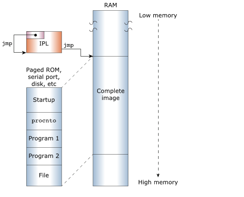
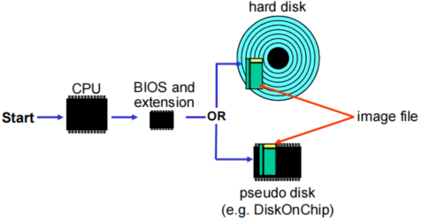
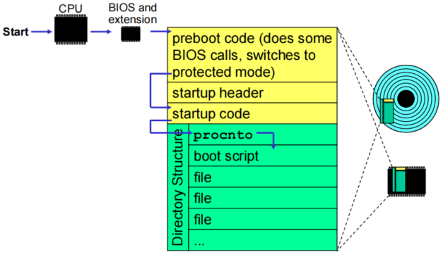
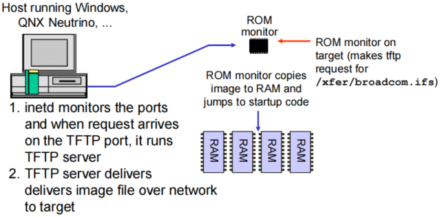
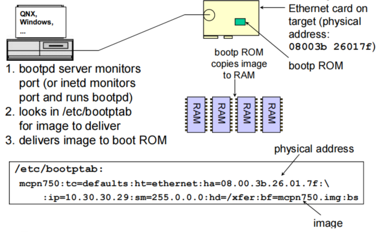
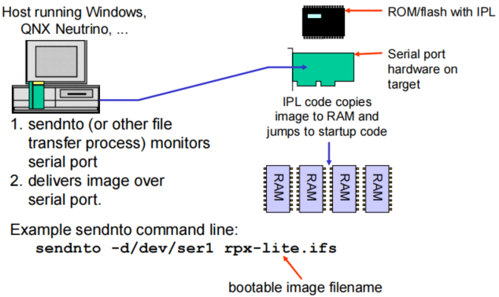

# QNX®  Neutrino IPL

本文主要描述Initial program loader的相关内容，并以[Texas Instruments DRA74x Jacinto6 Cortex A15](#Texas Instruments DRA74x Jacinto6 ARM IPLs)处理器为例讲解

### Initial Program Loaders (IPLs)

IPL 初始化硬件，为 C 语言环境设置堆栈，将操作系统映像加载到内存中，最后跳转到 QNX 的`startup`代码。

IPL是非常简化的，功能可以类比Uboot；它使用尽可能少的代码来运行启动代码。 IPL 首先设置执行其编译的 C 代码所需的最小环境，然后查找 OS 映像并将其加载到内存中。因此，IPL 按顺序执行以下任务：

>1. 完成硬件初始化，对硬件进行最低限度的配置。
>2. 为 C 语言环境设置堆栈。
>3. 查找并验证OS映像。
>4. 将操作系统映像加载到内存中。
>5. 跳转到操作系统`startup`代码。

IPL 可以存储在`linearly-mapped device`（例如 NOR 闪存设备）或`non-linearly-mapped device`（例如 eMMC、SD 卡或 SPI NOR 闪存设备）上。 与电路板架构一样，存储 IPL 和 OS 映像的存储设备类型决定了 IPL 的设计。

#### 影响IPL设计因素

IPL 的设计和内容受多种因素影响，包括：

> * **Board 板级因素** 
>
>   IPL 是特定于硬件架构的。 x86 处理器和 ARM 处理器的 IPL 差异很大。（请参阅“[From reset to startup](#From reset to startup 从复位到启动代码)”）。
>
>   除了特定于架构之外，IPL 还特定于它运行的电路板（甚至跟电路板种类有关）。 它必须进行定制，以便知道如何配置内存控制器（例如DDR）、设置时钟和执行其他硬件初始化。
>
> * **Supported removeable media 支持的可移动存储设备**
>
>   IPL 必须考虑电路板从中检索引导映像的可移动介质的类型，因为该可移动介质决定了 IPL 可以使用的引导策略和技术。
>   即支持linear media，又non-linear media（例如，USB 密钥或板载 eMMC、NOR 闪存或 NAN 闪存）已成为最常见的选择。
>
> * **Size of the storage media 存储设备的大小**
>
>   IFS 映像是压缩还是未压缩取决于存储介质的大小和性能。 对于压缩和未压缩图像，IPL 将 IFS 复制到 RAM，然后跳转到启动代码。 启动代码确定图像是否被压缩，解压缩它（如果它被压缩），然后将它重向到 RAM 中的适当位置。 因为所有这些任务都会增加引导过程的时间，所以您可以配置引导过程以将 IFS 拷贝到其最终位置，而不是启动代码。

#### From reset to startup 从复位到启动代码

由于单板架构和处理器的差异导致单板的估计处理也是不一样的。x86 和 ARM 平台的 IPL 差异很大。

尽管存在差异，但所有系列的单板的 IPL 完成将 IFS 映像加载到内存并跳转到 OS 启动代码工作是一样的。 他们至少有以下共同点：

>* 它们是在单板上首先执行的软件代码（单板固件 BIOS 或 Boot ROM）。
>* 最终控制权移交给操作系统内核启动代码（请参阅“[Startup Programs](http://www.qnx.com/developers/docs/7.0.0/com.qnx.doc.neutrino.building/topic/startup/startup_about.html)“）。

下图显示了初始化和单板启动的各个组件的顺序。ARM是从Boot ROM里启动，X86是从BIOS里启动。


### Image storage镜像存储

存储可引导映像的介质以及它的存储方式（压缩或未压缩）决定了 IPL 必须对映像做什么。

用于存储 IPL 和 IFS 的可移动介质类型影响 IPL 设计的许多方面。 最重要的因素之一是存储介质是线性映射**(linearly-mapped)**（例如，NOR FLASH）还是非线性映射**(non-linearly-mapped)**（例如，eMMC、SD 卡），因为它决定了 IPL 是否能使用 XIP。

其他重要因素包括图像的存储方式（压缩时不压缩），以及存储它的设备（eMMC、SD 卡、硬盘等；参见“[Image storage methods](http://www.qnx.com/developers/docs/7.0.0/com.qnx.doc.neutrino.building/topic/ipl/ipl_image_struct.html)”）。

#### Linearly-mapped devices 线性映射设备

对于线性映射设备（例如，ROM 设备），整个映像位于可直接寻址的存储中，该存储将其整个地址空间映射到处理器的地址空间。 处理器可以寻址 OS 映像中的任何位置，因此 IPL 只需将启动代码（而不是整个映像）复制到 RAM 中。


由于线性映射的设备可以直接映射到处理器的地址空间，IPL 只能将启动代码直接从该设备加载到 RAM 中，其余的映像留在设备上。

如果可移动存储设备是线性映射，IPL能够使用就地执行XIP(eXecute In Place)。如果使用 XIP，则链接器文件（例如 mx6sx-sabre-sdb.lnk 或 vayu-evm.lnk）中 IPL（代码）的 .text 部分必须有线性映射地址空间。这意味着所有的IPL的汇编代码在镜像拷贝到RAM之前都可以被执行。

#### Non-linearly-mapped devices 非线性映射设备

对于非线性映射设备（例如 eMMC、SD 卡或 SPI NOR 设备），存储镜像位于无法直接映射到处理器地址空间中。 处理器无法寻址 OS 映像，因此 IPL 需要将整个映像（包括启动代码）复制到 RAM 中。



QNX IPL 从非线性映射设备加载整个图像，因为这些设备上的处理器地址不能直接映射到处理器的地址空间。

#### Compressed images 压缩镜像

如果可启动映像太大而无法以其原始格式存储在可移动存储媒体上，或者如果硬件限制（例如，慢速总线）使复制和解压映像比以原始格式复制映像更有效，则可启动映像可能是压缩在线性映射或非线性映射的可移动存储设备上。

在构建 OS 映像时，`mkifs` 工具会检查构建文件中的 `+compress` 属性。 如果设置了属性（例如，[virtual = x86_64, bios +compress boot = {），mkifs 将压缩映像（请参阅 "[OS Image Buildfiles](http://www.qnx.com/developers/docs/7.0.0/com.qnx.doc.neutrino.building/topic/buildfiles/buildfile.html)" 章节）。

如果镜像被压缩，则必须在 IPL 的第二阶段中的 main() 函数调用 image_scan() 函数之前将其复制到 RAM 并解压。 当您编写 IPL 或更新使用压缩映像的系统时，请注意以下事项：

>* 将压缩镜像复制到 RAM 中的位置，而不是您将解压它的地址。
>
>* 解压镜像到启动代码跳转地址，以便位于您的 IPL 完成跳转。
>* 在复制压缩镜像的位置和解压图像的地址之间为整个未压缩镜像留出足够的空间。

如果您更改或添加组件，这可能会增加镜像的大小。 检查在未压缩图像的起始地址和您第一次将压缩图像复制到 RAM 的地址之间是否有足够的空间容纳新的、更大的镜像。

#### Image locations 镜像位置

IPL 从不同类型的设备或通过网络加载操作系统映像，具体取决于主板支持什么方式。 存储可启动映像的更常见位置包括：

##### **Disk 磁盘**

大多数嵌入式系统现在使用固态媒体，例如 U盘、SD和micro SD 卡或 eMMC，还有可能仍使用旋转磁盘。

对于x86的系统来说，从磁盘引导是最简单的引导方法。BIOS 或 UEFI 执行所有工作：它从磁盘获取映像，将其传输到 RAM，然后启动它。





对于ARM的系统来说，从磁盘启动至少需要：

>* 需要有驱动程序知道如何访问磁盘
>
>* 需要有检查磁盘分区表并定位操作系统映像的IPL代码
>* 需要有将镜像从磁盘硬件（旋转磁盘）获取映射并按字节方式传输到RAM（固态磁盘）某个地址空间。

##### **Network**

如果板上有一个 PCI 网卡，操作系统映像可以通过以太网加载，并放置在处理器的地址空间中。



##### **BOOTP server**

在某些嵌入式板上，ROM 监视器包含 BOOTP 代码。 此代码知道如何与网络硬件通信，以及如何从远程系统获取操作系统映像。

要使用 BOOTP 启动 QNX Neutrino 系统，您需要一个用于 OS 客户端的 BOOTP ROM 和一个 BOOTP 服务器（例如 bootpd）。 由于使用TFTP协议将镜像从服务器移动到客户端，因此还需要一个TFTP服务器； 在大多数系统上，此服务器随 BOOTP 服务器一起提供（请参阅**Utilities Reference**中的 [bootpd](http://www.qnx.com/developers/docs/7.0.0/com.qnx.doc.neutrino.utilities/topic/b/bootpd.html)）。



##### **Serial port**

目标上的串行端口在开发过程中可用于下载映像或作为故障安全机制（例如，如果校验和失败，您可以简单地通过串行端口重新加载操作系统映像）。

串行加载器可以内置到 IPL 代码中，以便 IPL 可以从外部硬件端口获取 OS 映像。 IPL 过程与用于网络引导的过程几乎相同，不同之处在于使用串行端口替代了以太网端口来获取操作系统映像。

串行加载器通常对嵌入式系统的成本影响很小。 电路板供应商通常在他们的评估板上包含串行端口功能，有时通过另一个端口，例如调试端口。 在很多情况下，串口硬件和串口加载器可以在项目开发过程中使用，然后从最终产品中省去。

QNX 为 8250 芯片的嵌入式串行加载器提供源代码，QNX Neutrino SDP 包含一个`Utility`，可通过串行或并行端口将操作系统映像发送到目标板（请参阅Utilities Reference中的“[sendnto](http://www.qnx.com/developers/docs/7.0.0/com.qnx.doc.neutrino.utilities/topic/s/sendnto.html)”）。



#### IPL库

| Function                                                     | Description                                                  |
| ------------------------------------------------------------ | ------------------------------------------------------------ |
| **[enable_cache()](http://www.qnx.com/developers/docs/7.0.0/com.qnx.doc.neutrino.building/topic/ipl_lib/enable_cache.html)** | Enable the cache                                             |
| **[image_download_8250()](http://www.qnx.com/developers/docs/7.0.0/com.qnx.doc.neutrino.building/topic/ipl_lib/image_download_8250.html)** | Download an OS image                                         |
| **[image_download_ser()](http://www.qnx.com/developers/docs/7.0.0/com.qnx.doc.neutrino.building/topic/ipl_lib/image_download_ser.html)** | Download an OS image                                         |
| **[image_scan(), image_scan_2(), image_scan_ext()](http://www.qnx.com/developers/docs/7.0.0/com.qnx.doc.neutrino.building/topic/ipl_lib/image_scan.html)** | Scans memory for a valid system image                        |
| **[image_setup(), image_setup_2(), image_setup_ext()](http://www.qnx.com/developers/docs/7.0.0/com.qnx.doc.neutrino.building/topic/ipl_lib/image_setup.html)** | Copy the startup code and OS image into RAM and prepare it for execution |
| **[image_start(), image_start_2(), image_start_ext()](http://www.qnx.com/developers/docs/7.0.0/com.qnx.doc.neutrino.building/topic/ipl_lib/image_start.html)** | Jump to the bootable OS image start point                    |
| **[init_8250()](http://www.qnx.com/developers/docs/7.0.0/com.qnx.doc.neutrino.building/topic/ipl_lib/init_8250.html)** | Initialize an 8250 serial port to 8N1 parameters             |
| **[int15_copy()](http://www.qnx.com/developers/docs/7.0.0/com.qnx.doc.neutrino.building/topic/ipl_lib/int15_copy.html)** | Copy data from high memory (above 1 MB) to a buffer, or to low memory (below 1 MB) |
| **[jump()](http://www.qnx.com/developers/docs/7.0.0/com.qnx.doc.neutrino.building/topic/ipl_lib/jump.html)** | Jump to the specifed in address in memory                    |
| **[print_byte()](http://www.qnx.com/developers/docs/7.0.0/com.qnx.doc.neutrino.building/topic/ipl_lib/print_byte.html)** | Output one byte to video (x86 only)                          |
| **[print_char()](http://www.qnx.com/developers/docs/7.0.0/com.qnx.doc.neutrino.building/topic/ipl_lib/print_char.html)** | Display a character to video.                                |
| **[print_long()](http://www.qnx.com/developers/docs/7.0.0/com.qnx.doc.neutrino.building/topic/ipl_lib/print_long.html)** | Display a long to video                                      |
| **[print_sl()](http://www.qnx.com/developers/docs/7.0.0/com.qnx.doc.neutrino.building/topic/ipl_lib/print_sl.html)** | Displays to video a string, followed by a long (x86 only)    |
| **[print_string()](http://www.qnx.com/developers/docs/7.0.0/com.qnx.doc.neutrino.building/topic/ipl_lib/print_string.html)** | Display a string to video                                    |
| **[print_var()](http://www.qnx.com/developers/docs/7.0.0/com.qnx.doc.neutrino.building/topic/ipl_lib/print_var.html)** | Display a variable to video                                  |
| **[print_word()](http://www.qnx.com/developers/docs/7.0.0/com.qnx.doc.neutrino.building/topic/ipl_lib/print_word.html)** | Display a word to video                                      |
| **[protected_mode()](http://www.qnx.com/developers/docs/7.0.0/com.qnx.doc.neutrino.building/topic/ipl_lib/protected_mode.html)** | Switches the x86 processor to protected mode (non-BIOS systems) |
| **[uart_hex8](http://www.qnx.com/developers/docs/7.0.0/com.qnx.doc.neutrino.building/topic/ipl_lib/uart_hex8.html)** | Output an 8-bit hex number to the UART (x86 only)            |
| **[uart_hex16](http://www.qnx.com/developers/docs/7.0.0/com.qnx.doc.neutrino.building/topic/ipl_lib/uart_hex16.html)** | Output a 16-bit hex number to the UART (x86 only)            |
| **[uart_hex32](http://www.qnx.com/developers/docs/7.0.0/com.qnx.doc.neutrino.building/topic/ipl_lib/uart_hex32.html)** | Output a 32-bit hex number to the UART (x86 only)            |
| **[uart_init](http://www.qnx.com/developers/docs/7.0.0/com.qnx.doc.neutrino.building/topic/ipl_lib/uart_init.html)** | Initializes the on-chip UART to 8 data bits, 1 stop bit, and no parity (8250 compatible) |
| **[uart_put](http://www.qnx.com/developers/docs/7.0.0/com.qnx.doc.neutrino.building/topic/ipl_lib/uart_put.html)** | Output single character to UART (x86 only)                   |
| **[uart_string](http://www.qnx.com/developers/docs/7.0.0/com.qnx.doc.neutrino.building/topic/ipl_lib/uart_string.html)** | Output a NULL-terminated string to the UART (x86 only)       |
| **[uart32_hex8](http://www.qnx.com/developers/docs/7.0.0/com.qnx.doc.neutrino.building/topic/ipl_lib/uart32_hex8.html)** | Output a 16-bit hex number to the UART (x86 only)            |
| **[uart32_hex16](http://www.qnx.com/developers/docs/7.0.0/com.qnx.doc.neutrino.building/topic/ipl_lib/uart32_hex16.html)** | Output a 16-bit hex number to the UART (x86 only)            |
| **[uart32_hex32](http://www.qnx.com/developers/docs/7.0.0/com.qnx.doc.neutrino.building/topic/ipl_lib/uart32_hex32.html)** | Outputs a 32-bit hex number to the UART (x86 only)           |
| **[uart32_init](http://www.qnx.com/developers/docs/7.0.0/com.qnx.doc.neutrino.building/topic/ipl_lib/uart32_init.html)** | Initializes the on-chip UART to 8 data bits, 1 stop bit, and no parity (8250 compatible) |
| **[uart32_put](http://www.qnx.com/developers/docs/7.0.0/com.qnx.doc.neutrino.building/topic/ipl_lib/uart32_put.html)** | Output a single character to the UART (x86 only)             |
| **[uart32_string](http://www.qnx.com/developers/docs/7.0.0/com.qnx.doc.neutrino.building/topic/ipl_lib/uart32_string.html)** | Output a NULL-terminated string to the UART (x86 only)       |


#### Texas Instruments DRA74x Jacinto6 ARM IPLs

TI DRA74x Jacinto6  BSP包：[BSP_ti-j6-dra74x_vayu-evm_br-660_be-660_SVN817036_JBN156.zip](https://community.qnx.com/sf/frs/do/downloadFile/projects.bsp/frs.qnx_sdp_6_6_bsp_for_the_ti_dra74.qnx_sdp_6_6_bsp_for_the_ti_jacin/frs85031?dl=1)

下载TI DRA74x Jacinto6  BSP zip包并解压，IPL代码位于src/hardware/ipl/boards/dra74x/中，其中src/hardware/ipl/boards/dra74x/arm/vayu-evm.le.v7.64/vayu-evm.lnk为链接文件，指定了程序的入口以及内存的分段及布局等。

```makefile
TARGET(elf32-littlearm)
OUTPUT_FORMAT(elf32-littlearm)
ENTRY(_start)

MEMORY
{
	ram :	ORIGIN = 0x40300000,	LENGTH = 0x14000

	/* TLB table must be align to 16K (0x4000) */
	tlb :	ORIGIN = 0x40314000, LENGTH = 0x4000

	/* dedicated for non-cacheble buffer */
	scratch :	ORIGIN = 0x80000000,	LENGTH = 0x100000
}

SECTIONS
{
	.text : {
			_start.o(.text)
			*(.text)
			*(.rodata*)
			*(.glue_7)
			*(.glue_7t)
	} > ram

	.note.gnu.build-id : {
			*(.note.gnu.build-id)
	} > ram
	_etext = .;

	.data : {
			*(.data)
			*(.sdata)
	} > ram
	_edata = .;

	/*
	 * The .bss.dummy section needs to be placed at the beginning of .bss
	 * and right after the .data,
	 * in order to protect the _TI_ROM_r0 from being overwritten
	 * when loading IPL from NOR
	 */
	.bss : {
			*(.bss.dummy)
			*(.bss)
			*(.sbss)
	} > ram

	.stack : {
		*.(*)
	} > ram

	.tlb : {
		*(.tlb);
	} > tlb

	.scratch : {
		*(.scratch);
	} > scratch
}

```

程序的入口：ENTRY(_start)，在 src/hardware/ipl/boards/dra74x/_start.S 文件中完成了以下工作：

- 设置CPU为SVC32模式
- Invalidate L1 I/D and TLBs
- Disable MMU stuff 和caches
- 确定 IPL 是否从 SRAM 启动
- 设置堆栈
- 跳转到main函数
   在src/hardware/ipl/boards/dra74x/arm/vayu-evm/目录中的main.c完成IPL的主要工作：

```c
int main(void)
{
	unsigned		image, start;
	IPL_BootOpt_t	bootOpt;

	chip_revision = get_omap_rev();

#if defined (CACHE_ENABLED)
	enable_cache_mmu();
#endif

	/* Initialize Pin Muxing, SDRAM, Clocks etc. */
	init_hw_platform();

	/*
	 * The eMMC part takes 400-600ms between the first CMD1 and fully powered up
	 * Thus issuing CMD0 and CMD1 in IPL will significantly reduce the startup time of MMCSD driver on eMMC
	 */
	powerup_emmc(2);

	log_putstr("\nQNX Neutrino Initial Program Loader for DRA74X Vayu EVM\n");

	print_omap_revision();

	bootOpt = ipl_boot_detect();

#if MANBOOT
	bootOpt = ipl_boot_menu();
#endif

	while (1) {
		image = QNX_LOAD_ADDR;
		switch (bootOpt) {
			case IPL_BOOT_SD:
				if (sdmmc_load_file(SD_INTERFACE, 1, image, "QNX-IFS", 0) != 0) {
					ser_putstr("load image from SD failed\n");
					goto print_boot_menu;
				}
				break;
			case IPL_BOOT_EMMC:
				if (sdmmc_load_file(EMMC_INTERFACE, 2, image, "QNX-IFS", 0) != 0) {
					ser_putstr("load image from eMMC failed\n");
					goto print_boot_menu;
				}
				break;
			case IPL_BOOT_QSPI:
				if (qspi_load_image(QSPI_IFS_OFFSET(0), image) != 0) {
					ser_putstr("load image from QSPI flash failed\n");
					goto print_boot_menu;
				}
				break;
			case IPL_BOOT_SERIAL:
				ser_putstr("Send IFS image through serial now...\n");
				if (image_download_ser(image) != 0) {
					ser_putstr("Download image failed\n");
					goto print_boot_menu;
				}

				ser_putstr("Download ok...\n");

				/* get remaining bytes */
				while (ser_poll())
					ser_getchar();

				break;
			case IPL_MEM_TEST:
				sdram_test(DRA74x_EMIF_CS0_BASE, MEG(1536));
			default:
				goto print_boot_menu;
		}

		if (bootOpt == IPL_BOOT_SERIAL) {
			start = image_scan_2(image, image + MAX_SCAN, 0);
		} else {
			start = image_scan_2(image, image + MAX_SCAN, 1);
		}

		if (start != 0xffffffff) {
#ifdef HS_AUTH_IFS
			/* Authenticate loaded image before jumping execution */
			authenticate_image_signature(image, startup_hdr.stored_size + start - image + IFS_CERT_SIZE);
#endif
			log_putstr("Found image		@ 0x");
			log_puthex(start);
			log_putstr("\n");
			image_setup_2(start);

			log_putstr("Jumping to startup @ 0x");
			log_puthex(startup_hdr.startup_vaddr);
			log_putstr("\n\n");

#if defined (CACHE_ENABLED)
			/*
			 * Flush D-cache and invalidate I-cache before jumping
			 */
			arm_v7_dcache_flush();
			arm_v7_icache_invalidate();
#endif

#if defined(DEBUG_BOOT_TIMING)
			omap_timer_curr("IPL total", TIMING_MILLI_SECOND);
#endif
			image_start_2(start);

			/* Never reach here */
			return 0;
		}

		ser_putstr("Image_scan failed...\n");

print_boot_menu:
		bootOpt = ipl_boot_menu();
	}

	return 0;
}

```

进入main分别完成了以下工作：

* enable_cache_mmu() 该函数用于使能cache和mmu
* init_hw_platform(), 该函数用于设置管脚的复用，系统的时钟，串口初始化，DDR初始化等。
* powerup_emmc()，该函数用于eMMC初始化。
* ipl_boot_detect(), 该函数用于启动模式检测，分别包含串口，SD卡，eMMC和QSPI NOR Flash加载启动。
* sdmmc_load_file()/qspi_load_image()/image_download_ser 这三个函数用于完成Image的加载；
* image_scan_2()，该函数用于扫描image，对Image进行一些校验检查；
* image_start_2()，该函数跳转到Image的入口去执行，也就是跳转到startup程序中去运行；

从以上的流程可以看出IPL整体的功能并不复杂，完成最少硬件（需要用到的，比如时钟、串口、SD）的初始化，然后对Image加载和校验，最终跳转过去执行即可。


### 参考文献：

[**OS Core Components** Initial Program Loaders (IPLs)](http://www.qnx.com/developers/docs/7.0.0/index.html#com.qnx.doc.neutrino.building/topic/ipl/ipl_about.html)

