# QNX®  Neutrino 微内核

QNX Neutrino微内核`procnto`实现了嵌入式实时系统中常用的核心POSIX功能，并提供了基本的 QNX Neutrino 消息传递服务。但是未实现POSIX的功能（例如filesystem I/O and device I/O）则可以通过可选的进程和共享库来提供。

> Tips ->`procnto`系统进程包含：微内核，进程管理，内存管理和路径名管理。[procnto* 用法](http://www.qnx.com/developers/docs/7.0.0/index.html#com.qnx.doc.neutrino.utilities/topic/p/procnto.html)

微内核包含了一些基本对象以及操作这些对象的例程，这些对象定义得很具体，而且高度可重用，整个操作系统在此之上构建的。

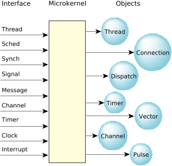

​                                                                                                    图 1：微内核

### **系统服务**

QNX Neutrino微内核提供了一系列系统调用来支持以下服务：

> - 线程（**threads**）
> - 消息传递（**message passing**）
> - 信号（**signals**）
> - 时钟（**clocks**）
> - 定时器（**timers**）
> - 中断处理（**interrupt handlers**）
> - 信号量（**semaphores**）
> - 互斥锁 mutual exclusion locks（**mutexes**） 
> - 条件变量 condition variables （**condvars**） 
> - 屏障 （**barriers**）

整个系统都是基于这些系统调用来构建的，QNX完全可抢占，甚至在消息传递的过程时也能被抢占，并在抢占完成后恢复之前的消息传递状态。

整个系统都是基于这些系统调用来构建的，QNX完全可抢占，甚至在消息传递的过程时也能被抢占，并在抢占完成后恢复之前的消息传递状态。微内核实现越简单，越有利于减少不可抢占区间的长度，同时，代码量少，让解决复杂的多处理器问题也变得简单。将系统服务包含进内核的前提是，系统服务只有一个短的执行路径长度。需要执行很多工作的操作，可以交给外部的进程或线程去做。严格按照上边的规则来划分内核和外部进程功能的话，微内核的运行时负载不见得就高于单内核。简单内核的上下文切换的时间非常快，相比于在进程间通过消息传递来服务请求的时间，上下文的切换开销微不足道。

下图演示了在非对称多处理器内核（X86实现）抢占的细节，其中，中断禁用或禁止抢占的时间非常短，通常为几百纳秒。

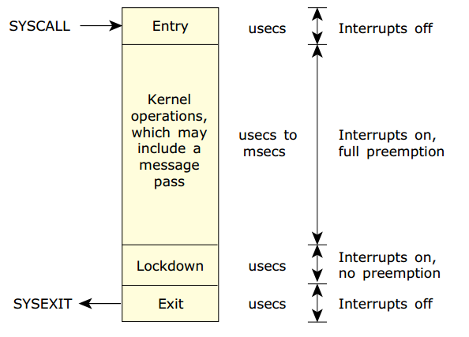


### **线程与进程**

在开发应用程序时（实时、嵌入式、图形等），通常会用到POSIX线程模型来实现多个算法同时执行。线程是微内核中最小的执行和调度单元，进程可以认为是线程的“容器”，定义了线程将在其中执行的“地址空间”，进程会包含一个或多个线程。应用程序中的线程有可能相互独立，也可能紧密的联系，QNX Neutrino提供了丰富的IPC和同步服务。

 其中不涉及微内核线程调用的POSIX 线程库接口**pthread_***有如下：

> - [*pthread_attr_destroy()*](http://www.qnx.com/developers/docs/7.0.0/com.qnx.doc.neutrino.lib_ref/topic/p/pthread_attr_destroy.html)
> - [*pthread_attr_getdetachstate()*](http://www.qnx.com/developers/docs/7.0.0/com.qnx.doc.neutrino.lib_ref/topic/p/pthread_attr_getdetachstate.html)
> - [*pthread_attr_getinheritsched()*](http://www.qnx.com/developers/docs/7.0.0/com.qnx.doc.neutrino.lib_ref/topic/p/pthread_attr_getinheritsched.html)
> - [*pthread_attr_getschedparam()*](http://www.qnx.com/developers/docs/7.0.0/com.qnx.doc.neutrino.lib_ref/topic/p/pthread_attr_getschedparam.html)
> - [*pthread_attr_getschedpolicy()*](http://www.qnx.com/developers/docs/7.0.0/com.qnx.doc.neutrino.lib_ref/topic/p/pthread_attr_getschedpolicy.html)
> - [*pthread_attr_getscope()*](http://www.qnx.com/developers/docs/7.0.0/com.qnx.doc.neutrino.lib_ref/topic/p/pthread_attr_getscope.html)
> - [*pthread_attr_getstackaddr()*](http://www.qnx.com/developers/docs/7.0.0/com.qnx.doc.neutrino.lib_ref/topic/p/pthread_attr_getstackaddr.html)
> - [*pthread_attr_getstacksize()*](http://www.qnx.com/developers/docs/7.0.0/com.qnx.doc.neutrino.lib_ref/topic/p/pthread_attr_getstacksize.html)
> - [*pthread_attr_init()*](http://www.qnx.com/developers/docs/7.0.0/com.qnx.doc.neutrino.lib_ref/topic/p/pthread_attr_init.html)
> - [*pthread_attr_setdetachstate()*](http://www.qnx.com/developers/docs/7.0.0/com.qnx.doc.neutrino.lib_ref/topic/p/pthread_attr_setdetachstate.html)
> - [*pthread_attr_setinheritsched()*](http://www.qnx.com/developers/docs/7.0.0/com.qnx.doc.neutrino.lib_ref/topic/p/pthread_attr_setinheritsched.html)
> - [*pthread_attr_setschedparam()*](http://www.qnx.com/developers/docs/7.0.0/com.qnx.doc.neutrino.lib_ref/topic/p/pthread_attr_setschedparam.html)
> - [*pthread_attr_setschedpolicy()*](http://www.qnx.com/developers/docs/7.0.0/com.qnx.doc.neutrino.lib_ref/topic/p/pthread_attr_setschedpolicy.html)
> - [*pthread_attr_setscope()*](http://www.qnx.com/developers/docs/7.0.0/com.qnx.doc.neutrino.lib_ref/topic/p/pthread_attr_setscope.html)
> - [*pthread_attr_setstackaddr()*](http://www.qnx.com/developers/docs/7.0.0/com.qnx.doc.neutrino.lib_ref/topic/p/pthread_attr_setstackaddr.html)
> - [*pthread_attr_setstacksize()*](http://www.qnx.com/developers/docs/7.0.0/com.qnx.doc.neutrino.lib_ref/topic/p/pthread_attr_setstacksize.html)
> - [*pthread_cleanup_pop()*](http://www.qnx.com/developers/docs/7.0.0/com.qnx.doc.neutrino.lib_ref/topic/p/pthread_cleanup_pop.html)
> - [*pthread_cleanup_push()*](http://www.qnx.com/developers/docs/7.0.0/com.qnx.doc.neutrino.lib_ref/topic/p/pthread_cleanup_push.html)
> - [*pthread_equal()*](http://www.qnx.com/developers/docs/7.0.0/com.qnx.doc.neutrino.lib_ref/topic/p/pthread_equal.html)
> - [*pthread_getspecific()*](http://www.qnx.com/developers/docs/7.0.0/com.qnx.doc.neutrino.lib_ref/topic/p/pthread_getspecific.html)
> - [*pthread_setspecific()*](http://www.qnx.com/developers/docs/7.0.0/com.qnx.doc.neutrino.lib_ref/topic/p/pthread_setspecific.html)
> - [*pthread_key_create()*](http://www.qnx.com/developers/docs/7.0.0/com.qnx.doc.neutrino.lib_ref/topic/p/pthread_key_create.html)
> - [*pthread_key_delete()*](http://www.qnx.com/developers/docs/7.0.0/com.qnx.doc.neutrino.lib_ref/topic/p/pthread_key_delete.html)
> - [*pthread_self()*](http://www.qnx.com/developers/docs/7.0.0/com.qnx.doc.neutrino.lib_ref/topic/p/pthread_self.html)


下表中的POSIX接口，微内核中有对应的接口实现一样的功能，允许自己来选择哪类接口：

| POSIX call                                                   | Microkernel call                                             | Description                                                  |
| ------------------------------------------------------------ | ------------------------------------------------------------ | ------------------------------------------------------------ |
| [*pthread_create()*](http://www.qnx.com/developers/docs/7.0.0/com.qnx.doc.neutrino.lib_ref/topic/p/pthread_create.html) | [*ThreadCreate()*](http://www.qnx.com/developers/docs/7.0.0/com.qnx.doc.neutrino.lib_ref/topic/t/threadcreate.html) | Create a new thread of execution                             |
| [*pthread_exit()*](http://www.qnx.com/developers/docs/7.0.0/com.qnx.doc.neutrino.lib_ref/topic/p/pthread_exit.html) | [*ThreadDestroy()*](http://www.qnx.com/developers/docs/7.0.0/com.qnx.doc.neutrino.lib_ref/topic/t/threaddestroy.html) | Destroy a thread                                             |
| [*pthread_detach()*](http://www.qnx.com/developers/docs/7.0.0/com.qnx.doc.neutrino.lib_ref/topic/p/pthread_detach.html) | [*ThreadDetach()*](http://www.qnx.com/developers/docs/7.0.0/com.qnx.doc.neutrino.lib_ref/topic/t/threaddetach.html) | Detach a thread so it doesn't need to be joined              |
| [*pthread_join()*](http://www.qnx.com/developers/docs/7.0.0/com.qnx.doc.neutrino.lib_ref/topic/p/pthread_join.html) | [*ThreadJoin()*](http://www.qnx.com/developers/docs/7.0.0/com.qnx.doc.neutrino.lib_ref/topic/t/threadjoin.html) | Join a thread waiting for its exit status                    |
| [*pthread_cancel()*](http://www.qnx.com/developers/docs/7.0.0/com.qnx.doc.neutrino.lib_ref/topic/p/pthread_cancel.html) | [*ThreadCancel()*](http://www.qnx.com/developers/docs/7.0.0/com.qnx.doc.neutrino.lib_ref/topic/t/threadcancel.html) | Cancel a thread at the next cancellation point               |
| N/A                                                          | [*ThreadCtl()*](http://www.qnx.com/developers/docs/7.0.0/com.qnx.doc.neutrino.lib_ref/topic/t/threadctl.html) | Change a thread's QNX Neutrino-specific thread characteristics |
| [*pthread_mutex_init()*](http://www.qnx.com/developers/docs/7.0.0/com.qnx.doc.neutrino.lib_ref/topic/p/pthread_mutex_init.html) | [*SyncTypeCreate()*](http://www.qnx.com/developers/docs/7.0.0/com.qnx.doc.neutrino.lib_ref/topic/s/synctypecreate.html) | Create a mutex                                               |
| [*pthread_mutex_destroy()*](http://www.qnx.com/developers/docs/7.0.0/com.qnx.doc.neutrino.lib_ref/topic/p/pthread_mutex_destroy.html) | [*SyncDestroy()*](http://www.qnx.com/developers/docs/7.0.0/com.qnx.doc.neutrino.lib_ref/topic/s/syncdestroy.html) | Destroy a mutex                                              |
| [*pthread_mutex_lock()*](http://www.qnx.com/developers/docs/7.0.0/com.qnx.doc.neutrino.lib_ref/topic/p/pthread_mutex_lock.html) | [*SyncMutexLock()*](http://www.qnx.com/developers/docs/7.0.0/com.qnx.doc.neutrino.lib_ref/topic/s/syncmutexlock.html) | Lock a mutex                                                 |
| [*pthread_mutex_trylock()*](http://www.qnx.com/developers/docs/7.0.0/com.qnx.doc.neutrino.lib_ref/topic/p/pthread_mutex_trylock.html) | [*SyncMutexLock()*](http://www.qnx.com/developers/docs/7.0.0/com.qnx.doc.neutrino.lib_ref/topic/s/syncmutexlock.html) | Conditionally lock a mutex                                   |
| [*pthread_mutex_unlock()*](http://www.qnx.com/developers/docs/7.0.0/com.qnx.doc.neutrino.lib_ref/topic/p/pthread_mutex_unlock.html) | [*SyncMutexUnlock()*](http://www.qnx.com/developers/docs/7.0.0/com.qnx.doc.neutrino.lib_ref/topic/s/syncmutexunlock.html) | Unlock a mutex                                               |
| [*pthread_cond_init()*](http://www.qnx.com/developers/docs/7.0.0/com.qnx.doc.neutrino.lib_ref/topic/p/pthread_cond_init.html) | [*SyncTypeCreate()*](http://www.qnx.com/developers/docs/7.0.0/com.qnx.doc.neutrino.lib_ref/topic/s/synctypecreate.html) | Create a condition variable                                  |
| [*pthread_cond_destroy()*](http://www.qnx.com/developers/docs/7.0.0/com.qnx.doc.neutrino.lib_ref/topic/p/pthread_cond_destroy.html) | [*SyncDestroy()*](http://www.qnx.com/developers/docs/7.0.0/com.qnx.doc.neutrino.lib_ref/topic/s/syncdestroy.html) | Destroy a condition variable                                 |
| [*pthread_cond_wait()*](http://www.qnx.com/developers/docs/7.0.0/com.qnx.doc.neutrino.lib_ref/topic/p/pthread_cond_wait.html) | [*SyncCondvarWait()*](http://www.qnx.com/developers/docs/7.0.0/com.qnx.doc.neutrino.lib_ref/topic/s/synccondvarwait.html) | Wait on a condition variable                                 |
| [*pthread_cond_signal()*](http://www.qnx.com/developers/docs/7.0.0/com.qnx.doc.neutrino.lib_ref/topic/p/pthread_cond_signal.html) | [*SyncCondvarSignal()*](http://www.qnx.com/developers/docs/7.0.0/com.qnx.doc.neutrino.lib_ref/topic/s/synccondvarsignal.html) | Signal a condition variable                                  |
| [*pthread_cond_broadcast()*](http://www.qnx.com/developers/docs/7.0.0/com.qnx.doc.neutrino.lib_ref/topic/p/pthread_cond_broadcast.html) | [*SyncCondvarSignal()*](http://www.qnx.com/developers/docs/7.0.0/com.qnx.doc.neutrino.lib_ref/topic/s/synccondvarsignal.html) | Broadcast a condition variable                               |
| [*pthread_getschedparam()*](http://www.qnx.com/developers/docs/7.0.0/com.qnx.doc.neutrino.lib_ref/topic/p/pthread_getschedparam.html) | [*SchedGet()*](http://www.qnx.com/developers/docs/7.0.0/com.qnx.doc.neutrino.lib_ref/topic/s/schedget.html) | Get the scheduling parameters and policy of a thread         |
| [*pthread_setschedparam()*](http://www.qnx.com/developers/docs/7.0.0/com.qnx.doc.neutrino.lib_ref/topic/p/pthread_setschedparam.html), [*pthread_setschedprio()*](http://www.qnx.com/developers/docs/7.0.0/com.qnx.doc.neutrino.lib_ref/topic/p/pthread_setschedprio.html) | [*SchedSet()*](http://www.qnx.com/developers/docs/7.0.0/com.qnx.doc.neutrino.lib_ref/topic/s/schedset.html) | Set the scheduling parameters and policy of a thread         |
| [*pthread_sigmask()*](http://www.qnx.com/developers/docs/7.0.0/com.qnx.doc.neutrino.lib_ref/topic/p/pthread_sigmask.html) | [*SignalProcmask()*](http://www.qnx.com/developers/docs/7.0.0/com.qnx.doc.neutrino.lib_ref/topic/s/signalprocmask.html) | Examine or set a thread's signal mask                        |
| [*pthread_kill()*](http://www.qnx.com/developers/docs/7.0.0/com.qnx.doc.neutrino.lib_ref/topic/p/pthread_kill.html) | [*SignalKill()*](http://www.qnx.com/developers/docs/7.0.0/com.qnx.doc.neutrino.lib_ref/topic/s/signalkill.html) | Send a signal to a specific thread                           |

建议：鉴于代码可移植性和扩展性使用POSIX 接口编程。

可以将 OS 配置为提供线程和进程的混合（由 POSIX 定义）。每个进程都相互受到MMU 保护，每个进程可能包含一个或多个共享进程地址空间的线程。


#### **线程属性**

尽管进程中的线程共享进程地址空间中的所有内容，但每个线程仍然有一些“私有”数据，在某些情况下，这些私有数据在内核中受到保护，比如线程ID/进程ID；而其他的可能不受保护，比如线程的堆栈。
值得注意的私有数据有：

>* **tid**，线程ID，每个线程在进程中都有唯一的ID，从1开始；
>* **priority**，每个线程都有一个调度的优先级，线程的初始优先级是继承而来，并且可以根据调度策略进行改变，进程没有优先级；
>* **name**，线程名字，可以通过`pthread_getname_np()`和`pthread_setname_np()`来获取和设置；
>* **Register set**，每个线程都有IP、SP以及处理器相关的寄存器上下文；
>* **Stack**，线程在自己的堆栈上执行，存储在其进程的地址空间中；
>* **Signal mask**，信号掩码；
>* **Thread local storage**，线程本地存储TLS，用于存储线程私有的数据，用户不需要直接访问TLS，线程可以通过线程特定的key与用户自定义数据进行绑定，用到的接口有`pthread_key_create()`, `pthread_key_delete()`, `pthread_setspecific()`, `pthread_getspecfic()`.其中线程对应的key和线程ID是通过稀疏矩阵来映射的。
>* **Cancellation handlers**，线程终止时执行的回调函数；


#### **线程生命周期**

线程是动态创建的，线程创建（**pthread_create()**）时涉及到资源分配和初始化，线程销毁（**pthread_exit(), pthread_cancel()**）时涉及到资源回收，当线程执行时，它的状态通常描述为“就绪”或“阻塞”，具体来说有以下状态：

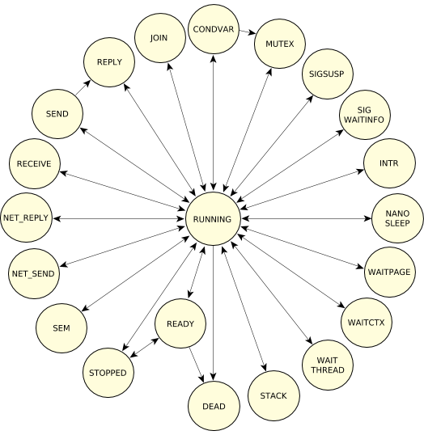

>* CONDVAR，阻塞在条件变量上，比如调用`pthread_cond_wait()`；
>
>* DEAD，线程终止了，等待被其他线程join；
>
>* INTERRUPT，阻塞在等待中断上，比如调用`InterruptWait()`；
>
>* JOIN，线程阻塞在join另一个线程，比如调用`pthread_join()`；
>
>* MUTEX，线程阻塞在互斥锁上，比如调用`pthread_mutex_lock()`；
>
>* NANOSLEEP，线程休眠很短的时间，比如调用`nanosleep()`；
>
>* NET_REPLY，线程正在等待通过网络传递回复，比如调用`MsgReply*()`；
>
>* NET_SEND，线程正在等待通过网络发送脉冲或信号，比如调用`MsgSendPulse()`，`MsgDeliverEvent()，`SignalKill()`等；
>
>* READY，线程等待执行，此时处理器可能正在执行同级或更高优先级的线程；
>
>* RECEIVE，线程阻塞在接收消息上，比如调用`MsgReceive()`；
>
>* REPLY，线程阻塞在消息回复上，比如调用`MsgSend()`；
>
>* RUNNING，线程正在执行，内核会使用一个数组（每个CPU上有一个入口）来跟踪记录所有运行的线程；
>
>* SEM，线程正在等待信号量的释放，比如调用`SyncSemWait()`；
>
>* SEND，线程阻塞在信息发送上，比如调用`MsgSend()`，但服务器还没收到消息；
>
>* SIGSUSPEND，线程阻塞在等待一个信号上，比如调用`sigsuspend()`；
>
>* SIGWAITINFO，线程阻塞在等待一个信号之上，比如调用`sigwaitinfo()`；
>
>* STACK，线程正在等待虚拟堆栈地址空间分配，父进程调用`ThreadCreate()`；
>
>* STOPPED，线程阻塞在等待`SIGCONT`信号；
>
>* WAITCTX，线程在等待非整数上下文变得可用，比如浮点运算；
>
>* WAITPAGE，线程等待为虚拟地址分配物理地址；
>
>* WAITTHREAD，线程等待子线程完成自我创建，比如调用`ThreadCreate()`；


### **线程调度**

当执行内核调用、异常、硬件中断时，当前的执行线程会被挂起，每当任何线程的执行状态发生改变时，都会做出调度决策。通常被挂起的线程将会被恢复，这时线程调度器将进行一次上下文切换。
有三种情况会发生上下文切换：

> * 阻塞(**blocks**)，当线程需要等待某些事件的发生时（比如响应IPC请求、等待互斥锁等），就会阻塞等待。线程被阻塞时，会从运行队列中移除，解阻塞时会移动到同优先级就绪队列的尾部中。
>
> * 抢占(**is preempted**)，高优先级线程会抢占低优先线程；
>
> * 主动让出CPU(**yields**)，比如调用`sched_yield()`等；


#### 调度优先级 (Scheduling priority)

每个线程都被分配了一个优先级。 线程调度器通过查看分配给每个就绪线程（即能够使用 CPU）的优先级来选择下一个要运行的线程。QNX Neutrino支持256级优先级，non-root线程可以将优先级设置为1-63，与调度策略无关，root线程（有效uid为0），能将优先级设置为63之上。特殊空闲(**Idle**)线程（在进程管理器中）优先级为 0 且始终为 0 准备好了。默认情况下，线程继承其父线程的优先级。通常会采用优先级继承来应对优先级反转的问题。

 下图中描述了一个就绪队列中，B-F是就绪，G-Z是阻塞，A正在运行：

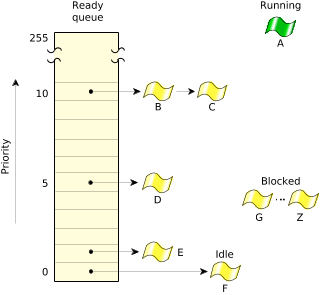

您可以使用 `procnto -P` 选项更改非特权进程的允许优先级范围：

```shell
procnto -P priority
procnto-smp-instr -P priority
```


### 调度策略(Scheduling policies)

为了满足各种应用场景需求，QNX Neutrino提供了三种调度策略：

> - FIFO调度(**FIFO scheduling**)
> - 循环调度(**round-robin scheduling**)
> - 零星调度(**sporadic scheduling**)


请记住，FIFO 和循环调度策略仅在共享相同优先级的两个或多个线程为 READY 时才适用（即，线程直接相互竞争）。然而，零星方法对线程的执行采用“预算”。在所有情况下，如果优先级较高的线程变为READY，它会立即抢占所有优先级较低的线程。

在下图中，三个具有相同优先级的线程是 READY。如果线程 A 阻塞，则线程 B 将运行。

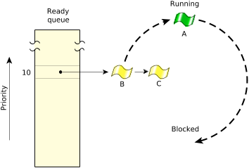

虽然线程从其父进程继承其调度策略，但线程可以请求更改内核应用的算法。

#### 1.FIFO调度

在FIFO调度下，线程会在两种情况下放弃执行：1）主动放弃CPU；2）高优先级线程抢占；

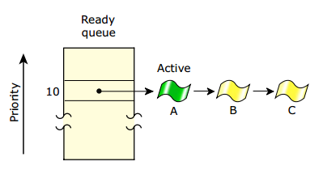


#### 2.循环调度

在Round-Robin调度下，线程会在三种情况下放弃执行：1）主动放弃CPU；2）高优先级线程抢占；3）时间片消耗完毕；

如下图所示，线程 A 一直运行直到它消耗了它的时间片;现在运行下一个 READY 线程（线程 B）：

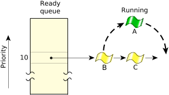

时间片为4倍时钟周期。与FIFO调度不同的是多了一个时间片的控制。

#### 3.零星调度

Sporadic调度策略通常用于在给定时间段内提供线程执行时间的上限，Sporadic调度会为线程执行提供“预算”。与FIFO调度一样，在阻塞或被抢占的情况下会放弃执行。Sporadic调度会自动降低线程的优先级，可以更精确的控制线程的行为。
Sporadic调度时，线程优先级会在前台正常优先级N和后台低优先级L之间动态调整，通过使用下列参数控制调度条件：

>* Initial budget（C），线程从正常优先级调整到低优先级前，允许的执行时间；
>
>* Low priority（L），线程降到的优先级，线程在后台以L优先级运行，在前台以N优先级运行；
>
>* Replenishment period（T），允许线程消耗执行预算的时间段，对于Replenishment操作，POSIX实现时采用这个值作为线程变为Ready状态的时间段。
>
>* Max number of pending replenishment，Replenishment最大次数，决定了Sporadic调度策略的最大系统负载上限。

下图所示，Sporadic调度策略建立了线程的初始化执行budget（预算），线程执行时会消耗这个budget，但这个值会周期性重复填满。

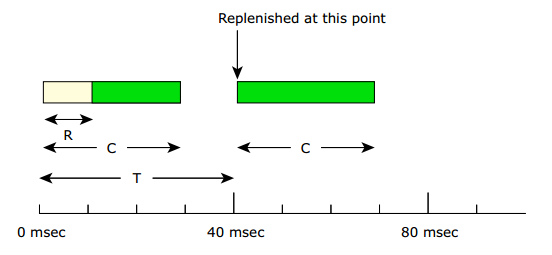

在正常优先级N时，线程会执行budget时间C，当时间耗尽后，线程的优先级会调整至L。当Replenishment发生后又将恢复到原来的优先级，在一个T的时间周期内，线程将会有机会最大去执行C的运行时间，也能保证一个线程在N优先级的情况下只消耗C/T比例的系统资源。假设在一个系统中，线程不会被阻塞或抢占，运行情况如下图所示：

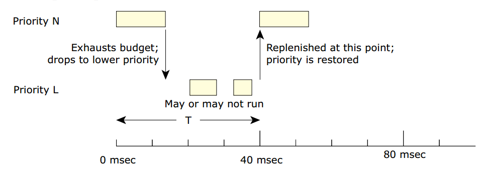

关于优先级和调度策略的设置，有以下接口来实现：

- `sched_getparam()/SchedGet()`
- `sched_setparam()/SchedSet()`
- `sched_getscheduler()/SchedGet()`
- `sched_setscheduler()/SchedSet()`


### 同步服务

QNX Neutrino提供POSIX标准线程级别的同步原语：

| Synchronization service                                      | Supported between processes | Supported across a QNX Neutrino LAN |
| ------------------------------------------------------------ | --------------------------- | ----------------------------------- |
| [Mutexes](http://www.qnx.com/developers/docs/7.0.0/com.qnx.doc.neutrino.sys_arch/topic/kernel_Mutexes.html) | Yes(a)                      | No                                  |
| [Condvars](http://www.qnx.com/developers/docs/7.0.0/com.qnx.doc.neutrino.sys_arch/topic/kernel_Condvars.html) | Yes                         | No                                  |
| [Barriers](http://www.qnx.com/developers/docs/7.0.0/com.qnx.doc.neutrino.sys_arch/topic/kernel_Barriers.html) | Yes(a)                      | No                                  |
| [Sleepon locks](http://www.qnx.com/developers/docs/7.0.0/com.qnx.doc.neutrino.sys_arch/topic/kernel_Sleepon_locks.html) | No                          | No                                  |
| [Reader/writer locks](http://www.qnx.com/developers/docs/7.0.0/com.qnx.doc.neutrino.sys_arch/topic/kernel_Reader_writer_locks.html) | Yes(a)                      | No                                  |
| [Semaphores](http://www.qnx.com/developers/docs/7.0.0/com.qnx.doc.neutrino.sys_arch/topic/kernel_Semaphores.html) | Yes                         | Yes (named only)                    |
| [FIFO scheduling](http://www.qnx.com/developers/docs/7.0.0/com.qnx.doc.neutrino.sys_arch/topic/kernel_Sync_scheduling.html) | Yes                         | No                                  |
| [Send/Receive/Reply](http://www.qnx.com/developers/docs/7.0.0/com.qnx.doc.neutrino.sys_arch/topic/kernel_Sync_message_passing.html) | Yes                         | Yes                                 |
| [Atomic operations](http://www.qnx.com/developers/docs/7.0.0/com.qnx.doc.neutrino.sys_arch/topic/kernel_Sync_atomic.html) | Yes                         | No                                  |

上述同步机制中，大部分都是由内核直接实现，除了以下几种：

>- 屏障(**barriers**)、睡眠锁(**sleepon locks**)、读写锁(**sleepon locks**)，这些是基于条件变量和互斥锁实现的；
>- 原子操作(**atomic operations**)，由处理器提供，或者在内核中模拟实现；

#### 1. Mutex

互斥锁是最简单的同步服务，用于对临界区的互斥访问，通常会用`phtread_mutext_lock()`/`pthread_mutex_timedlock()`来获取锁，使用`phread_mutext_unlock()`来释放锁，当获取不到锁的时候线程会阻塞等待，也可以使用非阻塞函数`pthread_mutex_trylock()`来测试`Mutex`是否已经被锁。

#### 2. Condvars

条件变量用于在临界区来阻塞线程，直到满足某些条件，这些条件可以是任意复杂的，并且与`Condvar`无关。`Condvar`必须始终与`Mutex`一起使用。
条件变量支持三种操作：

>- 等待，`pthread_cond_wait()`
>- 发出信号，`pthread_cond_signal()`
>- 广播，`pthread_cond_broadcast()`

#### 3. Barriers

屏障是一种同步机制，可以用于将多个协作线程阻塞在某个点等待，直到所有线程都完成后才可以继续。`pthread_join()`函数是用于等待线程终止，而屏障是用于等待多个线程在某个点“集合”，当线程都达到后，就可以取消阻塞所有线程并继续运行了。有以下接口：

| Function                                                     | Description                                           |
| ------------------------------------------------------------ | ----------------------------------------------------- |
| [*pthread_barrierattr_getpshared()*](http://www.qnx.com/developers/docs/7.0.0/com.qnx.doc.neutrino.lib_ref/topic/p/pthread_barrierattr_getpshared.html) | Get the value of a barrier's process-shared attribute |
| [*pthread_barrierattr_destroy()*](http://www.qnx.com/developers/docs/7.0.0/com.qnx.doc.neutrino.lib_ref/topic/p/pthread_barrierattr_destroy.html) | Destroy a barrier's attributes object                 |
| [*pthread_barrierattr_init()*](http://www.qnx.com/developers/docs/7.0.0/com.qnx.doc.neutrino.lib_ref/topic/p/pthread_barrierattr_init.html) | Initialize a barrier's attributes object              |
| [*pthread_barrierattr_setpshared()*](http://www.qnx.com/developers/docs/7.0.0/com.qnx.doc.neutrino.lib_ref/topic/p/pthread_barrierattr_setpshared.html) | Set the value of a barrier's process-shared attribute |
| [*pthread_barrier_destroy()*](http://www.qnx.com/developers/docs/7.0.0/com.qnx.doc.neutrino.lib_ref/topic/p/pthread_barrier_destroy.html) | Destroy a barrier                                     |
| [*pthread_barrier_init()*](http://www.qnx.com/developers/docs/7.0.0/com.qnx.doc.neutrino.lib_ref/topic/p/pthread_barrier_init.html) | Initialize a barrier                                  |
| [*pthread_barrier_wait()*](http://www.qnx.com/developers/docs/7.0.0/com.qnx.doc.neutrino.lib_ref/topic/p/pthread_barrier_wait.html) | Synchronize participating threads at the barrier      |

#### 4. Sleepon locks

`Sleepon locks`与`Condvar`很像，也都是等待条件的满足，不同的是`Condvars`必须为每个检查的`condition`分配`Mutex`，而`Sleepon locks`可以复用一个`Mutex`。

#### 5. Reader/writer locks

读写锁通常用于“多个读取者，单个写入者”场景的同步，它的开销远大于`Mutex`，但是在这种数据访问模式下很有用。通常使用`pthread_rwlock_rdlock()`/`pthread_rwlock_wrlock()`/`pthread_rwlock_unlock()`接口。

#### 6. Semaphores

信号量是常用的同步形式，允许线程在一个信号量上`post`和`wait`来控制线程何时唤醒和休眠。信号量与其他同步原语的一个显著区别是信号量是异步安全的，可以由信号处理程序操作。如果想让一个信号处理程序唤醒一个线程，信号量是正确的选择。
 对于单个进程中的线程之间同步，互斥锁比信号量更有效。

#### 7. 通过调度策略来同步

可以使用FIFO调度策略来保证同一优先级的线程不会在非SMP系统中并发运行。

#### 8. 通过消息传递来同步

`Send/Receive/Reply`IPC消息传递天然就是一种同步机制，在很多情况下让其他同步机制变得不必要。它们也是唯一可以跨网络使用的同步和IPC原语。

#### 9. 通过原子操作来同步

QNX Neutrino提供以下原子操作：

> * adding a value
>
> * subtracting a value
>
> * clearing bits
>
> * setting bits
>
> * toggling (complementing) bits
>    可以在任何地方使用原子操作，但原子操作在以下两种情况下非常适用：
>
> * ISR和线程之间，ISR可以在任何时间点抢占线程，线程保护自己不被ISR打扰的唯一方法就是禁用中断，在实时系统中不建议禁用中断，推荐使用QNX提供的原子操作；
>
> * 两个线程之间，在SMP系统中，线程能做到真正并发，使用原子操作来进行保护；

下表列出了各种微内核调用以及从它们构造的更高级别的 POSIX 调用：

| Microkernel call                                             | POSIX call                                                   | Description                                      |
| ------------------------------------------------------------ | ------------------------------------------------------------ | ------------------------------------------------ |
| [*SyncTypeCreate()*](http://www.qnx.com/developers/docs/7.0.0/com.qnx.doc.neutrino.lib_ref/topic/s/synctypecreate.html) | [*pthread_mutex_init()*](http://www.qnx.com/developers/docs/7.0.0/com.qnx.doc.neutrino.lib_ref/topic/p/pthread_mutex_init.html), [*pthread_cond_init()*](http://www.qnx.com/developers/docs/7.0.0/com.qnx.doc.neutrino.lib_ref/topic/p/pthread_cond_init.html), [*sem_init()*](http://www.qnx.com/developers/docs/7.0.0/com.qnx.doc.neutrino.lib_ref/topic/s/sem_init.html) | Create object for mutex, condvars, and semaphore |
| [*SyncDestroy()*](http://www.qnx.com/developers/docs/7.0.0/com.qnx.doc.neutrino.lib_ref/topic/s/syncdestroy.html) | [*pthread_mutex_destroy()*](http://www.qnx.com/developers/docs/7.0.0/com.qnx.doc.neutrino.lib_ref/topic/p/pthread_mutex_destroy.html), [*pthread_cond_destroy()*](http://www.qnx.com/developers/docs/7.0.0/com.qnx.doc.neutrino.lib_ref/topic/p/pthread_cond_destroy.html), [*sem_destroy()*](http://www.qnx.com/developers/docs/7.0.0/com.qnx.doc.neutrino.lib_ref/topic/s/sem_destroy.html) | Destroy synchronization object                   |
| [*SyncCondvarWait()*](http://www.qnx.com/developers/docs/7.0.0/com.qnx.doc.neutrino.lib_ref/topic/s/synccondvarwait.html) | [*pthread_cond_wait()*](http://www.qnx.com/developers/docs/7.0.0/com.qnx.doc.neutrino.lib_ref/topic/p/pthread_cond_wait.html), [*pthread_cond_timedwait()*](http://www.qnx.com/developers/docs/7.0.0/com.qnx.doc.neutrino.lib_ref/topic/p/pthread_cond_timedwait.html) | Block on a condvar                               |
| [*SyncCondvarSignal()*](http://www.qnx.com/developers/docs/7.0.0/com.qnx.doc.neutrino.lib_ref/topic/s/synccondvarsignal.html) | [*pthread_cond_broadcast()*](http://www.qnx.com/developers/docs/7.0.0/com.qnx.doc.neutrino.lib_ref/topic/p/pthread_cond_broadcast.html), [*pthread_cond_signal()*](http://www.qnx.com/developers/docs/7.0.0/com.qnx.doc.neutrino.lib_ref/topic/p/pthread_cond_signal.html) | Wake up condvar-blocked threads                  |
| [*SyncMutexLock()*](http://www.qnx.com/developers/docs/7.0.0/com.qnx.doc.neutrino.lib_ref/topic/s/syncmutexlock.html) | [*pthread_mutex_lock()*](http://www.qnx.com/developers/docs/7.0.0/com.qnx.doc.neutrino.lib_ref/topic/p/pthread_mutex_lock.html), [*pthread_mutex_trylock()*](http://www.qnx.com/developers/docs/7.0.0/com.qnx.doc.neutrino.lib_ref/topic/p/pthread_mutex_trylock.html) | Lock a mutex                                     |
| [*SyncMutexUnlock()*](http://www.qnx.com/developers/docs/7.0.0/com.qnx.doc.neutrino.lib_ref/topic/s/syncmutexunlock.html) | [*pthread_mutex_unlock()*](http://www.qnx.com/developers/docs/7.0.0/com.qnx.doc.neutrino.lib_ref/topic/p/pthread_mutex_unlock.html) | Unlock a mutex                                   |
| [*SyncSemPost()*](http://www.qnx.com/developers/docs/7.0.0/com.qnx.doc.neutrino.lib_ref/topic/s/syncsempost.html) | [*sem_post()*](http://www.qnx.com/developers/docs/7.0.0/com.qnx.doc.neutrino.lib_ref/topic/s/sem_post.html) | Post a semaphore                                 |
| [*SyncSemWait()*](http://www.qnx.com/developers/docs/7.0.0/com.qnx.doc.neutrino.lib_ref/topic/s/syncsemwait.html) | [*sem_wait()*](http://www.qnx.com/developers/docs/7.0.0/com.qnx.doc.neutrino.lib_ref/topic/s/sem_wait.html), [*sem_trywait()*](http://www.qnx.com/developers/docs/7.0.0/com.qnx.doc.neutrino.lib_ref/topic/s/sem_trywait.html) | Wait on a semaphore                              |


### 时钟和定时器服务

时钟服务用于维护系统时间，同时内核也会使用时间服务来完成定时器操作。
时钟相关的接口如下：

| Microkernel call                                             | POSIX call                                                   | Description                                                  |
| ------------------------------------------------------------ | ------------------------------------------------------------ | ------------------------------------------------------------ |
| [*ClockTime()*](http://www.qnx.com/developers/docs/7.0.0/com.qnx.doc.neutrino.lib_ref/topic/c/clocktime.html) | [*clock_gettime()*](http://www.qnx.com/developers/docs/7.0.0/com.qnx.doc.neutrino.lib_ref/topic/c/clock_gettime.html), [*clock_settime()*](http://www.qnx.com/developers/docs/7.0.0/com.qnx.doc.neutrino.lib_ref/topic/c/clock_settime.html) | Get or set the time of day (using a 64-bit value in nanoseconds ranging from 1970 to 2554) |
| [*ClockAdjust()*](http://www.qnx.com/developers/docs/7.0.0/com.qnx.doc.neutrino.lib_ref/topic/c/clockadjust.html) | N/A                                                          | Apply small time adjustments to synchronize clocks.          |
| [*ClockCycles()*](http://www.qnx.com/developers/docs/7.0.0/com.qnx.doc.neutrino.lib_ref/topic/c/clockcycles.html) | N/A                                                          | Read a 64-bit free-running high-precision counter            |
| [*ClockPeriod()*](http://www.qnx.com/developers/docs/7.0.0/com.qnx.doc.neutrino.lib_ref/topic/c/clockperiod.html) | [*clock_getres()*](http://www.qnx.com/developers/docs/7.0.0/com.qnx.doc.neutrino.lib_ref/topic/c/clock_getres.html) | Get or set the period of the clock                           |
| [*ClockId()*](http://www.qnx.com/developers/docs/7.0.0/com.qnx.doc.neutrino.lib_ref/topic/c/clockid.html) | [*clock_getcpuclockid()*](http://www.qnx.com/developers/docs/7.0.0/com.qnx.doc.neutrino.lib_ref/topic/c/clock_getcpuclockid.html), [*pthread_getcpuclockid()*](http://www.qnx.com/developers/docs/7.0.0/com.qnx.doc.neutrino.lib_ref/topic/p/pthread_getcpuclockid.html) | Get a clock ID for a process or thread CPU-time clock        |

QNX提供了POSIX定时器所有功能函数集，定时器模型很丰富，有以下几种timer类型：

> - 绝对日期
> - 相对日期
> - 周期性的

周期模式非常重要，因为定时器常用来作为事件周期性来源，触发某些线程进行处理，处理完后睡眠，直到下一个事件触发。定时器是OS中的另外一个事件源，所有定时器都能用作时间分发系统。应用请求在定时器超时后，系统发送QNX支持的任意事件。
定时器有以下接口：

| Microkernel call                                             | POSIX call                                                   | Description                                     |
| ------------------------------------------------------------ | ------------------------------------------------------------ | ----------------------------------------------- |
| [*TimerAlarm()*](http://www.qnx.com/developers/docs/7.0.0/com.qnx.doc.neutrino.lib_ref/topic/t/timeralarm.html) | [*alarm()*](http://www.qnx.com/developers/docs/7.0.0/com.qnx.doc.neutrino.lib_ref/topic/a/alarm.html) | Set a process alarm                             |
| [*TimerCreate()*](http://www.qnx.com/developers/docs/7.0.0/com.qnx.doc.neutrino.lib_ref/topic/t/timercreate.html) | [*timer_create()*](http://www.qnx.com/developers/docs/7.0.0/com.qnx.doc.neutrino.lib_ref/topic/t/timer_create.html) | Create an interval timer                        |
| [*TimerDestroy()*](http://www.qnx.com/developers/docs/7.0.0/com.qnx.doc.neutrino.lib_ref/topic/t/timerdestroy.html) | [*timer_delete()*](http://www.qnx.com/developers/docs/7.0.0/com.qnx.doc.neutrino.lib_ref/topic/t/timer_delete.html) | Destroy an interval timer                       |
| [*TimerInfo()*](http://www.qnx.com/developers/docs/7.0.0/com.qnx.doc.neutrino.lib_ref/topic/t/timerinfo.html) | [*timer_gettime()*](http://www.qnx.com/developers/docs/7.0.0/com.qnx.doc.neutrino.lib_ref/topic/t/timer_gettime.html) | Get the time remaining on an interval timer     |
| [*TimerInfo()*](http://www.qnx.com/developers/docs/7.0.0/com.qnx.doc.neutrino.lib_ref/topic/t/timerinfo.html) | [*timer_getoverrun()*](http://www.qnx.com/developers/docs/7.0.0/com.qnx.doc.neutrino.lib_ref/topic/t/timer_getoverrun.html) | Get the number of overruns on an interval timer |
| [*TimerSettime()*](http://www.qnx.com/developers/docs/7.0.0/com.qnx.doc.neutrino.lib_ref/topic/t/timersettime.html) | [*timer_settime()*](http://www.qnx.com/developers/docs/7.0.0/com.qnx.doc.neutrino.lib_ref/topic/t/timer_settime.html) | Start an interval timer                         |
| [*TimerTimeout()*](http://www.qnx.com/developers/docs/7.0.0/com.qnx.doc.neutrino.lib_ref/topic/t/timertimeout.html) | [*sleep()*](http://www.qnx.com/developers/docs/7.0.0/com.qnx.doc.neutrino.lib_ref/topic/s/sleep.html), [*nanosleep()*](http://www.qnx.com/developers/docs/7.0.0/com.qnx.doc.neutrino.lib_ref/topic/n/nanosleep.html), [*sigtimedwait()*](http://www.qnx.com/developers/docs/7.0.0/com.qnx.doc.neutrino.lib_ref/topic/s/sigtimedwait.html), [*pthread_cond_timedwait()*](http://www.qnx.com/developers/docs/7.0.0/com.qnx.doc.neutrino.lib_ref/topic/p/pthread_cond_timedwait.html), [*pthread_mutex_trylock()*](http://www.qnx.com/developers/docs/7.0.0/com.qnx.doc.neutrino.lib_ref/topic/p/pthread_mutex_trylock.html) | Arm a kernel timeout for any blocking state     |


### 中断处理

在实时系统中，减少不必要的CPU cycles是至关重要的，需要关注两个latency：中断latency，调度latency。

#### 中断latency

中断latency指的是从硬件中断触发到执行驱动程序中中断处理函数的第一条指令之间的时间间隔。在QNX中，一直维持中断使能，但在某些特殊的代码中需要关闭中断，可能会造成大的延迟，在QNX中这个时间很短。


#### 调度latency

调度latency指的是从中断处理函数中返回后到驱动线程第一条指令执行的时间间隔，通常包括保存当前执行上下文，加载驱动线程上下文。尽管这个时间大于中断latency，但是QNX中调度延迟仍然很小。

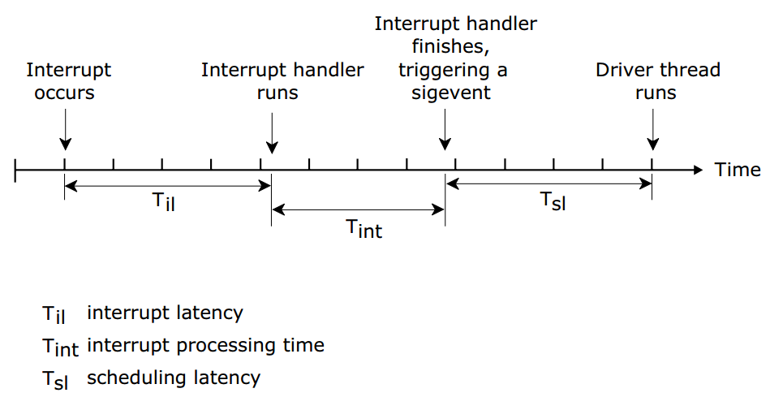

#### 中断嵌套

QNX支持中断嵌套，中断嵌套时序比较复杂，考虑以下这种情况：进程A在运行，中断IRQx触发Intx运行，在处理时又被IRQy抢占触发Inty运行，Inty返回一个事件导致线程B运行，Intx返回一个事件导致线程C运行，如下图：

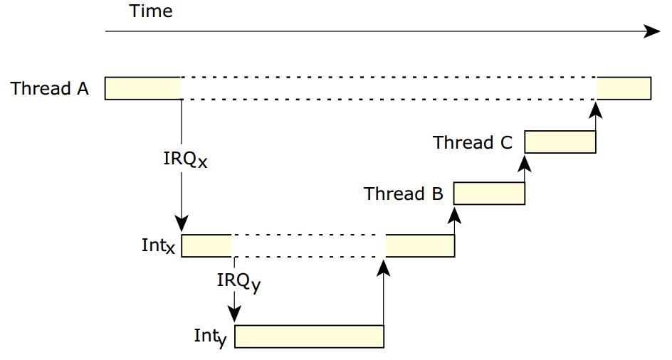

#### 中断调用接口

| Function                                                     | Description                                                  |
| ------------------------------------------------------------ | ------------------------------------------------------------ |
| [*InterruptAttach()*](http://www.qnx.com/developers/docs/7.0.0/com.qnx.doc.neutrino.lib_ref/topic/i/interruptattach.html) | Attach a local function (an Interrupt Service Routine or ISR) to an interrupt vector. |
| [*InterruptAttachEvent()*](http://www.qnx.com/developers/docs/7.0.0/com.qnx.doc.neutrino.lib_ref/topic/i/interruptattachevent.html) | Generate an event on an interrupt, which will ready a thread. No user interrupt handler runs. This is the preferred call. |
| [*InterruptDetach()*](http://www.qnx.com/developers/docs/7.0.0/com.qnx.doc.neutrino.lib_ref/topic/i/interruptdetach.html) | Detach from an interrupt using the ID returned by *InterruptAttach()* or *InterruptAttachEvent()*. |
| [*InterruptWait()*](http://www.qnx.com/developers/docs/7.0.0/com.qnx.doc.neutrino.lib_ref/topic/i/interruptwait.html) | Wait for an interrupt.                                       |
| [*InterruptEnable()*](http://www.qnx.com/developers/docs/7.0.0/com.qnx.doc.neutrino.lib_ref/topic/i/interruptenable.html) | Enable hardware interrupts.                                  |
| [*InterruptDisable()*](http://www.qnx.com/developers/docs/7.0.0/com.qnx.doc.neutrino.lib_ref/topic/i/interruptdisable.html) | Disable hardware interrupts.                                 |
| [*InterruptMask()*](http://www.qnx.com/developers/docs/7.0.0/com.qnx.doc.neutrino.lib_ref/topic/i/interruptmask.html) | Mask a hardware interrupt.                                   |
| [*InterruptUnmask()*](http://www.qnx.com/developers/docs/7.0.0/com.qnx.doc.neutrino.lib_ref/topic/i/interruptunmask.html) | Unmask a hardware interrupt.                                 |
| [*InterruptLock()*](http://www.qnx.com/developers/docs/7.0.0/com.qnx.doc.neutrino.lib_ref/topic/i/interruptlock.html) | Guard a critical section of code between an interrupt handler and a thread. A spinlock is used to make this code SMP-safe. This function is a superset of *InterruptDisable()* and should be used in its place. |
| [*InterruptUnlock()*](http://www.qnx.com/developers/docs/7.0.0/com.qnx.doc.neutrino.lib_ref/topic/i/interruptunlock.html) | Remove an SMP-safe lock on a critical section of code.       |

参考文献：

[**System Architecture** - The QNX Neutrino Microkernel](http://www.qnx.com/developers/docs/7.1/com.qnx.doc.neutrino.sys_arch/topic/kernel.html)


**QNX® Neutrino® RTOS** System Architecture

| To find out about:                                           | Go to:                                                       |
| ------------------------------------------------------------ | ------------------------------------------------------------ |
| OS design goals; message-passing IPC                         | [The Philosophy of the QNX Neutrino RTOS](./The.Philosophy.of.the.QNX.md) |
| System services                                              | [The QNX Neutrino Microkernel](http://www.qnx.com/developers/docs/7.1/com.qnx.doc.neutrino.sys_arch/topic/kernel.html) |
| Sharing information between processes                        | [Interprocess Communication (IPC)](http://www.qnx.com/developers/docs/7.1/com.qnx.doc.neutrino.sys_arch/topic/ipc.html) |
| System event monitoring                                      | [The Instrumented Microkernel](http://www.qnx.com/developers/docs/7.1/com.qnx.doc.neutrino.sys_arch/topic/trace.html) |
| Working on a system with more than one processor             | [Multicore Processing](http://www.qnx.com/developers/docs/7.1/com.qnx.doc.neutrino.sys_arch/topic/smp.html) |
| Memory management, pathname management, etc.                 | [Process Manager](http://www.qnx.com/developers/docs/7.1/com.qnx.doc.neutrino.sys_arch/topic/proc.html) |
| Shared objects                                               | [Dynamic Linking](http://www.qnx.com/developers/docs/7.1/com.qnx.doc.neutrino.sys_arch/topic/dll.html) |
| Device drivers                                               | [Resource Managers](http://www.qnx.com/developers/docs/7.1/com.qnx.doc.neutrino.sys_arch/topic/resource.html) |
| Image, RAM, Power-Safe, DOS, Flash, NFS, CIFS, Ext2, and other filesystems | [Filesystems](http://www.qnx.com/developers/docs/7.1/com.qnx.doc.neutrino.sys_arch/topic/fsys.html) |
| Persistent Publish/Subscribe (PPS)                           | [PPS](http://www.qnx.com/developers/docs/7.1/com.qnx.doc.neutrino.sys_arch/topic/pps.html) |
| Serial and parallel devices                                  | [Character I/O](http://www.qnx.com/developers/docs/7.1/com.qnx.doc.neutrino.sys_arch/topic/char.html) |
| Network subsystem                                            | [Networking Architecture](http://www.qnx.com/developers/docs/7.1/com.qnx.doc.neutrino.sys_arch/topic/net.html) |
| Native QNX Neutrino networking                               | [Native Networking (Qnet)](http://www.qnx.com/developers/docs/7.1/com.qnx.doc.neutrino.sys_arch/topic/qnet.html) |
| TCP/IP implementation                                        | [TCP/IP Networking](http://www.qnx.com/developers/docs/7.1/com.qnx.doc.neutrino.sys_arch/topic/tcpip.html) |
| Fault recovery                                               | [High Availability](http://www.qnx.com/developers/docs/7.1/com.qnx.doc.neutrino.sys_arch/topic/ham.html) |
| Sharing resources among competing processes                  | [Adaptive Partitioning](http://www.qnx.com/developers/docs/7.1/com.qnx.doc.neutrino.sys_arch/topic/adaptive.html) |
| An overview of hard and soft real time                       | [What is Real Time and Why Do I Need It?](http://www.qnx.com/developers/docs/7.1/com.qnx.doc.neutrino.sys_arch/topic/what_is_realtime.html) |
| Terms used in QNX Neutrino documentation                     | [Glossary](http://www.qnx.com/developers/docs/7.1/com.qnx.doc.neutrino.sys_arch/topic/glossary.html) |

