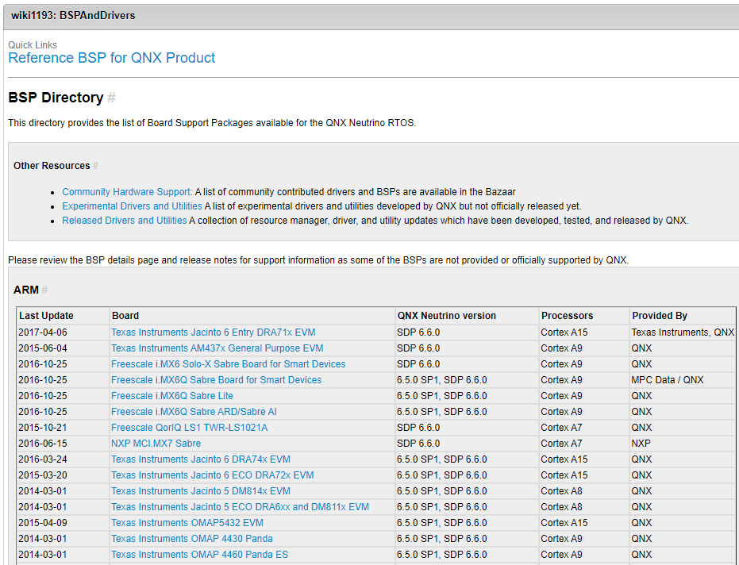
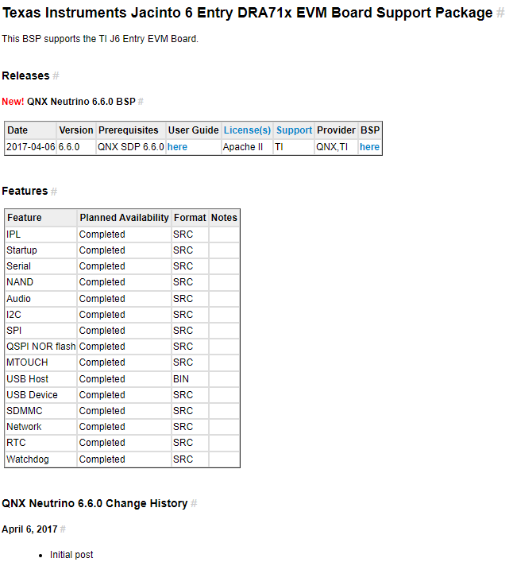
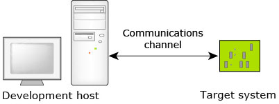
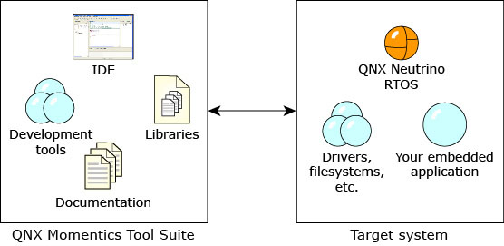
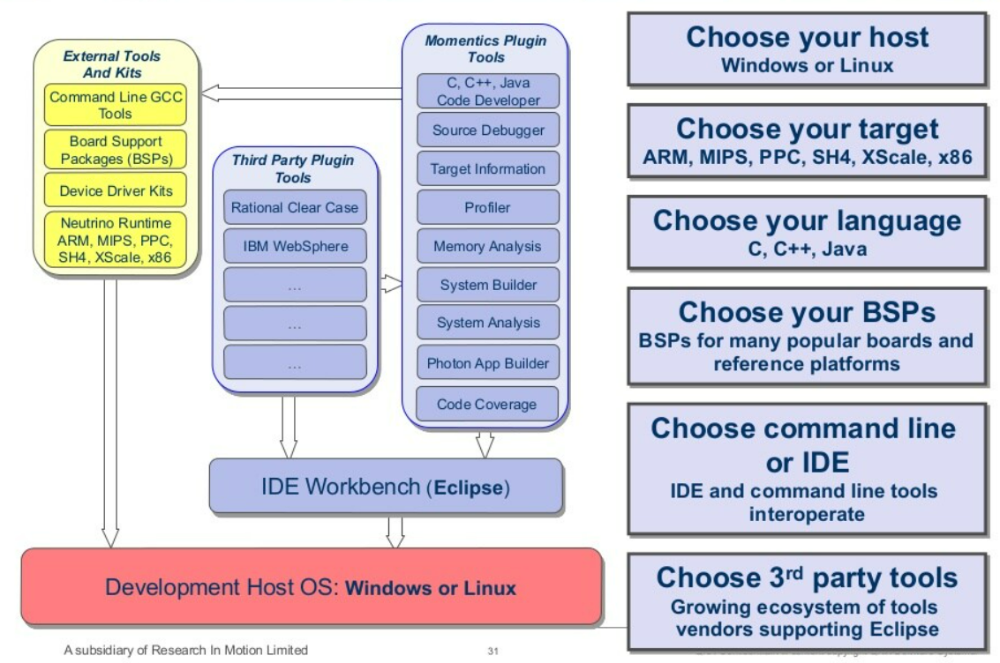

# QNX学习日志


# 系统简介

`QNX`是一个分布式、可扩展、遵从`POSIX`规范的类`Unix`硬实时操作系统。
 `QNX`为微内核的架构，微内核只提供进程调度、进程间通信、底层网络通信和中断处理四种服务。驱动程序、协议栈、文件系统、应用程序等都在微内核之外内存受保护的安全的用户空间内运行，组件之间能避免相互影响，在遇到故障时也能重启。

在[QNX Neutrino RTOS – Embedded OS官网](https://blackberry.qnx.com/en/software-solutions/embedded-software/qnx-neutrino-rtos)的Developers菜单下的[Community(Foundry27)](https://community.qnx.com/sf/sfmain/do/viewProject/projects.bsp)你可以找到相应芯片厂家的基础BSP开发包。

以[BSP Directory](https://community.qnx.com/sf/wiki/do/viewPage/projects.bsp/wiki/BSPAndDrivers)的Texas Instruments DRA71x Jacinto6 Entry BSP for QNX SDP 6.6为例



Texas Instruments Jacinto 6 Entry DRA71x EVM Board Support Package功能表如下：



解压Texas Instruments DRA71x Jacinto6 Entry BSP for QNX SDP 6.6.zip后，目录结构如下：

```shell
$ tree -L 3
.
├── Makefile
├── images
│   ├── Makefile
│   └── mkflashimage.sh
├── install
├── manifest
├── prebuilt
│   ├── armle-v7
│   │   ├── lib
│   │   └── usr
│   └── usr
│       └── include
├── readme.txt
├── source.xml
└── src
    ├── Makefile
    ├── hardware
    │   ├── Makefile
    │   ├── deva
    │   ├── devb
    │   ├── devc
    │   ├── devi
    │   ├── devnp
    │   ├── etfs
    │   ├── flash
    │   ├── i2c
    │   ├── ipl
    │   ├── mtouch
    │   ├── spi
    │   ├── startup
    │   └── support
    └── utils
        ├── Makefile
        └── r

25 directories, 9 files
```

**/src**

/src 目录包含 BSP 附带的所有源代码。源代码是组织成子目录，例如 /hardware、/lib、/utils 等。当BSP 构建完成后，BSP 内的所有源代码（包括这些中的源代码子目录）都会被构建。

**/prebuilt**

所有BSP 组件预构建并且存储在/prebuilt 目录。如果你在构建 BSP完成后，/prebuilt 的目录内容复制到 BSP 的 /install 目录。

**/install**

在构建 BSP 之前 /install 目录是空的。在构建 BSP 时，/prebuilt 目录的全部内容都复制到 /install 目录中。生成 IFS 映像时，/install 目录是首先被扫描在 BSP 的构建文件中指定的组件。如果生成 IFS 镜像进程在 /install 目录中找不到组件，它会扫描 QNX SDP 6.6 主机的组件的/target 目录。

> 如果您想通过更改或构建任何 BSP 源代码来修改 BSP 组件，你必须在构建相关的源代码时使用 make install 命令。此命令将导致您修改的组件复制到 BSP的 /install 目录中，覆盖由BSP提供的预构建的版本。

**/images**

/images是存放镜像的位置：

• BSP 的默认构建文件是在BSP 构建后生成
• 任何启动映像（例如 IFS 映像、IPL 二进制文件等）被生成。


那我们如何正常开发编译我们目标板的QNX镜像呢？

你可以安装QNX SDP 和 QNX Momentics IDE在你的Linux或者Windows主机上，并且部署QNX Neutrino RTOS在目标板上。



在开发主机上运行QNX Momentics Tool Suite,在目标板上运行QNX Neutrino RTOS和你开发好的程序。



安装QNX SDP，你需要商用的License。你可以从www.qnx.com/products/evaluation/下载评估License，评估License只有30天的使用期限。

**QNX660 SDP** （QNX ® Software Development Platform 6.6）包含一下内容：



我们展开QNX660 SDP 目录结构如下：

```shell
bspserver@ubuntu:~/workspace/SDP_QNX660$ tree -L 3
.
├── host
│   ├── linux
│   │   └── x86
│   └── win32
│       └── x86
├── qnx660-cmd.bat
├── qnx660-env.sh
├── README.md
└── target
    └── qnx6
        ├── accounts
        ├── appinstall
        ├── armle-v7
        ├── doc
        ├── etc
        ├── opt
        ├── usr
        ├── var
        └── x86

16 directories, 3 files

```

**/host**

**/host/linux/x86** 和**/host/win32/x86**分别表示选择在不同操作系统下的交叉编译

```shell
bspserver@ubuntu:~/workspace/SDP_QNX660/host/linux/x86$ tree -L 2
.
├── etc
│   └── qcc
└── usr
    ├── bin
    ├── include
    ├── lib
    ├── python27
    ├── qde
    └── share

```

**/qcc** 选择对应ARM处理器和x86处理器的编译语言规则`Choose your language `。

```shell
bspserver@ubuntu:~/workspace/SDP_QNX660/host/linux/x86/etc/qcc$ tree -L 3
.
├── default
└── gcc
    ├── 4.7.3
    │   ├── default
    │   ├── gcc_ntoarmv7le++.conf
    │   ├── gcc_ntoarmv7le.conf
    │   ├── gcc_ntoarmv7le_cpp++.conf
    │   ├── gcc_ntoarmv7le_cpp.conf
    │   ├── gcc_ntoarmv7le_cpp-ne++.conf
    │   ├── gcc_ntoarmv7le_cpp-ne.conf
    │   ├── gcc_ntoarmv7le_gpp++.conf
    │   ├── gcc_ntoarmv7le_gpp.conf
    │   ├── gcc_ntox86.conf
    │   ├── gcc_ntox86++.conf
    │   ├── gcc_ntox86_cpp++.conf
    │   ├── gcc_ntox86_cpp.conf
    │   ├── gcc_ntox86_cpp-ne++.conf
    │   ├── gcc_ntox86_cpp-ne.conf
    │   ├── gcc_ntox86_gpp++.conf
    │   └── gcc_ntox86_gpp.conf
    └── default

2 directories, 19 files

```

**qnx660-env.sh**表示支持`Choose Command line`,意思表示支持命令行编译。查看内容如下：

```shell
bspserver@ubuntu:~/workspace/SDP_QNX660$ cat qnx660-env.sh 
# This script is sets environment variables requires to use this version of QNX Software Development Platform 6.6
# from the command line. To use the script, you have to "source" it into your shell,
# source qnx660-env.sh
# if source command is not available use "." (dot) command instead
#
QNX660="$( cd "$( dirname "${BASH_SOURCE[0]}" )" && pwd )"
QNX_TARGET=$QNX660/target/qnx6
QNX_HOST=$QNX660/host/linux/x86
QNX_CONFIGURATION=/etc/qnx
MAKEFLAGS=-I$QNX660/target/qnx6/usr/include
PATH=$QNX660/host/linux/x86/usr/bin:/etc/qnx/bin:$QNX660/jre/bin:$PATH
cp $QNX660/target/qnx6/usr/include/mk/qconf-linux.mk $QNX660/target/qnx6/usr/include/qconfig.mk
```

其实qnx660-env.sh做了一下脚本环境变量的配置，便于执行命令行编译的时候能直接编译。

**/qde**表示`Choose 3rd part tools`支持的IDE Workbench是`eclipse`。

```shell
bspserver@ubuntu:~/workspace/SDP_QNX660/host/linux/x86/usr/qde$ tree -L 2
.
└── eclipse
    ├── artifacts.xml
    ├── configuration
    ├── dropins
    ├── epl-v10.html
    ├── features
    ├── icon.xpm
    ├── libcairo-swt.so
    ├── notice.html
    ├── p2
    ├── plugins
    ├── qde
    └── qde.ini

```

**/user** 你可以理解支持命令行编译，该目录为交叉编译工具链的目录，目录架构类似于Linux GCC的目录架构。

你可以对比一下QNX交叉编译链的目录和Linux GCC交叉编译链的目录。

QNX交叉编译链的目录：

```shell
bspserver@ubuntu:~/workspace/SDP_QNX660/host/linux/x86/usr/bin$ tree -L 1
......
├── arm-unknown-nto-qnx6.6.0eabi-addr2line -> arm-unknown-nto-qnx6.6.0eabi-addr2line-2.24
├── arm-unknown-nto-qnx6.6.0eabi-ar -> arm-unknown-nto-qnx6.6.0eabi-ar-2.24
├── arm-unknown-nto-qnx6.6.0eabi-as -> arm-unknown-nto-qnx6.6.0eabi-as-2.24
├── arm-unknown-nto-qnx6.6.0eabi-c++ -> arm-unknown-nto-qnx6.6.0eabi-c++-4.7.3
├── arm-unknown-nto-qnx6.6.0eabi-c++filt -> arm-unknown-nto-qnx6.6.0eabi-c++filt-2.24
├── arm-unknown-nto-qnx6.6.0eabi-cpp -> arm-unknown-nto-qnx6.6.0eabi-cpp-4.7.3
├── arm-unknown-nto-qnx6.6.0eabi-elfedit -> arm-unknown-nto-qnx6.6.0eabi-elfedit-2.24
├── arm-unknown-nto-qnx6.6.0eabi-g++ -> arm-unknown-nto-qnx6.6.0eabi-g++-4.7.3
├── arm-unknown-nto-qnx6.6.0eabi-gcc -> arm-unknown-nto-qnx6.6.0eabi-gcc-4.7.3
├── arm-unknown-nto-qnx6.6.0eabi-gcc-ar -> arm-unknown-nto-qnx6.6.0eabi-gcc-ar-4.7.3
├── arm-unknown-nto-qnx6.6.0eabi-gcc-nm -> arm-unknown-nto-qnx6.6.0eabi-gcc-nm-4.7.3
├── arm-unknown-nto-qnx6.6.0eabi-gcc-ranlib -> arm-unknown-nto-qnx6.6.0eabi-gcc-ranlib-4.7.3
├── arm-unknown-nto-qnx6.6.0eabi-gcov -> arm-unknown-nto-qnx6.6.0eabi-gcov-4.7.3
├── arm-unknown-nto-qnx6.6.0eabi-gprof -> arm-unknown-nto-qnx6.6.0eabi-gprof-2.24
├── arm-unknown-nto-qnx6.6.0eabi-ld -> arm-unknown-nto-qnx6.6.0eabi-ld-2.24
├── arm-unknown-nto-qnx6.6.0eabi-ld.bfd -> arm-unknown-nto-qnx6.6.0eabi-ld.bfd-2.24
├── arm-unknown-nto-qnx6.6.0eabi-nm -> arm-unknown-nto-qnx6.6.0eabi-nm-2.24
├── arm-unknown-nto-qnx6.6.0eabi-objcopy -> arm-unknown-nto-qnx6.6.0eabi-objcopy-2.24
├── arm-unknown-nto-qnx6.6.0eabi-objdump -> arm-unknown-nto-qnx6.6.0eabi-objdump-2.24
├── arm-unknown-nto-qnx6.6.0eabi-ranlib -> arm-unknown-nto-qnx6.6.0eabi-ranlib-2.24
├── arm-unknown-nto-qnx6.6.0eabi-readelf -> arm-unknown-nto-qnx6.6.0eabi-readelf-2.24
├── arm-unknown-nto-qnx6.6.0eabi-size -> arm-unknown-nto-qnx6.6.0eabi-size-2.24
├── arm-unknown-nto-qnx6.6.0eabi-strings -> arm-unknown-nto-qnx6.6.0eabi-strings-2.24
├── arm-unknown-nto-qnx6.6.0eabi-strip -> arm-unknown-nto-qnx6.6.0eabi-strip-2.24
......
```

Linux GCC交叉编译链的目录

```shell
$ tree -L 1
.......
├── arm-none-eabi-addr2line.exe
├── arm-none-eabi-ar.exe
├── arm-none-eabi-as.exe
├── arm-none-eabi-c++.exe
├── arm-none-eabi-c++filt.exe
├── arm-none-eabi-cpp.exe
├── arm-none-eabi-dwp.exe
├── arm-none-eabi-elfedit.exe
├── arm-none-eabi-g++.exe
├── arm-none-eabi-gcc-10.1.0.exe
├── arm-none-eabi-gcc-ar.exe
├── arm-none-eabi-gcc-nm.exe
├── arm-none-eabi-gcc-ranlib.exe
├── arm-none-eabi-gcc.exe
├── arm-none-eabi-gcov-dump.exe
├── arm-none-eabi-gcov-tool.exe
├── arm-none-eabi-gcov.exe
├── arm-none-eabi-gnat.exe
├── arm-none-eabi-gnatbind.exe
├── arm-none-eabi-gnatchop.exe
├── arm-none-eabi-gnatclean.exe
├── arm-none-eabi-gnatfind.exe
├── arm-none-eabi-gnatkr.exe
├── arm-none-eabi-gnatlink.exe
├── arm-none-eabi-gnatls.exe
├── arm-none-eabi-gnatmake.exe
├── arm-none-eabi-gnatname.exe
├── arm-none-eabi-gnatprep.exe
├── arm-none-eabi-gnatxref.exe
├── arm-none-eabi-gprof.exe
├── arm-none-eabi-ld.bfd.exe
├── arm-none-eabi-ld.exe
├── arm-none-eabi-ld.gold.exe
├── arm-none-eabi-lto-dump.exe
├── arm-none-eabi-nm.exe
├── arm-none-eabi-objcopy.exe
├── arm-none-eabi-objdump.exe
├── arm-none-eabi-ranlib.exe
├── arm-none-eabi-readelf.exe
├── arm-none-eabi-size.exe
├── arm-none-eabi-strings.exe
├── arm-none-eabi-strip.exe
.......
```

**/target/qnx6** 

**/target/qnx6/armle-v7**和**/target/qnx6/x86**表示`Choose Your target`是ARM和x86。

```shell
bspserver@ubuntu:~/workspace/SDP_QNX660/target$ tree -L 2
.
└── qnx6
    ├── armle-v7
    └── x86
```

**/target/qnx6** 你可以把它理解为类似于Linux下利用buildroot构建的根文件系统(rootfs)。这个buildroot的操作QNX厂家已经按购买好的组件包生成好提供给我们。

```shell
bspserver@ubuntu:~/workspace/SDP_QNX660/target$ tree -L 2
.
└── qnx6
    ├── accounts
    ├── appinstall
    ├── armle-v7
    ├── doc
    ├── etc
    ├── opt
    ├── usr
    ├── var
    └── x86

10 directories, 0 files
bspserver@ubuntu:~/workspace/SDP_QNX660/target/qnx6/armle-v7$ tree -L 1
.
├── bin
├── boot
├── freescale
├── lib
├── libexec
├── qt5
├── qt5-5.2
├── qtcar
├── sbin
├── ti
└── usr

```

通过命令行编译自己写的一个中间件程序效果如下：

```shell
bspserver@ubuntu:~/workspace/Upgrade_HAL$ ./build.sh 
-- The C compiler identification is QCC 4.7.3
-- The CXX compiler identification is QCC 4.7.3
-- Check for working C compiler: /home/bspserver/workspace/SDP_QNX660/host/linux/x86/usr/bin/cc
-- Check for working C compiler: /home/bspserver/workspace/SDP_QNX660/host/linux/x86/usr/bin/cc -- works
-- Detecting C compiler ABI info
-- Detecting C compiler ABI info - done
-- Detecting C compile features
-- Detecting C compile features - done
-- Check for working CXX compiler: /home/bspserver/workspace/SDP_QNX660/host/linux/x86/usr/bin/CC
-- Check for working CXX compiler: /home/bspserver/workspace/SDP_QNX660/host/linux/x86/usr/bin/CC -- works
-- Detecting CXX compiler ABI info
-- Detecting CXX compiler ABI info - done
-- Detecting CXX compile features
-- Detecting CXX compile features - done
-- Configuring done
-- Generating done
-- Build files have been written to: /home/bspserver/workspace/Upgrade_HAL/trunk/build
Scanning dependencies of target upgrade_hal_test
[ 16%] Building C object CMakeFiles/upgrade_hal_test.dir/example/main.c.o
[ 33%] Linking C executable upgrade_hal_test
[ 33%] Built target upgrade_hal_test
Scanning dependencies of target upgradehal
[ 50%] Building C object CMakeFiles/upgradehal.dir/modules/upgrade_hal.c.o
[ 66%] Building C object CMakeFiles/upgradehal.dir/modules/upgrade_ctrl/upgrade_ctrl.c.o
[ 83%] Building C object CMakeFiles/upgradehal.dir/modules/upgrade_ctrl/upgrade_ipc.c.o
[100%] Linking C shared library libupgradehal.so
[100%] Built target upgradehal
cp /home/bspserver/workspace/Upgrade_HAL/trunk/build/libupgradehal.so /home/bspserver/workspace/Upgrade_HAL/output/target/qnx6/armle-v7/usr/lib/hw
cp /home/bspserver/workspace/Upgrade_HAL/trunk/include/upgrade_hal.h /home/bspserver/workspace/Upgrade_HAL/output/target/qnx6/usr/include/hardware
cp /home/bspserver/workspace/Upgrade_HAL/trunk/example/main.c /home/bspserver/workspace/Upgrade_HAL/output/example
```


**QNX® Neutrino® RTOS** System Architecture

| To find out about:                                           | Go to:                                                       |
| ------------------------------------------------------------ | ------------------------------------------------------------ |
| OS design goals; message-passing IPC                         | [The Philosophy of the QNX Neutrino RTOS](http://www.qnx.com/developers/docs/7.1/com.qnx.doc.neutrino.sys_arch/topic/intro.html) |
| System services                                              | [The QNX Neutrino Microkernel](http://www.qnx.com/developers/docs/7.1/com.qnx.doc.neutrino.sys_arch/topic/kernel.html) |
| Sharing information between processes                        | [Interprocess Communication (IPC)](http://www.qnx.com/developers/docs/7.1/com.qnx.doc.neutrino.sys_arch/topic/ipc.html) |
| System event monitoring                                      | [The Instrumented Microkernel](http://www.qnx.com/developers/docs/7.1/com.qnx.doc.neutrino.sys_arch/topic/trace.html) |
| Working on a system with more than one processor             | [Multicore Processing](http://www.qnx.com/developers/docs/7.1/com.qnx.doc.neutrino.sys_arch/topic/smp.html) |
| Memory management, pathname management, etc.                 | [Process Manager](http://www.qnx.com/developers/docs/7.1/com.qnx.doc.neutrino.sys_arch/topic/proc.html) |
| Shared objects                                               | [Dynamic Linking](http://www.qnx.com/developers/docs/7.1/com.qnx.doc.neutrino.sys_arch/topic/dll.html) |
| Device drivers                                               | [Resource Managers](http://www.qnx.com/developers/docs/7.1/com.qnx.doc.neutrino.sys_arch/topic/resource.html) |
| Image, RAM, Power-Safe, DOS, Flash, NFS, CIFS, Ext2, and other filesystems | [Filesystems](http://www.qnx.com/developers/docs/7.1/com.qnx.doc.neutrino.sys_arch/topic/fsys.html) |
| Persistent Publish/Subscribe (PPS)                           | [PPS](http://www.qnx.com/developers/docs/7.1/com.qnx.doc.neutrino.sys_arch/topic/pps.html) |
| Serial and parallel devices                                  | [Character I/O](http://www.qnx.com/developers/docs/7.1/com.qnx.doc.neutrino.sys_arch/topic/char.html) |
| Network subsystem                                            | [Networking Architecture](http://www.qnx.com/developers/docs/7.1/com.qnx.doc.neutrino.sys_arch/topic/net.html) |
| Native QNX Neutrino networking                               | [Native Networking (Qnet)](http://www.qnx.com/developers/docs/7.1/com.qnx.doc.neutrino.sys_arch/topic/qnet.html) |
| TCP/IP implementation                                        | [TCP/IP Networking](http://www.qnx.com/developers/docs/7.1/com.qnx.doc.neutrino.sys_arch/topic/tcpip.html) |
| Fault recovery                                               | [High Availability](http://www.qnx.com/developers/docs/7.1/com.qnx.doc.neutrino.sys_arch/topic/ham.html) |
| Sharing resources among competing processes                  | [Adaptive Partitioning](http://www.qnx.com/developers/docs/7.1/com.qnx.doc.neutrino.sys_arch/topic/adaptive.html) |
| An overview of hard and soft real time                       | [What is Real Time and Why Do I Need It?](http://www.qnx.com/developers/docs/7.1/com.qnx.doc.neutrino.sys_arch/topic/what_is_realtime.html) |
| Terms used in QNX Neutrino documentation                     | [Glossary](http://www.qnx.com/developers/docs/7.1/com.qnx.doc.neutrino.sys_arch/topic/glossary.html) |

