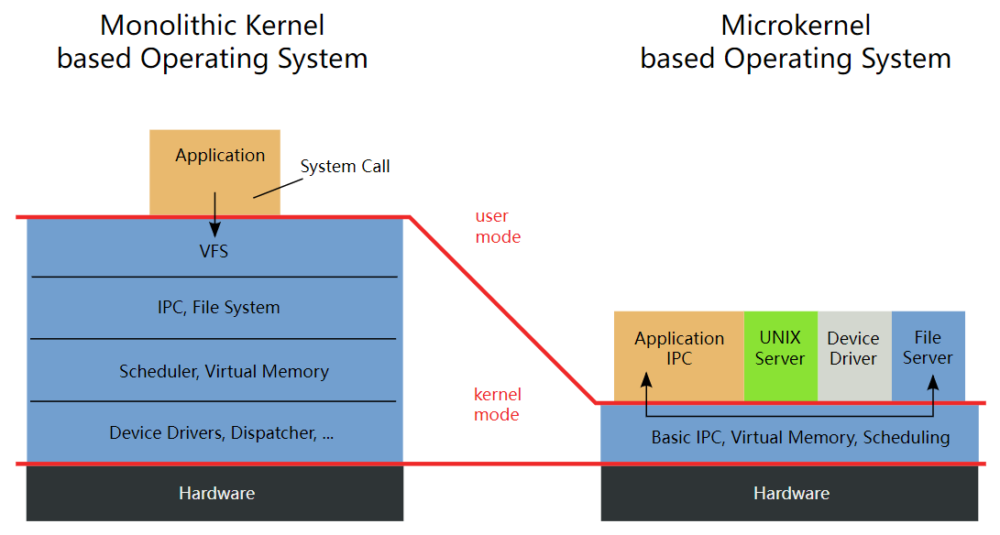

# QNX®  Neutrino RTOS简介

`QNX`是一个分布式、可扩展、遵从开放系统`POSIX API`规范的类`Unix`硬实时操作系统。

 `QNX`为微内核的架构，微内核只提供进程调度、进程间通信、底层网络通信和中断处理四种服务。驱动程序、协议栈、文件系统、应用程序等都在微内核之外内存受保护的安全的用户空间内运行，组件之间能避免相互影响，在遇到故障时也能重新启动。

尽管 QNX Neutrino 具有明显的非 UNIX 架构，但它实现了标准的 POSIXAPI。通过采用微内核架构，操作系统以一种可以轻松缩小实时嵌入式系统的规模或根据需要逐步扩大规模的形式提供此 API。

QNX Neutrino通过两个基本原则,模块化和简洁性实现了其独特的效率：

- 微内核架构
- 基于消息的进程间通信

如下图所示，真正的微内核提供完整的内存保护，不仅适用于用户应用程序，还适用于 OS 组件（设备驱动程序，文件系统等）：

针对内存保护，有以下几种情况：

* 不提供内存保护：所有程序位于同一个地址空间，应用程序可以访问所有空间，效率较高，但是程序指针错误可能造成内核崩溃，典型的比如Nuttx平板模式。

图 1：传统管理没有提供内存保护。

* 单内核OS提供部分内存保护：用户层和系统层进行了隔离，内核和各种驱动、协议栈在同一个地址空间，应用程序在单独空间。内核模块处于一个保护空间，效率较高，应用程序无法访问，系统的稳定性也得到提高。由于内核模块处于保护空间，调试会比较困难，比如Linux系统。

图 2：在宏内核(“单内核”)操作系统中，系统进程没有保护。

* 微内核OS提供完整的内存保护：内核处于一个被保护的地址空间，驱动程序、网络协议及应用程序等处于程序空间中。

图 3：微内核提供完整的内存保护。

> Tips -> **宏内核(“单内核”)与微内核的差异**
>
> **操作系统内核的几个重要的特点：**
>
> 1. 内核是操作系统的核心部分，它管理着系统的各种资源
>
> 2. 内核可以看成连接应用程序和硬件的一座桥梁，是直接运行在硬件上的最基础的软件实体
>
> 3. 在一些简单的硬件设备上可以没有内核或操作系统而直接运行程序，比方单片机等。这些设备通常只是用于特定的场合，也通常功能比较单一。而对于一般计算机来说操作系统是必不可少的。对不同的操作系统，其内核实现也是有所区别的。
>
> 4. 目前从内核架构来划分，可分为微内核(Micro Kernel)和宏内核(Monolithic Kernel)，“宏内核”这个翻译其实不是很好，翻译成“单内核”事实上更好一点。
>
> 5. 对于微内核，用户服务和内核服务分别运行在不同的地址空间中；对于宏内核不管是用户服务还是内核服务事实上都是内核在统一管理，它们是运行在同一地址空间中的。
>
>    我们需要好好理解第5点，也就是用户服务和内核服务运行的地址空间的问题。大家都知道Linux采用的是宏内核，但是它也区分内核空间和用户空间，那不是有歧义了吗？我们来看一张图。
>
>    
>
>    对于Linux来说，不管是应用还是内核都是由内存管理单元来做统一的内存管理的，用户空间的程序确实不能访问内核空间，但是对于内核来说，3GB-4GB的线性地址空间对整个内核都是共用的，同时内核中的VFS、System Call等模块被划分到内核中，它们之间的地址空间是相同的，这里的用户服务按照我的理解就是这几个内核模块所需要的报备，如上图所示。
>
>    
>
>    我们来列张表来对比一下微内核和宏内核的具体区别：
>
>    |              |                  微内核                  |                         宏内核                          |
>    | :----------: | :--------------------------------------: | :-----------------------------------------------------: |
>    | **基本概念** | 用户服务和内核服务运行在不同的地址空间中 |        用户服务和内核服务运行在相同的地址空间中         |
>    |   **Size**   |                  比较小                  |                        比微内大                         |
>    | **执行速度** |                    慢                    |                           快                            |
>    |  **安全性**  |          单个服务崩溃不影响全局          |           单个服务崩溃往往意味着整个系统崩溃            |
>    | **代码开发** |            需要开发的代码量打            |        平台提供的代码多，相对需要开发的代码量少         |
>    |   **系统**   |  QNX, Symbian, L4Linux, Mac OS X, etc.   | Linux, BSDs (FreeBSD, OpenBSD), Microsoft Windows, etc. |
>    
>    
>    
>    **微内核：**
>    
>    内核管理着所有的系统资源，在微内核中用户服务和内核服务在不同的地址空间中实现。在应用程序和硬件的通信中，内核进程和内存管理的极小的服务，而客户端程序和运行在用户空间的服务通过消息的传递来建立通信，它们之间不会有直接的交互，这样一来，微内核中的执行速度相对就比较慢了，这是微内核架构的一个缺点。
>    
>    在内核架构中，用户服务是独立于内核服务的，因此任何用户服务崩溃都不会影响到内核服务，这就加强了操作系统的健壮性，这是微内核的优势所在。另一点，微内核的扩展性强，添加一个功能，只需要建立一个新的服务到用户空间当中，而内核空间不需要任何的修改。因此，微内核可移植性强、安全并且易于扩展。
>    
>    **宏内核：**
>    
>    宏内核同样管理着用户程序和硬件之间的系统资源，但是和微内核不一样的是，在宏内核架构中，用户服务和内核服务在同一空间中实现。具体一点，就是内核可以代表内核进程运行代码，就是通常的内核进程；当用户进程经过系统调用或者中断进入到内核态时，内核也可以代表它运行代码。这样一来，宏内核需要管理的资源多于微内核，其大小就相对大一些了。
>    
>    在宏内核架构当中，内核管理着CPU调度，内存管理，文件管理和系统调用等各模块的的工作，由于用户服务和内核服务被实现在同一空间中，这样在执行速度上要比微内核快。然而，宏内核的劣势也是显而易见的，那就是当内核中的某个服务崩溃了，整个内核也会崩溃。另一点，想要在内核中添加新的功能就意味着内核中的各个模块需要做相应的修改，因此其扩展性很弱。
>
> 

**操作系统可以视为一个进程团队**

QNX Neutrino 实时操作系统由一个管理一组协作进程的小型微内核组成。

QNX Neutrino 扮演一种“软件总线”角色，可让您在需要时动态插入/拔出 OS 模块。

**一个真正的内核**

内核是任何操作系统的核心。在某些系统中，“内核”包含许多功能，无论从哪个角度来看，它都是整个操作系统！

但QNX的微内核确实是一个内核。首先，就像实时执行者的内核一样，它非常小。其次，它只致力于一些基本服务：

> •通过 POSIX 线程创建原语进行线程服务(**thread services**)
>
> •通过 POSIX 信号原语提供信号服务(**signal services**)
>
> •消息传递服务(**message-passing services**)-微内核处理整个系统中所有线程之间所有消息的路由。
>
> •通过 POSIX 线程同步原语的同步服务(**synchronization services**)。
>
> •调度服务(**scheduling services**)-微内核使用各种 POSIX 实时调度策略调度线程以执行。
>
> •定时器服务(**timer services**)-微内核提供丰富的 POSIX 定时器服务。
>
> •流程管理服务(**process management services**)-微内核和流程管理器共同组成一个单元（称为 `procnto`）。进程管理器部分负责管理进程，内存和路径名空间。

与线程不同，微内核本身永远不会被安排执行。处理器仅在显式内核调用，异常或响应硬件中断的结果下在微内核中执行代码。

**系统进程**

除那些强制性微内核/进程管理器模块（`procnto`）提供的服务外，所有 OS 服务都通过标准进程来处理。

配置丰富的系统可能包括以下内容：

> •文件系统管理员
>
> •角色设备管理员
>
> •本地网络管理员
>
> •TCP/IP

**系统进程与用户编写的进程**

系统进程基本上与任何用户编写的程序无法区分-它们使用相同公共 API 和内核服务给任意（适当特权的）用户进程。正是这种架构为QNX Neutrino RTOS 提供了无与伦比的可扩展性。由于大多数OS服务都是由标准系统进程提供的，因此增加操作系统本身非常简单：只需编写新程序即可提供新的OS服务。实际上，操作系统和应用程序之间的界限可能变得非常模糊。系统服务和应用程序之间唯一真正的区别是OS服务为客户端管理资源。

**设备驱动**

设备驱动程序允许 OS 和应用程序以通用方式使用底层硬件（例如，磁盘驱动器，网络接口）。虽然大多数操作系统要求设备驱动程序与操作系统本身紧密绑定，但 QNX Neutrino 的设备驱动程序可以作为标准进程启动和停止。 因此，添加设备驱动程序不会影响操作系统的任何其他部分—驱动程序可以像任何其他应用程序一样开发和调试。

参考文献：

[**System Architecture** - The Philosophy of the QNX Neutrino RTOS](http://www.qnx.com/developers/docs/7.1/com.qnx.doc.neutrino.sys_arch/topic/intro.html)

